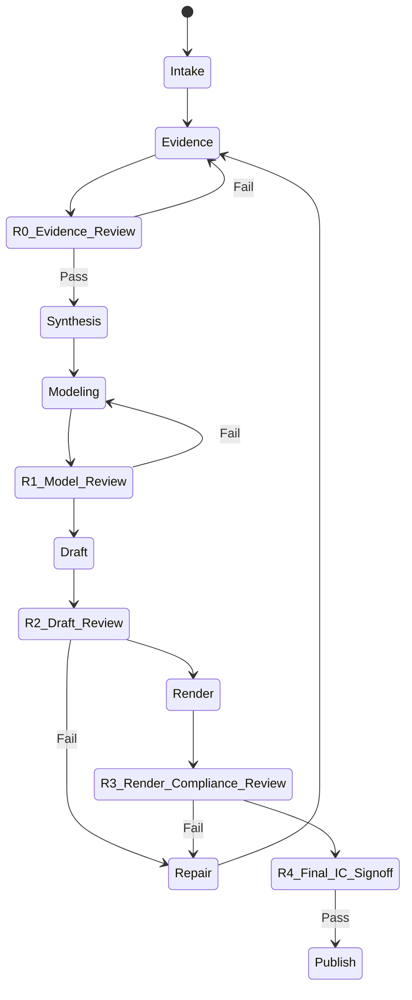

<SUBAGENT-STOP>
If you were dispatched as a subagent to execute a specific task, skip this skill.
</SUBAGENT-STOP>

# Equity Research — Institutional Report Production System

## Overview

A multi-stage orchestration that produces institutional-grade equity research reports. All agent capabilities live in `.agents/team/*.md` — this skill only defines the pipeline: which agents, what order, what inputs flow where.

```
Scope → Industry Coverage Pack → Template Benchmark → Source Governance → Research → Full-Chain Universe → Supply-Chain Gate → House View / Variant Perception → Growth-Earnings / Value-Chain Economics → Valuation Skill Gate → Exhibit Plan → Write → Render Review → Publish
```

Institutional research must run as a state machine. Do not skip a state, and do not publish from intent or draft quality alone:



Every state must leave auditable artifacts. The workflow is complete only when the gate manifest proves all required artifacts exist, review findings have no open S-Level or unwaived A-Level issues, the case verifier passes, and final sign-off is recorded.

## Workflow Control Artifacts

Create these files during Intake and keep them current throughout the case:

- `gate_manifest.md`
- `gate_manifest.json`
- `artifact_contract.md`
- `artifact_contract.json`

`gate_manifest.md/json` must include:

```text
case_id | report_type | data_cutoff | coverage_pack | required_skills | required_artifacts | review_cycles | verifiers | pass_conditions | downgrade_path
```

`artifact_contract.md/json` must include one row per required artifact:

```text
artifact | owner_skill | owner_agent | stage | required_for | schema_or_fields | reviewer_cycle | verifier_check | blocking_if_missing
```

Report-type routing:

| Report Type | Required Gates |
|---|---|
| Full industry-chain deep dive | All gates: full-chain, evidence, supply-chain, value-chain economics, growth model when applicable, valuation, R0-R4, generic + industry-chain verifier |
| Single-stock full note | Evidence, company model, valuation, risk, R1-R4, generic verifier |
| Valuation update | Market/financial refresh, valuation audit, model review, final sign-off |
| Quick screen / watchlist memo | Evidence/source quality, downgrade label, no investable target unless valuation gate passes |
| Evidence memo | Source governance and coverage gap only; explicitly non-investable |

Downgrade rule: if a required evidence or valuation gate cannot pass, downgrade the deliverable to `watchlist only` or `evidence memo`; do not publish investable conclusions.

## Skill Routing Matrix

| Workstream | Owner Skill / Agent | Required Output |
|---|---|---|
| Intake and gate manifest | `equity-research` orchestrator | `research_brief.md`, `gate_manifest.*`, `artifact_contract.*` |
| Broker/source collection | `reports`, `report-collector` | `data/report_catalog.md`, `sources/` |
| Source governance | `source-governance-analyst` | `data/source_registry.*`, `data/claim_audit.*`, `source_exhaustion_log.*` |
| Full-chain mapping | `supply-chain-research`, `supply-chain-analyst` | full-chain universe, taxonomy, core/satellite, coverage gaps |
| Industry/competition | `industry-analyst` | `analysis/industry_landscape.md`, `analysis/competitive_landscape.md` |
| House view / variant | `house-view-analyst`, `risk-analyst` | `analysis/house_view.md`, `analysis/variant_perception.md` |
| Growth earnings | `growth-earnings-model`, `growth-earnings-modeler` | growth model, segment bridge, sensitivity, driver JSON |
| Valuation | `valuation`, `valuation-specialist` | `analysis/valuation_model.md`, `analysis/valuation_audit.md`, valuation JSON |
| Exhibit/narrative | `exhibit-architect`, `latex-writer` | `analysis/exhibit_plan.md`, `analysis/narrative_blueprint.md`, LaTeX/PDF |
| Review and repair routing | `research-report-review`, `research-report-reviewer` | `review_findings_<cycle>.json`, `repair_plan_<cycle>.md/json`, `review_log.md` |
| Final sign-off | `research-report-review`, orchestrator | `final_signoff.md/json` |

Maker-checker rule: the agent or skill that writes an artifact cannot self-sign that artifact as PASS. Final review is read-only. Repairs must be routed through `repair_plan_<cycle>.md/json`, then re-reviewed.

## When to Use

**Triggers:**
- "帮我写调研报告" / "写一份行业研究"
- "equity research report" / "industry chain analysis"
- "产业链分析" / "投资调研"
- Any request for institutional-grade investment analysis with PDF output

**Don't use when:**
- Simple stock price lookup → `/quote`
- Quick opinion on a single company → `/team`
- Non-financial research reports

## Phase 0: SCOPE (You, the orchestrator)

Before dispatching any agents, establish scope:
1. **Target sector/theme** — what industry chain or investment theme?
2. **Ticker universe** — which specific companies to cover?
3. **Data cutoff** — what quarter's financials? What date for market data?
4. **Depth** — full report (50+ pages) or brief (15-20 pages)?
5. **Language** — Chinese body + English abstract (default) or full English?

If the user asks for an industry-chain report but does not provide a ticker universe, default to **full-chain taxonomy first**. Do not start from a short concept-stock list. Build:
- Full-chain universe: all material upstream, midstream, downstream, overseas, private, and demand-anchor nodes.
- Core valuation pool: investable listed names with enough evidence for valuation.
- Conditional watch pool: listed names with theme relevance but insufficient valuation evidence.
- Demand anchors: hyperscalers, OEMs, cloud/AI platforms, end customers, or other non-investable demand nodes.

Create `research_brief.md`, `gate_manifest.md/json`, and `artifact_contract.md/json` in the working directory. `research_brief.md` must state target theme, report type, data cutoff, language, depth, industry coverage pack, full-chain universe definition, core valuation pool, conditional watch pool, demand anchors, downgrade path, and any user-imposed exclusions. Missing any of these fields in an industry-chain report is an S-Level scope failure.

## Phase 0.5: TEMPLATE BENCHMARK

Before collecting data, choose the report archetype and benchmark it against the sample library in `workspace/templates/global-broker-research/` and the industry coverage packs in `workspace/templates/industry-coverage-packs/`.

| Agent | Role File | Output File |
|-------|-----------|-------------|
| Template Benchmark Analyst | `.agents/team/template-benchmark-analyst.md` | `analysis/template_brief.md` |

Reference archetypes:
- Single-stock note → JPM equity research sample.
- Market guide / chartbook → JPM Guide to the Markets.
- Global outlook in charts → BlackRock BII.
- Annual outlook / house view → Capital Group.
- Macro scenario whitepaper → Vanguard.
- Quarterly capital markets strategy → AllianceBernstein.

**Quality gate:** `analysis/template_brief.md` must define first-page dashboard, required chapter sequence, required exhibits, what to avoid, and the exact industry coverage pack used. If no coverage pack matches, write a case-specific pack in `analysis/template_brief.md` before research starts and label it `custom`.

## Industry Coverage Packs

Deep industry-chain reports must select and cite one industry coverage pack. The pack defines minimum chain blocks and mandatory evidence modules; missing a required module is S-Level unless explicitly scoped out by the user and disclosed in `research_brief.md`.

Available pack library:
- `workspace/templates/industry-coverage-packs/aidc.md`
- `workspace/templates/industry-coverage-packs/semiconductor.md`
- `workspace/templates/industry-coverage-packs/materials.md`
- `workspace/templates/industry-coverage-packs/healthcare.md`
- `workspace/templates/industry-coverage-packs/consumer.md`
- `workspace/templates/industry-coverage-packs/cyclical.md`

AIDC reports must cover at least these eight modules: compute platform and accelerator demand anchors, server/OEM/ODM, data-center power and thermal, optical/networking/interconnect, storage and memory, PCB/CCL/connectors/cables, IDC/cloud/operator infrastructure, and upstream equipment/materials/components.

## Phase 1: RESEARCH (Parallel)

Dispatch **in parallel** — no dependencies between them:

| Agent | Role File | Input | Output File |
|-------|-----------|-------|-------------|
| Data Collector (financials) | `.agents/team/data-collector.md` | ticker list + data cutoff date, mode=financials | `data/raw_financials.md` |
| Data Collector (market) | `.agents/team/data-collector.md` | ticker list + today's date, mode=market | `data/raw_market_data.md` |
| Industry Analyst | `.agents/team/industry-analyst.md` | sector theme + competitive questions | `analysis/industry_landscape.md` |
| Report Collector | `.agents/team/report-collector.md` | sector/ticker + date_range=last_90d + min_reports=10 + output_dir=`sources/broker-reports/<YYYY-MM-DD>/` | `data/report_catalog.md` + `sources/broker-reports/<YYYY-MM-DD>/` |
| Source Governance Analyst | `.agents/team/source-governance-analyst.md` | all collected sources | `data/source_registry.md/json` + `data/claim_audit.md/json` + `source_exhaustion_log.md/json` |

**Quality gate:** All tickers have data. If any ticker is missing, re-run collector for that ticker. High-impact claims must be classified before they can enter the main report. Broker evidence must distinguish `original_pdf`, `broker_official_page`, `abstract`, `media_repost`, `third_party_preview`, `search_snippet`, and `not_found`; weak sources cannot be upgraded into Street consensus language.

## Phase 2: VERIFY (Parallel, after Phase 1)

Dispatch **in parallel**:

| Agent | Role File | Input | Output File |
|-------|-----------|-------|-------------|
| Data Verifier (financials) | `.agents/team/data-verifier.md` | `data/raw_financials.md` | `data/verified_financials.md` |
| Data Verifier (market) | `.agents/team/data-verifier.md` | `data/raw_market_data.md` | `data/verified_market_data.md` |
| Report Analyzer | `.agents/team/report-analyzer.md` | `data/report_catalog.md` | `data/consensus_analysis.md` |

**Quality gate:** >95% of numbers confirmed. Unconfirmed items flagged as "⚠️ unverified".

## Phase 2.25: SUPPLY-CHAIN RESEARCH SKILL GATE

The standalone `supply-chain-research` skill is the authoritative supply-chain system for full industry-chain reports. The orchestrator must not rely on a generic industry-landscape paragraph or a concept-stock table as a substitute.

Required readiness inputs:
- `data/report_catalog.md`
- `data/source_registry.md/json`
- `data/claim_audit.md/json`
- `source_exhaustion_log.md/json`
- `data/verified_financials.md`
- `data/verified_market_data.md`
- Case-scoped raw sources under `sources/`
- Ticker universe, report language, data cutoff, and case directory

| Agent | Role File | Input | Output File |
|-------|-----------|-------|-------------|
| Supply Chain Analyst | `.agents/team/supply-chain-analyst.md` + `supply-chain-research` skill | verified data + source registry + claim audit + report catalog + sources + coverage pack | `data/full_chain_universe_<YYYYMMDD>.md/json` + `analysis/full_chain_taxonomy.md` + `analysis/core_vs_satellite_universe.md` + `analysis/coverage_gap_matrix.md` + `analysis/supply_chain_model.md` + `analysis/company_fundamental_cards.md` + `analysis/value_chain_economics.md` + `analysis/chain_earnings_bridge.md` + `data/supply_chain_relationships.md/json` + `data/customer_chain_audit.md/json` |

**Quality gate:** The supply-chain skill must complete before house view, valuation, risk, exhibit planning, writing, or review. Full industry-chain reports must output a full-chain universe before selecting the core valuation pool; a short list of listed stocks is not a valid substitute. `data/full_chain_universe_<YYYYMMDD>.json` must contain all material chain blocks from the selected coverage pack and each row must include `node_type` (`listed`, `overseas`, `private`, `demand_anchor`, `low_purity`, or `unavailable`), chain block, subsegment, role, evidence status, source count, valuation status, core/satellite classification, and next verification path. Every covered ticker must have a company card and at least one relationship row. Every relationship row must preserve layer, product/process, upstream input, downstream customer/platform/application, confidence, revenue exposure or `not disclosed`, capacity/certification/order visibility or `not found`, margin/earnings impact, source, evidence gap, and valuation eligibility. If evidence is unavailable, publish `analysis/coverage_gap_matrix.md` rather than omitting the topic. If the report cannot distinguish core beneficiaries, satellites, demand anchors, low-purity names, and unavailable nodes, block the report and collect more evidence.

## Phase 2.5: HOUSE VIEW

The report must have AStock's own thesis. Broker views are evidence, not the report's voice.

| Agent | Role File | Input | Output File |
|-------|-----------|-------|-------------|
| House View Analyst | `.agents/team/house-view-analyst.md` | verified data + source registry + report catalog + supply-chain outputs + competitive landscape | `analysis/house_view.md` + `analysis/variant_perception.md` |

**Quality gate:** If the house view mostly says “broker X believes,” it fails. `analysis/variant_perception.md` must state market consensus, AStock's differentiated view, the assumption gap, the strongest opposing argument, and what would prove AStock wrong.

## Phase 2.65: GROWTH EARNINGS MODEL SKILL GATE

The standalone `growth-earnings-model` skill is the authoritative high-growth earnings precision system. The orchestrator must run it before valuation whenever any covered ticker's investment case depends on AI-related revenue, high-growth segment mix, shipments, unit volume, ASP, order/backlog conversion, customer allocation, or claims such as "sales/revenue/orders will double."

Required readiness inputs:
- `data/verified_financials.md`
- `data/verified_market_data.md`
- `data/consensus_analysis.md` or a public broker/consensus snapshot with unavailable fields marked `not disclosed`
- `data/source_registry.md`
- `data/claim_audit.md`
- `analysis/supply_chain_model.md`
- `analysis/company_fundamental_cards.md`
- `analysis/value_chain_economics.md`
- `analysis/chain_earnings_bridge.md`
- `data/supply_chain_relationships.md`
- `data/customer_chain_audit.md`
- `analysis/house_view.md`

| Agent | Role File | Input | Output File |
|-------|-----------|-------|-------------|
| Growth Earnings Modeler | `.agents/team/growth-earnings-modeler.md` + `growth-earnings-model` skill | verified financials + market data + source registry + claim audit + consensus + supply-chain outputs + value-chain economics + house view | `analysis/growth_earnings_model.md` + `analysis/segment_forecast_bridge.md` + `analysis/implied_growth_sensitivity.md` + `data/growth_driver_model.json` |

**Quality gate:** If high-growth or AI-related valuation credit is used, the growth earnings skill must complete before valuation. Every applicable ticker must show base business versus growth segment split, unit/order/ASP or explicit proxy, recognition ratio, gross margin, incremental opex, net profit, EPS contribution, bear/base/bull scenarios, current-price-implied growth, source quality, evidence gap, and valuation credit. Generic AI demand, downstream TAM, capacity, or market heat cannot support EPS or target-price upside without this bridge. If the evidence is unavailable, publish a marked gap table and label the growth segment `watchlist only / insufficient growth evidence`.

## Phase 2.75: VALUATION SKILL READINESS

The standalone `valuation` skill is the authoritative valuation system for all full research reports. The orchestrator must not hand-roll a simplified valuation table inside `equity-research`; it must run the valuation skill after verified data, house view, supply-chain outputs, and any required growth earnings model are available.

Required readiness inputs:
- `data/verified_financials.md`
- `data/verified_market_data.md`
- `data/consensus_analysis.md` or a public broker/consensus snapshot with unavailable fields marked `not disclosed`
- `data/source_registry.md`
- `data/claim_audit.md`
- `analysis/supply_chain_model.md`
- `analysis/company_fundamental_cards.md`
- `analysis/full_chain_taxonomy.md`
- `analysis/core_vs_satellite_universe.md`
- `analysis/value_chain_economics.md`
- `analysis/chain_earnings_bridge.md`
- `data/supply_chain_relationships.md`
- `data/customer_chain_audit.md`
- `analysis/growth_earnings_model.md`, `analysis/segment_forecast_bridge.md`, `analysis/implied_growth_sensitivity.md`, and `data/growth_driver_model.json` when high-growth/AI/order/unit/ASP valuation credit is used
- `analysis/house_view.md`

**Quality gate:** If these files do not exist or are not usable, block valuation and fix the upstream research artifacts first. Do not proceed to risk, exhibit planning, LaTeX writing, or review with a simplified substitute. Industry-chain valuation must consume `analysis/core_vs_satellite_universe.md` and `analysis/value_chain_economics.md`; core names may receive valuation work, satellites require an explicit evidence gap, and demand anchors must not be valued as upstream beneficiaries.

## Institutional Depth Requirements

Full research reports must contain these evidence-backed sections. If evidence is unavailable, include a clearly marked "unverified / not found" table rather than omitting the topic. The `valuation` skill owns the valuation package and audit requirements in sections 3-5; use that skill's artifact contract as the source of truth.

1. **Supply-chain relationship matrix**
   - Use the `supply-chain-research` skill as the source of truth for this section.
   - Start from `data/full_chain_universe_<YYYYMMDD>.md/json`, not a short listed-company table.
   - Include the selected industry coverage pack, all required chain blocks, and the classification of each node as `listed`, `overseas`, `private`, `demand_anchor`, `low_purity`, or `unavailable`.
   - Separate `core valuation pool`, `satellite watch pool`, `demand anchors`, and `out-of-scope / unavailable` nodes in `analysis/core_vs_satellite_universe.md`.
   - Include `analysis/coverage_gap_matrix.md` with every missing block, missing source, reason, next verification path, and whether it blocks valuation.
   - Map upstream/downstream relationships: which company supplies which customer, platform, component, or process.
   - Classify each relationship as `confirmed`, `broker-stated`, `inferred`, or `market-rumor / unverified`.
   - Include revenue exposure, order visibility, margin/earnings impact, and competitive moat where available.
   - Every covered ticker must have a company fundamental card and relationship row; unavailable fields must be marked `not found` or `not disclosed`.

2. **Technology principle and architecture analysis**
   - Explain the technical principle in plain language.
   - Include old-vs-new technology comparison tables.
   - For hardware/material themes, include diagrams such as cross-sections, process flow, BOM layer maps, or architecture schematics.
   - Map each ticker to its technology generation, layer, material grade, process node, or platform generation.

2.5. **Competitive landscape and value-chain economics**
   - `analysis/competitive_landscape.md` must cover global and China competitors, CR3/CR5 when available, leader positions, localization boundary, substitution risk, and evidence quality.
   - `analysis/value_chain_economics.md` must show value amount, ASP or pricing proxy, margin pool, supply/demand balance, capacity, utilization/yield where applicable, certification/customer qualification, and whether economics justify valuation credit.
   - Do not convert chain participation into investable upside until value-chain economics and customer/order evidence support revenue and margin conversion.

3. **Broker target-price and rating history**
   - Build a time-series table by broker/date/rating/target price/valuation method.
   - Show target-price changes, implied upside/downside, EPS/net-profit assumptions, and whether the broker is bullish, neutral, or cautious.
   - Separate original broker evidence from media summaries and market rumors.
   - Build a reader-facing broker comparison table for covered tickers whenever public data are available: broker, report date, rating, target price, 2026E/2027E revenue, net profit, EPS, valuation method, implied upside, and source quality.
   - If only abstracts or aggregator pages are available, still publish a clearly labeled `public broker/consensus snapshot` and mark unavailable fields as `not disclosed`; do not replace missing broker assumptions with AStock assumptions.

4. **Financial expectations versus delivery**
   - Include annual/quarterly reported revenue, net profit, margins, capex, backlog/order indicators where available.
   - Include broker forecast ranges for future revenue/net profit/EPS and compare with consensus.
   - State what would count as in-line, beat, or miss for subsequent results.
   - For AI, high-growth, shipment, ASP, order, backlog, customer-allocation, or segment-mix narratives, use the `growth-earnings-model` skill as the source of truth. The report must show base business versus growth segment, units or proxy, ASP or price proxy, recognition ratio, gross margin, incremental opex, growth net profit, growth EPS, scenario sensitivity, and current-price-implied growth.
   - Do not apply AI/high-growth multiples to consolidated revenue when only one segment is growing unless segment purity is proven.
   - Include a market-expectation bridge: current price, 2026E revenue, expected revenue growth, 2026E net profit/EPS, expected PE/PS/PB or SOTP multiple, expectation-implied target price/fair value, and upside/downside.
   - The expectation bridge must answer what investors are paying for, not only what the company has already delivered. Reports must show whether upside comes from revenue growth, margin expansion, multiple expansion, or a combination.
   - Include a market-implied expectations and sentiment bridge: current price versus intrinsic value, current-implied PE/PS/PB/EV multiple, liquidity/trading-value percentile, momentum or price-action context where available, broker/Street target dispersion, sentiment premium/discount, and the embedded expectation needed to justify the market price.
   - The final research target must triangulate fundamental value, market-implied consensus pricing and broker/Street reference with explicit weights. If market evidence is strong, do not publish a mechanically conservative target or action that ignores observed market consensus; instead disclose the sentiment-supported component and the trigger that would invalidate it.

5. **Complete valuation model, final target price, and upside/downside**
   - Produce a complete final valuation package for every investable or explicitly covered ticker. This is mandatory for all full research reports.
   - Each valuation package must show current price and date, share count, market cap, currency/share class, forecast revenue/net profit/EPS, selected valuation method, core assumptions, bull/base/bear valuation, final target price or fair-value range, implied upside/downside, rating/action, key catalysts, and invalidation conditions.
   - Valuation method selection must match each ticker's business model, lifecycle, profit denominator and balance-sheet structure. Do not force a heterogeneous industry chain into one PE template.
   - For every covered ticker, explicitly state why the primary method is appropriate and include a secondary sanity check. Examples: AI optical-module leaders may use forward PE/PEG; optical chips and scarce precision-device names often need PE plus PS/strategic scarcity checks; fiber/cable, carrier-project and asset-heavy names require PB/EV-EBITDA/PS or SOTP-style blends; network-equipment names require PE plus cash-flow/order-book checks; loss-making or near-zero EPS names must not use PE as the primary method.
   - A target price that comes only from single-quarter annualized EPS multiplied by a sector PE is invalid unless the company is a stable earnings compounder and the section proves seasonality, customer durability and margin sustainability. Method mismatch is an S-Level publication blocker.
   - The reader-facing PDF must include a final valuation summary table that ties together current price, base target price, fair-value range, upside/downside, valuation method, rating/action, and evidence quality for the covered universe.
   - Broker target prices are evidence, not a substitute for AStock's own final valuation. Cite broker targets separately, disclose sell-side bias, and reconcile them against the house valuation.
   - Every full report must compare AStock valuation against broker/Street valuation and market-expectation valuation. The comparison must explain whether AStock is above, below, or in line with Street targets and which assumption drives the gap: 2026E revenue, margin, EPS, growth duration, multiple, or business-model classification.
   - Every full report must separate `intrinsic/fundamental value`, `market-implied sentiment anchor`, `broker/Street anchor`, and `final market-consensus adjusted target`. Reports must show the weights and explain why sentiment deserves high, medium, or low weight for each ticker.
   - If intrinsic value is far below the current price but market-implied evidence is strong, classify the gap as a sentiment premium instead of automatically calling the stock a sell. Use an action such as `Neutral / market-supported watch`, `Event-driven`, or `Hold while validating` unless the report proves the sentiment premium is already breaking.
   - If the inputs are insufficient to compute a defensible target price, label the ticker `insufficient evidence / watchlist only` and exclude it from investable recommendations. Do not publish an investable stance without a current-price-based target price or fair-value range.

6. **Fundamental, news, geopolitics, and policy impact**
   - Analyze demand drivers, policy, export controls, localization, customer capex, supply-chain security, and geopolitical risk.
   - Distinguish structural drivers from short-term news catalysts.

7. **Secondary-market behavior**
   - Discuss market positioning, valuation crowding, momentum/catalyst calendar, liquidity/lockup/technical risk, and sector rotation.
   - If live market data is unavailable, disclose that and use qualitative secondary-market analysis only.

8. **Variant perception and contrarian test**
   - Include `analysis/variant_perception.md` in the analytical package and reader-facing report.
   - Compare market consensus, AStock view, and the strongest opposing argument.
   - State what evidence would invalidate the thesis and which monitoring trigger would force a downgrade.

## Phase 3: ANALYZE (Sequential, builds on verified data)

| Agent | Role File | Input | Output File |
|-------|-----------|-------|-------------|
| Valuation Specialist | `.agents/team/valuation-specialist.md` + `valuation` skill | verified financials + verified market data + consensus + source registry + claim audit + supply-chain outputs + growth-earnings outputs when applicable + house view | `analysis/valuation_model.md` + `analysis/valuation_audit.md` + structured valuation JSON when applicable |
| Risk Analyst | `.agents/team/risk-analyst.md` | all verified data + `analysis/industry_landscape.md` + `analysis/competitive_landscape.md` + supply-chain outputs + value-chain economics + growth-earnings outputs when applicable + `data/consensus_analysis.md` (blind spots) + `analysis/variant_perception.md` | `analysis/risk_framework.md` |
| Exhibit Architect | `.agents/team/exhibit-architect.md` | house view + industry + supply-chain outputs + growth-earnings outputs when applicable + valuation + risk + source registry | `analysis/exhibit_plan.md` |

**Quality gate:** The supply-chain skill must complete before the valuation skill. The growth-earnings skill must complete before valuation whenever high-growth/AI/order/unit/ASP valuation credit is used. The valuation skill must complete before risk, exhibit planning, writing, or review. `analysis/competitive_landscape.md`, `analysis/value_chain_economics.md`, and `analysis/variant_perception.md` are mandatory for full industry-chain reports. `analysis/valuation_model.md` must contain a complete final valuation table for every investable or covered ticker: current price/date, share count, market cap, forecast revenue/net profit/EPS, method, bull/base/bear values, intrinsic/fundamental value, market-implied sentiment anchor, broker/Street anchor where available, final market-consensus adjusted target price or fair-value range, implied upside/downside, rating/action, catalysts, invalidation, and source/evidence quality. It must also include three-tier targets, seasonality calibration, next-quarter threshold, method bridge, market-expectation bridge, broker/Street comparison, and market-implied sentiment anchor. `analysis/valuation_audit.md` must verify the actual method used (PE, PEG, PS, PB, EV/EBITDA, DCF, SOTP or blend), market cap = price × shares, upside = target/current - 1, scenario bands, the explicit weights used in the multi-anchor target, any growth-earnings dependency, and `Model Reproducibility: PASS`. A one-size-fits-all PE table across companies with different business models is an S-Level issue. A mechanically conservative target that ignores strong observable market consensus is also an S-Level issue. Target-price tables must cite broker/date/source and separate broker targets from AStock targets. Supply-chain relationship tables must label confidence. Valuation catalysts, invalidation, and next-quarter thresholds must reference `analysis/chain_earnings_bridge.md`, `analysis/value_chain_economics.md`, and `data/supply_chain_relationships.md`; generic demand language is not enough. High-growth valuation credit must reference `analysis/growth_earnings_model.md` and `data/growth_driver_model.json`; generic AI demand is not enough. `analysis/exhibit_plan.md` must map every strong conclusion to an exhibit. Fix arithmetic, fake precision, missing final valuation outputs, missing supply-chain outputs, missing growth-earnings outputs, missing exhibits, evidence gaps, method mismatch, missing market-sentiment bridge, missing variant perception, and missing value-chain economics before proceeding.

## Phase 4: WRITE (Sequential)

| Agent | Role File | Input | Output |
|-------|-----------|-------|--------|
| LaTeX Writer | `.agents/team/latex-writer.md` | all Phase 1-3 outputs, including supply-chain skill outputs + `.agents/templates/` | `main.tex` + `sections/*.tex` |

Templates:
- `.agents/templates/preamble.tex` — IB-style formatting
- `.agents/templates/report-main.tex` — document skeleton

Report must include a dedicated full-chain universe section from `data/full_chain_universe_<YYYYMMDD>.md/json` and `analysis/full_chain_taxonomy.md`, a core-versus-satellite section from `analysis/core_vs_satellite_universe.md`, a coverage gap table from `analysis/coverage_gap_matrix.md`, a dedicated supply-chain section from `analysis/supply_chain_model.md`, company-card synthesis from `analysis/company_fundamental_cards.md`, value-chain economics from `analysis/value_chain_economics.md`, a chain earnings bridge from `analysis/chain_earnings_bridge.md`, a competitive landscape section from `analysis/competitive_landscape.md`, a variant perception / contrarian section from `analysis/variant_perception.md`, a growth earnings bridge from `analysis/growth_earnings_model.md` when high-growth valuation credit is used, a dedicated "Street Consensus" section from `data/consensus_analysis.md`, a dedicated final valuation section/table from valuation skill outputs (`analysis/valuation_model.md` and `analysis/valuation_audit.md`), and all sections listed in "Institutional Depth Requirements".
If source quality is weak, title the section "Publicly Available Research Sentiment" instead of "Street Consensus".

**Narrative quality gate:** The main body must read as institutional equity research, not a PPT deck, chartbook, source digest, or table stack. Each main-body chapter must:

- Open with prose that states the investment question and causal logic before the first table.
- Embed tables and diagrams inside the argument rather than using tables as the argument.
- Include synthesis after every major exhibit cluster explaining the investment implication, valuation consequence, risk, or monitoring action.
- Avoid consecutive table-heavy pages without explanatory prose.
- Keep appendices for source registries and dense audits; do not expose workflow files or repository paths in the reader-facing PDF.

**First-chapter gate:** Chapter 1 must be an investment committee summary. It must include:

- Direct investment conclusion with no meta-writing language.
- Current price, final target price or fair-value range, implied upside/downside, Q2E or next-quarter earnings bridge, ranking, action, and up/down triggers for primary names.
- A clear ranking methodology or weights.
- A clear answer to: what to buy or track, why now, what evidence would make us wrong, what price/earnings/customer trigger changes the action, and which names are only satellites or demand anchors.
- Definitions of action labels and risk labels in investment-behavior terms.
- Compact tables only; long triggers belong in prose.

**Quality gate:** XeLaTeX compiles without errors, and a text extraction review confirms prose-led chapters with no table-only main-body sections.

**Language gate:** When the requested report language is Chinese, all reader-facing narrative, table descriptions, valuation explanations, risk statements, catalysts, invalidation triggers, and source summaries must be written in Chinese. English is allowed only for proper nouns, ticker names, technical abbreviations, formulas, source titles, URLs, and short bilingual captions. Untranslated English sentences in the main body or appendix are A-Level; untranslated English valuation or recommendation logic is S-Level.

**macOS compiler rule:** Use MacTeX's XeLaTeX toolchain only. If `xelatex` is not on `PATH`, check `/Library/TeX/texbin/xelatex` and run compile commands with `PATH="/Library/TeX/texbin:$PATH"`. Do not try `tectonic`, `typst`, `pdflatex`, `lualatex`, or any other non-MacTeX substitute for project research reports.

## Phase 4.5: RENDERED PDF VISUAL REVIEW

After first compile, render or inspect actual PDF pages. Do not rely only on TeX source.

| Agent | Role File | Input | Output |
|-------|-----------|-------|--------|
| Visual Layout Reviewer | `.agents/team/visual-layout-reviewer.md` | `main.pdf` + rendered page images + source | `visual_review.md` |

**Quality gate:** Clipped diagrams, overlapping tables, unreadable appendices, table-only main-body chapters, or missing exhibits for core conclusions block publication.

**macOS compiler rule:** Use MacTeX's XeLaTeX toolchain only. If `xelatex` is not on `PATH`, check `/Library/TeX/texbin/xelatex` and run compile commands with `PATH="/Library/TeX/texbin:$PATH"`. Do not try `tectonic`, `typst`, `pdflatex`, `lualatex`, or any other non-MacTeX substitute for project research reports.

## Phase 5: REVIEW AND REPAIR CYCLES

| Agent | Role File | Input | Output |
|-------|-----------|-------|--------|
| Research Report Review Skill | `research-report-review` skill + `.agents/team/research-report-reviewer.md` | case directory + `gate_manifest.*` + `artifact_contract.*` + current artifacts | `review_findings_<cycle>.json` + `repair_plan_<cycle>.md/json` + `review_log.md` |

Run these cycles:

| Cycle | Timing | Focus | Fail Route |
|---|---|---|---|
| `R0_evidence` | Before synthesis/writing | source quality, full-chain universe, claim audit, coverage gaps, source exhaustion | source collection / supply-chain research |
| `R1_model` | Before drafting | growth model, valuation, model reproducibility, current price, method fit | growth-earnings / valuation |
| `R2_draft` | After first draft | thesis, narrative, chapter logic, source integration, IC summary, language | owner skill in repair plan |
| `R3_render_compliance` | After PDF build | visual layout, exhibit integrity, compliance, language, generic + industry verifier | writer / exhibit / source governance |
| `R4_final_ic` | Before publish | all issue closure, waivers, score, verifier summary, residual risk | repair plan or downgrade |

Each cycle must output `review_findings_<cycle>.json` and `repair_plan_<cycle>.md/json`. Findings must use this schema:

```text
issue_id | cycle | severity | owner_skill | owner_agent | artifact | evidence | fix_required | blocking_gate | status | verifier_ref | reopened_count
```

Lifecycle: `open -> fixed -> verified -> closed` or `open -> waived`. S-Level issues are not waivable except by explicit user instruction recorded in `final_signoff.md/json`. A-Level waiver requires reason, residual risk, and approver. B-Level issues may remain open only if final sign-off lists them.

After each failed review, route repairs to the owner skill named in `repair_plan_<cycle>.json`, regenerate affected artifacts, and rerun the same cycle. Continue until every required gate passes. Do not publish with open S-Level issues, open unwaived A-Level issues, publishability score below 90, failing verifier, or missing final sign-off.

**Quality gate:** Zero open S-Level issues and zero open unwaived A-Level issues before publish. Any missing full-chain universe artifact (`data/full_chain_universe_<YYYYMMDD>.md/json`, `analysis/full_chain_taxonomy.md`, `analysis/core_vs_satellite_universe.md`, or `analysis/coverage_gap_matrix.md`) in a full industry-chain report is S-Level and blocks publication. Any missing industry coverage pack citation in `analysis/template_brief.md`, missing selected pack block, missing `node_type`, or missing core/satellite/demand-anchor classification is S-Level. Any missing supply-chain skill artifact (`analysis/supply_chain_model.md`, `analysis/company_fundamental_cards.md`, `analysis/value_chain_economics.md`, `analysis/chain_earnings_bridge.md`, `data/supply_chain_relationships.md/json`, or `data/customer_chain_audit.md/json`) in a full industry-chain report is S-Level and blocks publication. Any missing competitive landscape, source exhaustion log, source-quality labels in broker consensus, or variant perception is S-Level for a full report. Any missing growth-earnings skill artifact (`analysis/growth_earnings_model.md`, `analysis/segment_forecast_bridge.md`, `analysis/implied_growth_sensitivity.md`, or `data/growth_driver_model.json`) when high-growth/AI/order/unit/ASP valuation credit is used is S-Level and blocks publication. Any missing valuation skill artifact (`analysis/valuation_model.md`, `analysis/valuation_audit.md`, or structured valuation JSON when the case uses a data room), missing `Model Reproducibility: PASS`, missing complete final valuation model, missing current-price-based target price/fair-value range, missing implied upside/downside, missing market-expectation valuation bridge, missing broker/Street comparison when public evidence exists, investable recommendation without valuation support, valuation method that does not fit the ticker's business model, or untranslated English recommendation/valuation logic in a Chinese report is S-Level and blocks publication. Any chapter that reads like a PPT/chartbook page instead of prose-led research must be revised before publish. `review_log.md` must contain every cycle, every open/closed issue count, and a publishability score. PASS requires score >= 90, generic verifier PASS, industry-chain verifier PASS when applicable, and `final_signoff.md/json`.
Missing market-implied sentiment anchor, missing multi-anchor valuation weights, or an action label that mechanically ignores strong observed market consensus is S-Level for full research reports.

## Phase 5.5: FINAL IC SIGN-OFF

Before publish, write:

- `final_signoff.md`
- `final_signoff.json`

The final sign-off must list verifier results, industry-chain verifier result when applicable, open issue counts, waived issues, publishability score, residual risks, data cutoff, PDF path, page count, and downgrade status if relevant.

## Phase 6: PUBLISH

```bash
.venv/bin/python -m astock.cli build-pdf workspace/research/<topic-slug>-<YYYYMMDD>/
# If macOS PATH has not loaded MacTeX:
PATH="/Library/TeX/texbin:$PATH" .venv/bin/python -m astock.cli build-pdf workspace/research/<topic-slug>-<YYYYMMDD>/
.venv/bin/python - <<'PY'
import json
from pathlib import Path
from astock import capabilities

case_dir = Path("workspace/research/<topic-slug>-<YYYYMMDD>")
packet = capabilities.evaluate_research_case_quality(case_dir)
(case_dir / "research_workflow_eval.json").write_text(
    json.dumps(packet, ensure_ascii=False, indent=2),
    encoding="utf-8",
)
(case_dir / "research_workflow_eval.md").write_text(
    f"# Research Workflow Eval\n\n"
    f"- Status: {packet['quality']['status']}\n"
    f"- Publishable: {packet['quality']['publishable']}\n"
    f"- Score: {packet['quality']['score']}\n"
    f"- Blocking failures: {packet['quality']['blocking_failure_count']}\n",
    encoding="utf-8",
)
PY
python3 workspace/research/tools/run_research_gates.py workspace/research/<topic-slug>-<YYYYMMDD>/
```

Verify PDF opens and Chinese renders. Report file location, page count, data cutoff, publishability score, open issue counts, generic verifier summary, industry-chain verifier summary when applicable, workflow-eval status, and final sign-off status to user.

## Workspace Conventions (authoritative)

The canonical directory structure, file-class semantics (PRIMARY / DERIVED / TEMP), file-naming and file-format rules (incl. Markdown+JSON twins, date/currency conventions, evidence-boundary discipline), `.gitignore` and rendered-PNG version-control policy, audit-artifact refresh dependencies, and the verifier gate are defined in [`workspace/research/RESEARCH_WORKSPACE_CONVENTIONS.md`](../../workspace/research/RESEARCH_WORKSPACE_CONVENTIONS.md). All research-producing agents (data-collector, source-governance-analyst, latex-writer, etc.) MUST follow it. It prevails on any conflict with the quick-reference layout below.

Key rules the orchestrator must enforce:
- `sources/` and `data/raw_*` are PRIMARY non-regenerable evidence — always tracked, never hand-edited.
- LaTeX intermediates (`*.aux .log .out .toc .fls .fdb_latexmk .synctex.gz .xdv .bcf .run.xml`) are TEMP — gitignored, delete after each rebuild.
- Markdown governance files have `.json` twins that MUST stay in sync; after editing either, update the other.
- After any PDF rebuild or governance edit, run `python3 tools/verify_research_workspace.py` — 39 PASS / 0 FAIL is the only acceptable state. See the conventions doc for the full refresh-dependency checklist.
- Before publish, generate `research_workflow_eval.md/json` from `astock.capabilities.evaluate_research_case_quality(case_dir)`, then run `python3 workspace/research/tools/run_research_gates.py <case-dir>` from repo root. Both must pass `gate_manifest`, review lifecycle, final sign-off, generic verifier, and industry-chain verifier checks.

## Case-Scoped Directory Standard

Every deep research case owns its report, analysis outputs, evidence packets, and raw source archive. Do not use the deprecated global `workspace/reports/` directory for new research-source downloads. Put broker PDFs, official filings, IR records, web pages, probes, and failed-source evidence under the current case's `sources/` tree.

Recommended `sources/` subdirectories:

| Directory | Purpose |
|---|---|
| `sources/broker-reports/<YYYY-MM-DD>/` | Initial or ad hoc broker report collection from `/reports`. |
| `sources/broker-core-*`, `sources/broker-watchlist-*`, `sources/broker-original-refresh-*` | Curated sell-side PDFs and extracted text used by the report. |
| `sources/official-*` | Company filings, exchange documents, refinancing documents, monthly revenue, HKEX filing excerpts. |
| `sources/ir-*` | Investor-relations records and official Q&A documents. |
| `sources/probe-*` | Failed source probes, customer-side pages, customs/BOL pages, global-broker access attempts. |

`data/` is for normalized evidence packets, extracted tables, quality gates, and audit manifests. Raw downloaded documents belong in `sources/`, not `data/`.

## File Outputs

```
workspace/research/<topic-slug>-<YYYYMMDD>/
├── research_brief.md
├── gate_manifest.md
├── gate_manifest.json
├── artifact_contract.md
├── artifact_contract.json
├── data/
│   ├── raw_financials.md
│   ├── raw_market_data.md
│   ├── report_catalog.md
│   ├── source_registry.md
│   ├── source_registry.json
│   ├── claim_audit.md
│   ├── claim_audit.json
│   ├── full_chain_universe_<YYYYMMDD>.md
│   ├── full_chain_universe_<YYYYMMDD>.json
│   ├── supply_chain_relationships.md
│   ├── supply_chain_relationships.json
│   ├── customer_chain_audit.md
│   ├── customer_chain_audit.json
│   ├── growth_driver_model.json
│   ├── verified_financials.md
│   ├── verified_market_data.md
│   └── consensus_analysis.md
├── analysis/
│   ├── template_brief.md
│   ├── industry_landscape.md
│   ├── competitive_landscape.md
│   ├── full_chain_taxonomy.md
│   ├── core_vs_satellite_universe.md
│   ├── coverage_gap_matrix.md
│   ├── supply_chain_model.md
│   ├── company_fundamental_cards.md
│   ├── value_chain_economics.md
│   ├── chain_earnings_bridge.md
│   ├── house_view.md
│   ├── variant_perception.md
│   ├── growth_earnings_model.md
│   ├── segment_forecast_bridge.md
│   ├── implied_growth_sensitivity.md
│   ├── valuation_model.md
│   ├── valuation_audit.md
│   ├── exhibit_plan.md
│   ├── narrative_blueprint.md
│   ├── risk_framework.md
│   └── delta_audit.md
├── sources/
│   ├── broker-reports/<YYYY-MM-DD>/
│   ├── official-*/
│   ├── ir-*/
│   └── probe-*/
├── main.tex
├── sections/
│   ├── ch01_summary.tex
│   ├── ch02_*.tex
│   └── ...
├── main.pdf
├── source_exhaustion_log.md
├── source_exhaustion_log.json
├── review_findings_R0_evidence.json
├── repair_plan_R0_evidence.md
├── repair_plan_R0_evidence.json
├── review_findings_R1_model.json
├── repair_plan_R1_model.md
├── repair_plan_R1_model.json
├── review_findings_R2_draft.json
├── repair_plan_R2_draft.md
├── repair_plan_R2_draft.json
├── review_findings_R3_render_compliance.json
├── repair_plan_R3_render_compliance.md
├── repair_plan_R3_render_compliance.json
├── review_findings_R4_final_ic.json
├── final_signoff.md
├── final_signoff.json
├── research_workflow_eval.md
├── research_workflow_eval.json
└── review_log.md
```

## Customization

| Type | Depth | Agents Used | Output |
|------|-------|-------------|--------|
| Full research report | 40-60 pages | All roles | Complete PDF |
| Quick sector note | 10-15 pages | data-collector, report-collector, report-analyzer, industry-analyst, latex-writer | Brief PDF |
| Data verification only | N/A | data-collector, data-verifier | Markdown tables |
| Valuation update | 5-10 pages | data-collector, valuation-modeler, latex-writer | Focused PDF |
| Consensus survey | 5-10 pages | report-collector, report-analyzer, latex-writer | Street view PDF |

## Error Handling

| Scenario | Action |
|----------|--------|
| Data Collector returns partial data | Re-run for missing tickers; proceed with available if re-run also fails |
| Report Collector finds <3 reports | Note "limited sell-side coverage" in report; proceed without consensus section |
| Verifier flags >20% errors | Re-run Phase 1 collectors with corrected queries |
| LaTeX compilation fails | LaTeX Writer fixes syntax; retry up to 3 times |
| Reviewer finds S-level or unwaived A-level issues | Generate `repair_plan_<cycle>.md/json`, route to owner skill, repair artifacts, rerun the same review cycle until closed or explicitly downgraded. |
| User points out a material missing chain block, missing ticker, weak evidence, or bad report structure | Create `analysis/delta_audit.md` before rewriting. It must list user correction, original miss, responsible skill/role, missing artifact/gate, new evidence collected, files changed, and prevention rule to add to the relevant skill. |
