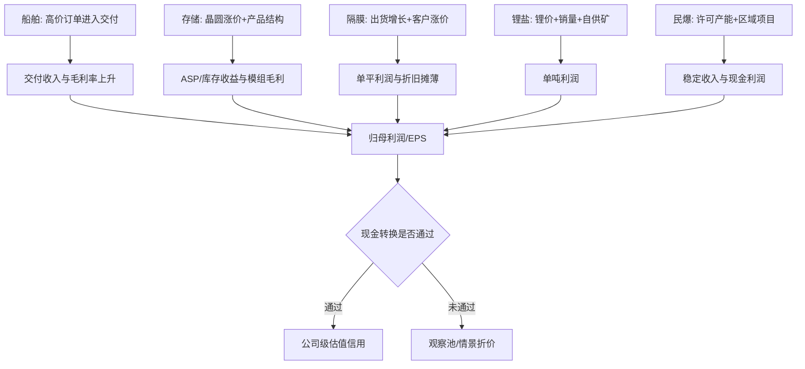

# 经营驱动—收入—利润桥

## 主题层利润池

## 公司级桥接

| 代码 | 收入桥 | 毛利/利润桥 | 已实现证据 | 尚未实现/推断 | 估值动作 |
|---|---|---|---|---|---|
| 600150 | `交付船数 × 单船确认收入` | `收入 × 船型/订单毛利 - 费用 ± 非经常项目` | Q1 毛利 17.48%、归母 48.32 亿元、OCF 81.52 亿元；H1 归母 92--110 亿元 | 华源 2026E 归母 181.98 亿元；H2 需 71.98--89.98 亿元 | 可估值，但并表重述、订单金额缺失扩大折价 |
| 301308 | `bit 出货 × 产品 ASP` | `收入 - 晶圆/主控/封测成本 ± 库存价差 - 费用` | H1 营收 220--250 亿元、归母 92--110 亿元；Q1 毛利 55.53% | 量、ASP、库存收益和客户转量均未拆；国信 111 亿元全年预测早于 H1 预告，失去时点匹配 | 阻断持续性估值；只保留事实锚和敏感性 |
| 002812 | `隔膜出货平米 × 单平售价` | `出货 × 单平利润 - 税费/一次项` | H1 归母 7.36--9.00 亿元；官方确认量增、价稳和毛利提升 | 东吴估计 H1 76--77 亿平、Q2 单平利润 0.15 元、全年 160 亿平+ | 阻断无折价核心估值；同源参数需 haircut |
| 002240 | `锂盐销量 × 实现售价` | `销量 ×（售价-矿/加工/物流）± 套保 - 费用` | H1 归母 10--12 亿元；官方确认量价齐升和印尼产能释放 | 东吴估计全年 12 万吨+、综合单吨利润约 2 万元 | 商品敏感性可用；客户/远期矿山不加分 |
| 002497 | `锂盐销量 × 实现售价 + 民爆/运输收入` | `锂盐吨利润 + 民爆稳定毛利 ± 套保/库存 - 费用` | H1 归母 11--13 亿元；2025 锂销量 6.95 万吨；重大客户合同正常履行；民爆收入 33.16 亿元/毛利率 37.46% | 东吴估计全年锂盐约 12 万吨、Q2 单吨利润 2.6--3.4 万元、民爆利润 5.5--6 亿元 | 条件估值可用；剔除库存收益，民爆单独给稳定分部倍数 |
| 300390 | `锂盐销量 × 实现售价 + 小业务收入` | `销量 ×（售价-矿/加工成本）- 少数股东损益 - 费用` | H1 归母 22--24 亿元；官方确认量价齐升；Q1 毛利 46.99% | 华源假设 13 万吨、18 万元/吨均价、2026E 归母 47.3 亿元 | 商品敏感性可用；CATL 股权关系不加客户溢价 |

## 下一季度验证阈值

| 代码 | 2026Q3 需要看到什么 | 证据性质 | 未达标后的动作 |
|---|---|---|---|
| 600150 | 毛利率约 16% 以上、OCF 维持正值、高价/中高端船继续交付 | 本报告推断，基于 Q1 与华源 2026E 毛利 | 下调交付利润率并撤销高倍数 |
| 301308 | 毛利率约 35% 以上、单季 OCF 转正或显著改善、存货周转改善、至少披露一个产品级量/价指标 | 本报告推断 | 继续 `watchlist only`，不得用 H1 峰值年化 |
| 002812 | 出货约 40 亿平以上、单平利润约 0.15 元、客户涨价兑现、新线良率/OCF不恶化 | 东吴估计 + 本报告现金阈值 | 单平利润低于约 0.12 元或涨价延迟则删除 bull case |
| 002240 | 出货约 3 万吨、综合单吨利润接近 2 万元、印尼爬坡且 OCF 转正 | 东吴估计 | 降低全年销量/自供比例并扩大债务折价 |
| 002497 | 锂盐出货约 3 万吨、剔除库存/套保后单吨利润至少约 2 万元、OCF 转正；民爆利润保持稳定 | 东吴估计 + 本报告推断 | 若利润主要由库存收益驱动或 OCF 持续为负，降级为周期观察 |
| 300390 | 折算销量约 3.25 万吨、毛利率约 35% 以上、OCF 转正、Ogapa 供矿贡献可核验 | 华源估计 + 本报告推断 | 删除自供降本与客户溢价，按纯商品冶炼估值 |

## 2026 年末兑现门槛

| 代码 | 年末经营门槛 | 与“翻倍”叙事的关系 |
|---|---|---|
| 600150 | FY 归母接近华源 181.98 亿元、H2 归母约 72--90 亿元、OCF 为正，订单覆盖仍在约四年 | 证明高价订单持续兑现；若只靠并表同比则不是估值重估 |
| 301308 | 全年 OCF 转正、H2 毛利和利润来源可拆、企业级/嵌入式认证转量可核验 | 未满足前，任何 100% 空间都只是峰值利润/估值双重外推 |
| 002812 | 全年出货接近 160 亿平、涨价完整落地、OCF 覆盖扩产，为 2027 单平 0.20--0.25 元提供订单/良率证据 | 需要从扭亏转为可持续单位经济；否则只够修复，不足以翻倍 |
| 002240 | 全年出货约 12 万吨、FY OCF 转正、印尼利用率和自供比例有公司级数据 | 翻倍必须依赖量价、成本与资产负债表同时改善 |
| 002497 | 全年锂盐出货约 12 万吨、归母接近东吴 30.3 亿元、剔除库存收益后吨利稳定、FY OCF 转正；民爆利润约 5.5--6 亿元 | 民爆给估值底，锂盐给弹性；只有两者均可核验，才可从周期尾部情景升级 |
| 300390 | 全年销量接近华源 13 万吨、归母约 45 亿元以上、FY OCF 转正 | 若利润仅来自锂价而自供/现金未改善，不应给一体化溢价 |

## EPS 与现金流的必要约束

- 归母净利润必须使用同一股本口径；本文件不替代正式 EPS/估值模型。
- Q1/H1 利润不得简单乘四/乘二。600150 有交付节奏，301308 有库存周期，隔膜有涨价和新线爬坡，锂盐有商品价格与套保。
- 301308、002240、002497、300390 Q1 OCF 均为负；其中 002497 FY2025 OCF 亦为负。年末情景若没有营运资金修复，不得把利润全额当作可分配现金。
- 002497 的民爆业务应单独建模：2025 年民爆收入 33.16 亿元、整体毛利率 37.46%，稳定但低增长；不能用锂盐吨利倍数替代。

## 升降级所需证据

- 升级：公司公告或定期报告给出产品级销量、实现价/单平利润、利用率/良率、客户订单履行、库存/套保影响和现金回款。
- 降级：仅有行业价格上涨、券商重复引用同一假设、认证无收入、产能无利用率、利润高增但 OCF/存货持续恶化。

**Chain earnings bridge gate: `CONDITIONAL`。** 600150、002240、002497、300390可进入带限制的公司情景；301308、002812 不得在缺口关闭前进入无条件核心估值池。

