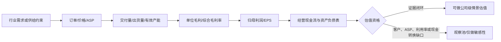

# 经营驱动版行业图谱：四类利润池、四种“翻倍”难题

## 结论先行

本报告不是单一产业链研报。六只深度标的分属船舶制造、存储模组、湿法隔膜、锂盐/锂资源和民爆，唯一可比的不是产品，而是利润从哪里来、能否在 2026 年末前兑现，以及市场是否已经计价。经营驱动证据门槛据此统一为：**价格或订单可见性 → 可交付销量/产能与利用率 → 单位经济性/毛利率 → 归母利润与现金流 → 可进入估值的持续性**。

## 四类利润池

| 利润池 | 深度标的 | 真正经营驱动 | 收益确认前的关键约束 | 当前证据判断 |
|---|---|---|---|---|
| 高价船舶订单交付 | 600150 中国船舶 | 手持订单结构、单船均价、中高端船型占比和生产节拍 | 船台/船坞产能、交付时点、成本管控、集团整合后的可比口径 | 船舶链条闭环完整；订单交付排至 2028--2030 年为券商表述，订单金额与船型级毛利未披露 |
| 存储涨价与产品结构 | 301308 江波龙 | NAND/DRAM 晶圆涨价、模组销量、低成本库存、企业级/嵌入式结构升级 | 上游晶圆供应、库存成本层、下游认证转量、价格回落速度、营运资金 | 利润已实现但单位量价和现金转换未闭环；高利润不等于高持续性 |
| 湿法隔膜供需修复 | 002812 恩捷股份 | 出货平米数、单平售价/利润、湿法产能利用率、客户涨价兑现 | 新线良率、客户验证、应收回款、行业扩产 | 官方仅确认产销量、价格和毛利率改善；160 亿平、90% 利用率、0.15 元/平来自券商估计 |
| 锂盐量价与资源自给 | 002240 盛新锂能；002497 雅化集团；300390 天华新能 | 锂盐销量、实现售价、精矿/自有矿成本、套保、资源自给率 | 锂价回撤、矿山/冶炼爬坡、营运资金、项目资本开支 | 三家公司 H1 官方预告均确认量价齐升；雅化另有客户合同和实际销量披露，经营证据最完整 |
| 牌照型民爆与矿服 | 002497 雅化集团 | 炸药/雷管许可产能、区域项目、爆破服务与矿服 | 安全监管、区域需求、项目回款和许可产能实际利用率 | FY2025 官方披露民爆收入 33.16 亿元、整体毛利率 37.46%，构成稳定利润底盘而非高增长引擎 |

## 行业价格/订单不能直接等于公司收入

- 船舶：新造船价格指数是行业代理变量。公司收入取决于具体订单进入交付、完工百分比和合并口径；不能把行业指数涨幅直接乘到收入。
- 存储：晶圆价格上涨同时提高售价与补库成本。只有库存成本层、bit 出货、产品结构和客户转价共同披露，才能判断毛利是否可持续。
- 隔膜：名义产能不是销量。设备、良率、客户验证和稼动率决定有效产能；“供需紧张”不能替代公司单平盈利。
- 锂盐：碳酸锂现货价只是价格代理。氢氧化锂/碳酸锂结构、长协、套保、自供矿比例和权益比例都会改变实际单位利润。
- 民爆：许可产能不是收入。区域市场、爆破项目、产品利用率、安全资质和回款共同决定稳定利润；不能把新增许可产能直接转为销量。

## 2026 年末前的持续性比较

| 维度 | 船舶 | 存储模组 | 隔膜 | 锂盐/资源 |
|---|---|---|---|---|
| 收益周期 | 多年订单、交付节奏较慢 | 季度级价格与库存周期 | 半年到年度的供需/验证周期 | 商品价格周期叠加项目爬坡 |
| 最易造成假增长的环节 | 并表与历史口径重述 | 低价库存一次性重估/释放 | 低基数扭亏和券商单平利润外推 | 锂价反弹、套保/库存收益和减值反转；雅化民爆稳定利润被误当锂盐高增长 |
| 最关键现金证据 | 合同负债、回款、经营现金流 | 存货、应付、经营现金流 | 应收、库存、资本开支、经营现金流 | 存货/预付、套保、资本开支、经营现金流 |
| 年末前最强验证 | 高价船交付与毛利率 | Q3 毛利率和现金流 | 涨价落地、单平利润与新线良率 | Q3 锂价、销量、自供比例和现金流 |

## “假翻倍空间”控制组

### 控股/持股平台类

控股平台或持有大额金融股权的公司，模型常用 `持股市值 + 经营资产 - 净负债` 得到很高 NAV，再把长期折价一次性收敛，形成表面翻倍空间。该路径有四个常见错误：持股不可自由出售、税费与少数股东未扣、投资收益不等于可分配现金、治理与资本配置导致折价长期存在。因此，只有明确资产处置/分红/回购等折价收敛事件，才可给催化权重；权益法或公允价值收益不得套用成长股 PE。

### 拥挤的 AI 硬件类

600183 与 002916 按研究简报被保留为拥挤度控制，不是默认受益股。AI 需求正确也可能出现估值错误：当前股价可能已计入 2027 年产能与高端产品占比，所谓翻倍还需要“盈利上修 + 估值再扩张”同时发生；若客户、订单、良率和产品 ASP 未形成公司级证据，需求锚只能解释主题，不能解释收入。对这类名字，应以当前价格隐含盈利反推为主，禁止把行业 TAM 再乘一次高 PE。

## 证据边界与时点

- 公司级 H1 预告来自 `workspace/research/low-position-capital-layout-20260711/refresh-20260715/data/raw_a_share_h1_2026_preview_20260715.json`，上游登记为 Eastmoney/Akshare 汇总的公司公告数据，属于未审计预告；原始公告 URL 未在登记表捕获，不能提供分部、客户或 ASP 证明。
- Q1/FY2025 财务来自同案例 `data/financials/<ticker>_20260715.json`；是结构化财务包，非本案例内的原始公告影像。
- 经营颗粒度主要来自归档的原始券商 PDF/文本，证据等级低于公司公告，所有预测均保持“券商估计”措辞。
- 本文件不使用 2026-07-22 股价决定经营证据；价格与估值应由 `data/verified_market_data.md` 和正式估值模型独立承接。
