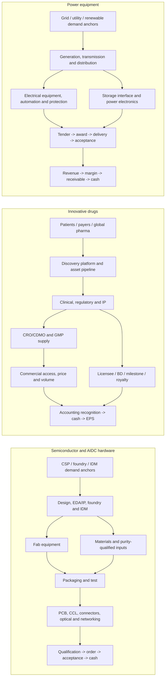

# Full-Chain Taxonomy

**Case:** `a-share-rotation-semi-healthcare-power-20260726`  
**Cut-off:** 2026-07-26  
**Supply-chain gate:** `CONDITIONAL` — all required cross-sector blocks are mapped, but no provisional company has the relationship-and-economics package required for `eligible`.

The taxonomy begins with demand and ends with revenue recognition and cash. An index methodology, policy statistic, sector report, overseas peer, named counterparty or demand anchor is never evidence that a Chinese listed supplier has a customer, order, revenue or margin benefit.

| Theme | Mandatory block | Economic hand-off | Test companies / status | Evidence boundary |
|---|---|---|---|---|
| Semiconductor | demand anchors; design/foundry/IDM; equipment; materials; packaging/test; PCB/CCL/connectors; optical/networking; overseas/private nodes | qualified process/product → order → shipment/acceptance → revenue, margin and cash | 北方华创 (002371.SZ), 中微公司 (688012.SH): `satellite_watch` | SRC-01 and BR-01/03 are sector/universe context. No retained issuer product-to-fab/customer, order, ASP, utilization or margin bridge. |
| Innovative drugs | demand/access; discovery/platform; clinical/regulatory/IP; CRO/CDMO; commercial portfolio; BD/licensee; global peers | asset/rights → trial/approval → contract terms → cash/recognition/royalty → costs/tax/shares → EPS | 恒瑞医药 (600276.SH), 百奥赛图 (688506.SH): `satellite_watch` | SRC-05 supports only an explicitly disclosed Hengrui–GSK counterparty/terms relationship. It does not close recognition, probability, cost or EPS. No retained primary evidence supports a 百奥赛图 relationship. |
| Power equipment | grid/utility demand; T&D; automation/protection; storage interfaces; power electronics; tender/order-to-cash; overseas/private/low-purity nodes | tender → award → executable order → delivery → acceptance → revenue → margin → receivable/cash | 思源电气 (002028.SZ), 国电南瑞 (600406.SH): `satellite_watch` | SRC-04/07/08/23/24 provide index, policy or system-demand context only. No supplier tender/award/order/economics record is retained. |

## Taxonomy controls

- `data/full_chain_universe_20260726.json` contains listed, overseas, private, demand-anchor, low-purity and unavailable nodes. Missing blocks remain visible as gaps.
- The only adopted named commercial counterpart is **GSK for Hengrui’s disclosed HRS-9821 agreement**. It does not establish current revenue, profit or repeatability.
- No test company is a direct beneficiary for valuation purposes. `eligible` requires company-level product/process exposure, relationship/certification/order evidence, and a value-chain economics bridge. All three are required.
- The valuation consequence of every missing field is recorded in `analysis/coverage_gap_matrix.md` and the two audit JSON files.
