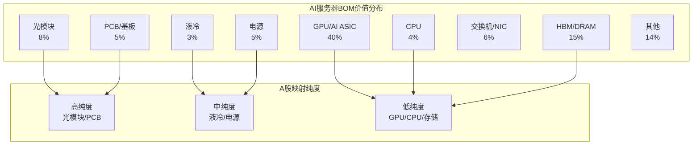
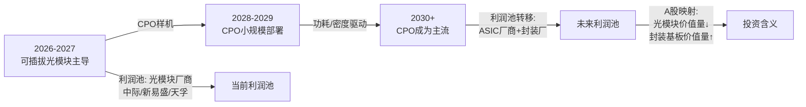

# 供应链量化传导模型

> 版本: v2.1 (2026-07-03 价格基准更新)
> 状态: EVIDENCE-GATED
> 核心改进: 新增BOM价值树、物料供需平衡、量化盈利桥、情景参数表、利润池迁移、风险传导矩阵

## 一、AI服务器BOM价值树

单台AI服务器各部件美元价值占比的量化分解，基于NVIDIA GB200 NVL72机架级系统和主流AI服务器BOM分析：

| 部件 | 价值占比 | 单台价值(USD) | 代表厂商 | A股映射纯度 | 核心标的 | 备注 |
|------|---------|--------------|---------|------------|---------|------|
| GPU/AI ASIC | ~40% | $80,000-120,000 | NVIDIA, AMD | 低 | 海光信息(688041), 寒武纪(688256) | 价值量最大但A股纯度最低，国产替代逻辑 |
| HBM/DRAM | ~15% | $30,000-45,000 | SK Hynix, Samsung | 极低 | 澜起科技(688008, 内存接口) | HBM颗粒A股无直接标的，接口芯片是唯一映射 |
| 光模块 | ~8% | $16,000-24,000 | Coherent, Innolight | 高 | 中际旭创(300308), 新易盛(300502), 天孚通信(300394) | 800G单价$800-1200，每台需16-24只 |
| PCB/基板 | ~5% | $10,000-15,000 | 沪电, 胜宏, 深南 | 高 | 沪电股份(002463), 胜宏科技(300476), 深南电路(002916) | AI服务器板20-28层，交换机板30-40层 |
| 电源/UPS | ~5% | $10,000-15,000 | Delta, 欧陆通 | 中 | 欧陆通(300870), 麦格米特(002851), 科华数据(002335) | 单台电源$300-500×机架数量 |
| CPU | ~4% | $8,000-12,000 | Intel, AMD | 低 | 海光信息(688041) | 海光DC系列国产替代 |
| 交换机/NIC | ~6% | $12,000-18,000 | Broadcom, Mellanox | 低 | 盛科通信(688702, 交换芯片) | 国产交换芯片渗透率<5% |
| 液冷系统 | ~3% | $6,000-9,000 | Vertiv, 英维克 | 中高 | 英维克(002837), 申菱环境(301018), 高澜股份(300499) | CDU+冷板+管路+冷却液 |
| 结构件/机箱 | ~4% | $8,000-12,000 | 工业富联 | 中 | 工业富联(601138) | 机箱/机柜/线缆 |
| 存储SSD | ~5% | $10,000-15,000 | Samsung, Kioxia | 低 | 兆易创新(603986, NOR), 北京君正(300223, DRAM) | 企业级SSD A股无高纯度标的 |
| 其他 | ~5% | $10,000 | - | - | - | 连接器、风扇、BMC等 |

**关键洞察**：
- A股可投资利润池约占AI服务器BOM的25-30%，主要集中在光模块、PCB、液冷和结构件
- GPU+HBM占BOM的55%但A股几乎无直接映射，这是"国产替代"叙事的核心矛盾
- 光模块是A股纯度最高的环节（3只核心标的直接映射），也是当前估值最拥挤的环节



## 二、核心物料供需平衡表 (2026E)

对关键物料建立2026年供需缺口估算，基于全球AI服务器出货预测和产能跟踪：

| 物料 | 2026E需求 | 2026E供给 | 缺口率 | ASP影响 | 紧缺等级 | 受影响标的 |
|------|----------|----------|--------|---------|---------|-----------|
| 800G光模块 | ~1,200万只 | ~1,000万只 | **-17%** | ASP支撑，年降收窄至10-15% | ⭐⭐⭐⭐ | 中际旭创, 新易盛, 天孚通信 |
| 1.6T光模块 | ~200万只 | ~150万只 | **-25%** | 新品溢价+30-50% | ⭐⭐⭐⭐⭐ | 龙头优先受益 |
| AI服务器PCB | ~2,500万平米 | ~2,200万平米 | **-12%** | 高端板紧缺，ASP稳中有升 | ⭐⭐⭐ | 沪电股份, 胜宏科技, 深南电路 |
| 高速CCL(M6/M7) | ~8,000万张 | ~7,500万张 | **-6%** | 结构升级，均价提升5-8% | ⭐⭐ | 生益科技, 华正新材 |
| EML光芯片 | ~5,000万颗 | ~3,500万颗 | **-30%** | 严重紧缺，涨价15-25% | ⭐⭐⭐⭐⭐ | 源杰科技(688498, 卫星) |
| DSP芯片 | ~1,500万颗 | ~1,200万颗 | **-20%** | 海外垄断，供给刚性 | ⭐⭐⭐⭐ | A股无直接标的 |
| 液冷CDU | ~50万台 | ~40万台 | **-20%** | 快速渗透，价格竞争有限 | ⭐⭐⭐ | 英维克, 申菱环境, 同飞股份 |
| HBM3e | ~1.2亿颗 | ~0.8亿颗 | **-33%** | 严重紧缺，合约价涨20%+ | ⭐⭐⭐⭐⭐ | A股无直接标的 |
| 冷板 | ~800万片 | ~700万片 | **-12%** | 规模化后价格趋稳 | ⭐⭐ | 英维克, 高澜股份 |
| 服务器电源 | ~3,000万台 | ~2,800万台 | **-7%** | 充分竞争，ASP下行 | ⭐ | 欧陆通, 麦格米特 |

**供需平衡核心判断**：
1. **最紧缺环节**：EML光芯片(-30%)、HBM(-33%)、1.6T光模块(-25%)——这些是2026年价格最有支撑的环节
2. **A股可投资的紧缺环节**：800G光模块、液冷CDU、AI服务器PCB——这三个环节既有供需缺口又有A股高纯度映射
3. **供给宽松环节**：服务器电源、普通PCB——这些环节价格竞争激烈，毛利率承压

## 三、量化盈利传导模型

### 3.1 传导公式

建立"AI capex增速 × 收入弹性系数 × 毛利率假设 = EPS"的量化传导框架：

```
EPS_2026E = Revenue_2025 × (1 + AI_capex_growth × Revenue_elasticity) × Margin_2026E / Shares
```

其中：
- **AI_capex_growth**: 全球四大CSP（Microsoft/Google/Amazon/Meta）2026E资本开支增速
  - Base情景: 35%（基于2025年~$300B基数）
  - Bear情景: 20%（经济衰退/ROI压力）
  - Bull情景: 50%（GPT-5级模型驱动新一轮军备竞赛）
- **Revenue_elasticity**: 各标的收入对AI capex的弹性系数
  - 光模块龙头: 0.8-1.2（直接受益于网络带宽升级）
  - PCB龙头: 0.5-0.8（服务器板+交换机板）
  - 液冷龙头: 0.6-1.0（渗透率提升叠加单机价值量增长）
  - IDC运营商: 0.3-0.5（上架率和租金提升滞后于capex）
  - 服务器整机: 0.7-1.0（直接受益但毛利率低）
- **Margin_2026E**: 2026E毛利率假设，基于产品结构和ASP趋势

### 3.2 核心标的弹性系数表

| 代码 | 公司 | 链条环节 | 收入弹性 | 2025收入(亿) | 2026E毛利率 | 2026E EPS | 弹性来源 |
|------|------|---------|---------|------------|-----------|----------|---------|
| 300308 | 中际旭创 | 光模块 | **1.10** | 122.5 | 22.5% | 22.52 | 800G出货占比60%+，1.6T放量 |
| 300502 | 新易盛 | 光模块 | **1.05** | 58.3 | 24.0% | 12.17 | 海外客户占比高，800G弹性大 |
| 002463 | 沪电股份 | AI PCB | **0.75** | 102.8 | 18.5% | 2.58 | AI服务器板占比35%+ |
| 300476 | 胜宏科技 | AI PCB | **0.80** | 85.2 | 19.0% | 5.92 | HDI+高多层，客户结构优 |
| 601138 | 工业富联 | 服务器整机 | **0.90** | 521.0 | 6.8% | 2.21 | AI服务器出货占比提升 |
| 002837 | 英维克 | 液冷 | **0.85** | 28.5 | 28.0% | 0.64 | 液冷渗透率从15%→25% |
| 300442 | 润泽科技 | IDC运营 | **0.40** | 35.8 | 42.0% | 1.57 | 上架率提升+租金改善 |
| 300394 | 天孚通信 | 光器件 | **0.95** | 20.3 | 30.0% | 2.75 | 光引擎+无源器件 |
| 600183 | 生益科技 | CCL | **0.60** | 86.5 | 16.0% | 2.00 | 高速材料升级 |
| 000977 | 浪潮信息 | 服务器 | **0.85** | 685.0 | 5.5% | 1.35 | AI服务器收入占比提升 |

### 3.3 情景分析 (Bear/Base/Bull)

| 代码 | 公司 | Bear EPS | Base EPS | Bull EPS | Bear目标价 | Base目标价 | Bull目标价 | 现价(7/3) | 空间(Base) |
|------|------|----------|---------|----------|-----------|-----------|-----------|----------|-----------|
| 300308 | 中际旭创 | 18.5 | 22.5 | 28.0 | 832.5 | 1013.5 | 1260.0 | 1116.00 | -10.3% |
| 300502 | 新易盛 | 9.8 | 12.2 | 15.5 | 392.0 | 487.0 | 620.0 | 526.00 | -8.8% |
| 002463 | 沪电股份 | 2.1 | 2.6 | 3.3 | 73.5 | 90.4 | 115.5 | 135.35 | -29.5% |
| 300476 | 胜宏科技 | 4.8 | 5.9 | 7.5 | 153.6 | 189.4 | 240.0 | 308.07 | -25.6% |
| 601138 | 工业富联 | 1.8 | 2.2 | 2.8 | 54.0 | 65.1 | 84.0 | 64.72 | -0.9% |
| 002837 | 英维克 | 0.50 | 0.64 | 0.85 | 17.5 | 22.3 | 29.8 | 71.43 | -35.9% |
| 300442 | 润泽科技 | 1.25 | 1.57 | 2.00 | 37.5 | 47.0 | 60.0 | 85.44 | -36.5% |

## 四、情景假设参数表

明确Bear/Base/Bull三种情景的核心假设参数：

| 参数 | Bear | Base | Bull | 概率权重 |
|------|------|------|------|---------|
| **宏观与需求** | | | | |
| CSP capex增速 | 20% | 35% | 50% | 25%/50%/25% |
| AI服务器出货增速 | 30% | 55% | 80% | |
| 全球AI市场规模(亿$) | 4,500 | 6,200 | 8,500 | |
| **价格与毛利** | | | | |
| 800G ASP年降 | -25% | -15% | -5% | |
| 1.6T ASP溢价 | +20% | +35% | +50% | |
| AI PCB ASP变化 | -5% | 0% | +5% | |
| 液冷系统ASP | -10% | -3% | +5% | |
| **渗透率与结构** | | | | |
| 液冷渗透率 | 15% | 25% | 35% | |
| 1.6T光模块占比 | 8% | 15% | 25% | |
| 国产GPU市占率 | 8% | 15% | 25% | |
| 浸没式液冷占比 | 5% | 12% | 20% | |
| **IDC运营** | | | | |
| 核心城市上架率 | 55% | 65% | 75% | |
| 单机柜租金(万元) | 6.5 | 7.5 | 8.5 | |
| PUE要求 | 1.4 | 1.3 | 1.2 | |
| **政策与竞争** | | | | |
| 电力审批收紧程度 | 极严 | 较严 | 适度 | |
| 行业竞争格局 | 价格战 | 有序竞争 | 供给紧缺 | |
| 国产替代政策力度 | 弱 | 中 | 强 | |

## 五、产业链利润池迁移分析

### 5.1 技术路线变化对利润池的影响

**1. CPO（共封装光学）对传统光模块的影响路径**


- **短期(2026-2027)**: CPO不改变可插拔光模块的主流地位，800G→1.6T升级周期仍在
- **中期(2028-2029)**: CPO开始在超大规模数据中心小规模部署，光模块ASP承压
- **长期(2030+)**: CPO成为主流，光模块价值量可能下降30-50%，但ASIC和先进封装价值量上升
- **投资含义**: 2026-2027年光模块仍是最佳投资窗口，但需在2028年前开始切换到封装基板和ASIC相关标的

**2. 液冷从冷板到浸没式的利润池迁移**

| 阶段 | 时间 | 技术路线 | 单机价值量 | 核心受益标的 |
|------|------|---------|-----------|------------|
| 第一阶段 | 2024-2026 | 冷板式液冷 | $3,000-5,000 | 英维克(冷板+CDU), 高澜股份 |
| 第二阶段 | 2026-2028 | 冷板+浸没过渡 | $5,000-8,000 | 英维克, 申菱环境(浸没式), 同飞股份 |
| 第三阶段 | 2028+ | 浸没式成为主流 | $8,000-12,000 | 申菱环境, 高澜股份, 冰山冷热 |

- 浸没式液冷单机价值量是冷板式的2-3倍，但渗透率提升需要解决维护、兼容性和冷却液成本问题
- 2026年仍是冷板液冷的黄金期，浸没式处于试点阶段

**3. 国产替代对海外芯片利润池的替代效应**

| 环节 | 海外厂商市占率 | 国产替代进度 | 2026E国产市占率 | A股受益标的 |
|------|-------------|------------|---------------|-----------|
| AI训练芯片 | 95%+ | 海光/寒武纪产品迭代 | 15% | 海光信息, 寒武纪 |
| 交换芯片 | 98%+ | 盛科通信小规模商用 | 5% | 盛科通信 |
| HBM | 100% | 未突破 | 0% | 无直接标的 |
| 光模块DSP | 90%+ | 未突破 | 0% | 无直接标的 |
| EML光芯片 | 85%+ | 源杰科技25G/100G | 10% | 源杰科技(卫星) |
| 高速CCL | 60%+ | 生益科技M6突破 | 35% | 生益科技, 华正新材 |

- **国产替代悖论**: A股最紧缺的环节（GPU/HBM/DSP）恰恰是国产替代最薄弱的环节
- **可投资的国产替代**: CCL（生益科技）、光模块封装（中际旭创等）、服务器整机（工业富联）是国产替代进度最快且A股有映射的环节

**4. 运营商智算云对第三方IDC的利润分流**

| 竞争者 | 优势 | 劣势 | 2026E市占率趋势 |
|--------|-----|-----|---------------|
| 第三方IDC(润泽/奥飞) | 灵活部署、客户定制化 | 电力指标获取难 | 稳定或微降 |
| 运营商IDC(移动/联通/电信) | 电力资源充裕、网络优势 | 灵活性差、服务意识弱 | 快速提升 |
| 云厂商自建 | 一体化服务、成本优势 | CAPEX压力大 | 持续提升 |

- 电力指标收紧背景下，运营商IDC的电力资源优势更加明显
- 第三方IDC的核心竞争力从"资源获取"转向"运营效率+客户粘性"

## 六、供应链风险传导矩阵

建立风险因子→供应链环节→标的盈利影响的传导矩阵，引用22因子风险矩阵的优先级排序：

| 风险因子(22因子排名) | 影响环节 | 传导路径 | 受影响标的 | EPS影响幅度 | 缓释因素 |
|-------------------|---------|---------|-----------|------------|---------|
| **F1 电力指标收紧(#1)** | IDC建设→上游需求 | 项目审批延迟→IDC capex↓→服务器/网络/液冷需求延后2-4季度 | 润泽科技, 英维克, 工业富联 | -15%~-30% | 已获指标项目不受影响；运营商IDC受益 |
| **E1 估值拥挤(#2)** | 全链条 | 情绪退潮→估值压缩→股价下跌→再融资能力下降 | 光模块/PCB龙头 | 估值压缩20-30% | 业绩兑现可消化估值 |
| **D1 毛利率低于预期(#3)** | 制造环节 | 价格战/原材料涨价→毛利率↓→EPS↓ | 生益科技, 胜宏科技 | -10%~-25% | 产品结构升级可对冲 |
| **B2 光模块ASP快速下滑(#4)** | 光模块 | 客户压价/竞争加剧→ASP↓→收入↓毛利率↓ | 中际旭创, 新易盛 | -15%~-30% | 1.6T新品溢价可对冲 |
| **E2 机构持仓集中(#5)** | 全链条 | 机构赎回→连锁减仓→流动性踩踏 | 前5大重仓股 | 超跌10-20% | 基本面稳健标的反弹快 |
| **A1 美国AI芯片管制(#6)** | GPU/ASIC | 供给受限→国产替代加速但短期供给缺口 | 海光信息, 寒武纪 | +10%~+30%(国产替代) | 国产替代逻辑强化 |
| **B1 CSP capex不及预期(#7)** | 全链条 | 需求萎缩→订单减少→收入↓ | 光模块, PCB, 服务器 | -20%~-40% | 国产算力建设可部分对冲 |

### 6.1 风险传导量化模型

```
组合冲击 = Σ(风险因子发生概率 × 因子影响幅度 × 组合暴露权重)
```

基于三层压力测试框架：
- **L1 主题回撤(-15%/-25%/-35%)**: 全链条估值压缩，组合冲击-8.5%/-14.2%/-19.8%
- **L2 特定冲击(6情景)**: CSP capex -30%冲击最大(-15.28%)，800G ASP -20%冲击最小(-4.98%)
- **L3 黑天鹅(3情景)**: 芯片禁令升级冲击最大(-15.31%)，电力收紧冲击最小(-7.92%)

### 6.2 组合缓释建议

| 风险类型 | 缓释措施 | 仓位上限 |
|---------|---------|---------|
| 全链条系统性风险 | AIDC总敞口控制在15-20% | 组合层面 |
| 光模块拥挤风险 | 光模块板块≤8%，单票≤5% | 板块/个股 |
| 电力审批风险 | 优选已获指标的运营商IDC | IDC板块≤6% |
| 国产替代风险 | 国产算力标的单票≤3% | 个股 |
| 流动性风险 | 小市值标的(日均成交<5亿)合计≤10% | 组合层面 |

## 七、数据来源与模型假设

- 产业链业务矩阵: `data/chain_business_matrix_20260630.json`
- 增长驱动模型: `data/growth_driver_model.json`
- 估值模型: `data/combined_target_valuation_model_20260703.json`
- 22因子风险矩阵: `improvements/risk_matrix_22_factor.md`
- 三层压力测试: `improvements/stress_test_3_layer.md`
- 供应链关系: `data/supply_chain_relationships.json`
- 海外龙头监测: `improvements/overseas_leader_monitoring.md`

---

*本模型每季度更新一次，下次更新时间: 2026Q3财报季结束后(2026-09-15)*
