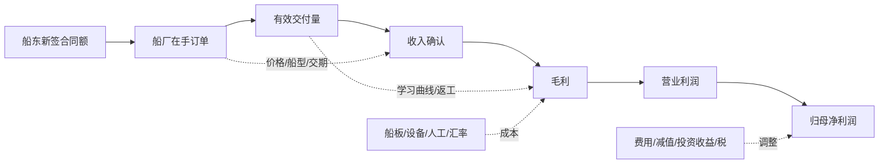

# 从订单到盈利：证据桥与验证阈值

## 主题层利润池桥

行业层可以写成：

\[
\text{船厂收入}_t = \sum_i \text{合同价}_i \times \text{当期履约确认比例}_{i,t} + \text{修船及装备收入}_t
\]

\[
\text{毛利}_t = \text{收入}_t \times \left(\text{基准毛利率}+\text{签价/船型}+\text{效率}-\text{材料/设备}-\text{延期/质保}-\text{汇率影响}\right)
\]

这是一套驱动框架，不是船型级预测；公司未披露逐船合同价、完工百分比和成本预算，不能用载重吨简单乘船价生成收入。

## 600150 订单到盈利桥

| 环节 | 2025/最新观察 | 对下一阶段盈利的含义 | 证据边界 |
|---|---|---|---|
| 新签订单 | 民船/海工 237 艘、3,050.67 万 DWT、1,758.36 亿元；>80%中高端、约 50%绿色 | 补充 2028 年前后工作量并改善结构 | “中高端/绿色”定义及船型金额未披露 |
| 在手订单 | 652 艘、7,997.30 万 DWT、4,674.51 亿元 | 相当于 2025 收入约 3.08 倍，收入可见性强 | 不能等同于无风险收入；排程和撤单条款不披露 |
| 交付来源 | 管理层称 2025 年交付主要为 2022—2023 年订单，2026 年计划交付主要为 2023—2024 年订单 | 高价订单进入交付，是毛利修复的主线 | 没有按年度量化高价订单占比 |
| 交付量 | 2025 年 161 艘/1,367.75 万 DWT；2026 计划 168 艘/1,650 万 DWT | 载重吨计划增幅高于艘数，船型/大型化可能抬升收入 | DWT 不能替代 CGT 或价值量 |
| 收入 | 2025 年 1,519.78 亿元；2026 计划 >1,650 亿元 | 计划口径至少约 8.6%增长 | 计划不是盈利承诺 |
| 毛利 | 造船/修船/海工 2025 毛利率 11.72%，同比 +2.94pct | 价格、结构和效率已开始兑现 | 说明会问题中出现的“17.48%”只是投资者提问前提，公司答复未明确确认，不采纳为披露事实 |
| 成本 | 钢材和外购设备约占成本 65%；设备价格上升 | 高船价并非全额转化为毛利 | 分项成本和锁价条款未披露 |
| 营运资金 | 存货 749.21 亿元、合同资产 179.78 亿元、合同负债 1,522.14 亿元；OCF 77.67 亿元 | 预付款提供融资，但生产爬坡占用现金 | 需结合交付与合同资产结转观察 |
| 业绩验证 | 2026Q1 收入 433.12 亿元、归母净利 48.32 亿元；H1 预告归母 92亿—110亿元 | 上半年利润兑现强 | H1 为未经审计预告，最终数和非经常项需中报确认 |

## 2025 收入与利润锚点

| 项目 | 数值 | 用途 |
|---|---:|---|
| 营业收入 | 1,519.78 亿元 | 合并口径基准 |
| 造船/修船/海工收入 | 1,312.79 亿元 | 核心业务基准 |
| 装备等收入 | 186.17 亿元 | 非船厂总装业务基准 |
| 归母净利润 | 78.48 亿元 | 盈利基准 |
| 主营业务毛利率 | 12.27% | 综合毛利锚 |
| 造船/修船/海工毛利率 | 11.72% | 订单兑现毛利锚 |
| 经营现金流 | 77.67 亿元 | 利润现金化锚 |
| 资产负债率 | 64.42% | 资产负债表约束 |

## 子公司经营观察

单位：亿元。下表仅作经营质量与整合观察，不做独立 SOTP，因为内部交易、分红、船型组合和净资产归属需进一步统一。

| 子公司 | 2025 收入 | 2025 净利润 | 净利率代理 | 解释 |
|---|---:|---:|---:|---|
| 江南造船 | 421.50 | 9.53 | 2.3% | 高端船能力强，但利润受项目结构与交付阶段影响 |
| 大连造船 | 321.45 | 13.24 | 4.1% | 合并后重要油轮/高端商船与海工平台 |
| 外高桥造船 | 164.69 | 25.04 | 15.2% | 2025 盈利能力突出；不可直接外推至全公司或永久化 |
| 广船国际 | 201.88 | 20.01 | 9.9% | PCTC/油化船等结构较好 |
| 中船澄西 | 87.22 | 8.65 | 9.9% | 中型商船与修船业务 |
| 北海造船 | 116.52 | 16.65 | 14.3% | 大型散货/VLOC 等；需验证周期持续性 |

## 下一季度/中报验证阈值

| 指标 | 正向阈值 | 降级触发器 | 所需证据 |
|---|---|---|---|
| 2026H1 归母净利润 | 最终值落在 92亿—110亿元预告区间，扣非 90亿—108亿元 | 低于区间、重大非经常项或追溯调整 | 2026 半年报 |
| 年度收入进度 | 对 >1,650 亿元计划保持合理进度，且造船主业增长为主 | 交付延期导致收入明显落后 | 半年报/季度经营公告 |
| 交付 | 向 168 艘/1,650 万 DWT 计划推进 | 大型船延期、关键设备短缺、客户融资失败 | 交付公告、经营数据 |
| 毛利 | 造船/修船/海工毛利率不逆转 2025 年改善趋势 | 设备涨价、返工、低价旧单或质保导致明显回落 | 半年报分行业毛利与成本说明 |
| 订单质量 | 在手合同额维持高位，新签结构不显著降级 | 撤单、延期、船价下行或低毛利船型占比上升 | 订单/在手经营公告 |
| 现金转换 | 合同负债与交付匹配，经营现金流不持续显著弱于利润 | 存货/合同资产持续快于收入，OCF 大幅恶化 | 现金流量表和营运资金附注 |
| 成本 | 设备与钢材涨价可由签价、效率和采购管理吸收 | 外购设备/关联采购涨幅侵蚀毛利 | 成本分项、采购和关联交易附注 |
| 整合 | 七家主要船厂交付和管理协同不出现明显中断 | 重组整合导致排产、治理或关联交易问题 | 公司治理、关联交易及经营说明 |

## 估值信用升级/降级

- **升级**：披露船型/年度交付排程、船型合同额或更清晰的高价订单兑现节奏；毛利与经营现金流同步改善；重大订单明确归属上市子公司。
- **降级**：集团项目被证实主要落在上市体外；交付延期、合同资产/存货积压、客户违约或设备成本侵蚀；H1 最终业绩低于预告。
- **始终不纳入**：未披露的军品利润、沪东中华 LNG 订单、未分配的集团合作额、仅由投资者提问提出而管理层未确认的数据。
