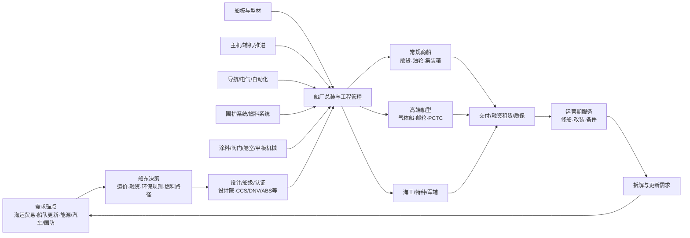

# 造船全链条分类

## 全链条图

## 分层定义与研究要求

| 链条区块 | 子环节 | 经济功能 | 核心量化指标 | 对 600150 的相关性 | 当前证据状态 |
|---|---|---|---|---|---|
| 需求锚点 | 海运贸易、运价、船队年龄、能源与汽车贸易 | 决定船东回报与更新意愿 | 吨海里、运价、拆船、船龄、订单/船队比 | 间接；不能证明公司订单 | 行业官方/数据库可得 |
| 规则与政策 | IMO 碳规则、船级规范、贸易与港口政策 | 改变技术规格和相对成本 | 生效日、适用船型、燃料强度、收费规则 | 影响绿色船需求与地域选择 | IMO 规则未最终生效；USTR 行动暂停 |
| 船东与融资 | 班轮、油运、散运、能源企业、租赁与出口信贷 | 形成订单、首付款和交付融资 | 资本开支、融资成本、预付款比例、撤单 | 直接决定订单与合同负债 | 单客户合同条款多数未披露 |
| 设计/认证 | 船舶设计院、船级社、核心系统许可 | 形成技术与客户准入门槛 | 型式认可、船级、实船业绩、许可费 | 高端船型关键 | 项目级清单 not disclosed |
| 原材料 | 船板、型材、有色金属、涂料 | 影响直接材料成本 | 价格、采购周期、规格、库存 | 公司钢材和外购设备合计约成本 65% | 总体占比可得，供应商/传导条款不足 |
| 动力与推进 | 主机、辅机、轴系、螺旋桨、阀门 | 决定能效、可靠性与单船价值 | 功率、燃料适配、认证、交期 | 合并范围有部分设备能力；中国动力为参股 | 并表与参股边界可得，产品利润不披露 |
| 航电与自动化 | 导航、通信、电气、自动化 | 高价值设备与系统集成 | 国产率、认证、故障率、交期 | 影响交付和成本 | 供应商与价值量 not disclosed |
| 特种系统 | LNG 围护、双燃料、邮轮舱室/酒店、海工模块 | 决定高端船型门槛 | 许可、国产率、单船价值、实绩 | 高端产品结构改善关键 | 邮轮国产率有披露，其余项目级缺口 |
| 船厂总装 | 船台/船坞、分段、总装、调试、项目管理 | 行业主要收入确认与风险承担环节 | 产能、利用率、周期、交付、返工 | 600150 核心 | 订单/交付/在手可得；精确产能利用率不披露 |
| 产品层 | 散货、油轮、集装箱、气体、PCTC、邮轮、海工、军辅 | 船型决定价格、周期和毛利 | 艘数、DWT/CGT、合同额、毛利 | 直接 | 总体订单和船型数量可得，船型金额/利润不足 |
| 交付与服务 | 质保、修船、改装、备件 | 平滑周期、带来后市场收入 | 修理艘数、订单、坞期、质保损失 | 600150 有修船和设备业务 | 总额可得，单项目盈利不披露 |
| 拆解与更新 | 老旧船拆解、环保更新 | 闭环形成替换需求 | 拆船量、平均船龄、钢价 | 需求锚点 | 与公司订单映射 not found |

## 600150 经营节点

| 节点 | 主要产品/能力 | 上市口径 |
|---|---|---|
| 江南造船 | 大型/超大型集装箱船、LPG/氨/乙烷/乙烯/LNG 等气体船、PCTC、特种船 | 并表主要子公司 |
| 大连造船 | VLCC/油轮、集装箱、LNG、散货/VLOC、化学品、海工、军品 | 2025 年吸收合并后并表 |
| 外高桥造船 | 大型邮轮、散货/VLOC、集装箱、油轮、PCTC、FPSO/平台 | 并表主要子公司 |
| 广船国际 | 油轮/化学品/Aframax、PCTC、客滚、半潜、科研/军辅 | 并表主要子公司 |
| 武昌造船 | 公务/科研、化学品/油轮、支线集装箱、多用途、特种、海工 | 2025 年吸收合并后并表 |
| 中船澄西 | 中型散货、支线集装箱、MR 油轮、特种运输、修船 | 并表主要子公司 |
| 北海造船 | 大型散货/VLOC、VLCC、木屑、集装箱、养殖、修船 | 2025 年吸收合并后并表 |
| 装备单位 | 推进、阀门、材料、重工装备等 | 部分并表；需逐实体核实产品收入 |
| 中国动力 | 综合动力系统 | 600150 持有约 20.19%权益，参股而非并表 |
| 沪东中华 | LNG 船等 | CSSC group 上市体外，不属于上述 600150 主要船厂范围 |

## 分类原则

- 只有同时具备上市公司产品/工艺暴露、订单或客户/认证证据、以及可解释收入和利润的经济性证据，才进入核心估值池。
- 需求锚点、集团姐妹单位和上游概念股均保留在全链宇宙，但不得分享核心公司的订单或估值。
- 不能确认的供应商、客户、技术许可和产能利用率用 `not disclosed` 或 `not found`，不以行业常识补齐。

来源：600150 2025 年年报及重组报告；行业边界参考工信部、中船协、UNCTAD、OECD、IMO 与 Clarksons 公共披露，详见 `sources/official-industry-20260722/SOURCE_INDEX.md`。
