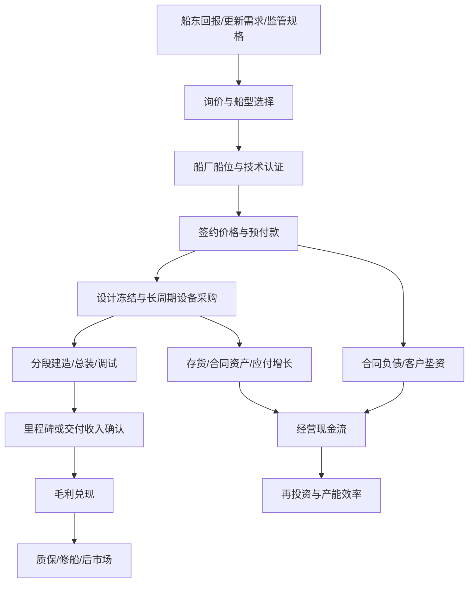

# 供应链模型：订单如何转化为收入与现金

## 传导框架

## 关键节点

| 节点 | 决策变量 | 领先指标 | 财务落点 | 600150 最新证据 |
|---|---|---|---|---|
| 船东下单 | 运价、融资、环保规则、船龄、燃料路线 | 新接订单 CGT/DWT、合同额、撤单 | 在手订单、合同负债 | 2025 年民船/海工新签 1,758.36 亿元 |
| 船位与定价 | 可用船位、船型难度、客户认证 | 新船价格、交期、订单结构 | 未来收入和毛利 | 公司称 >80%中高端、约 50%绿色船；具体定义/船型金额未披露 |
| 采购 | 船板、主机、推进、航电、特种系统 | 钢价、设备交期、采购合同 | 存货、应付、毛利 | 钢材和外购设备约占成本 65%，设备价格上涨 |
| 建造 | 设计成熟度、人员、船坞、供应链 | 开工/下水/试航、完工进度 | 合同资产、生产成本 | 2025 年交付 161 艘/1,367.75 万载重吨 |
| 交付 | 验收、客户融资、缺陷整改 | 交船数量、延期、质保 | 收入、应收、利润 | 2026 计划 168 艘/1,650 万载重吨 |
| 现金 | 预付款与采购付款节奏 | 合同负债、存货、合同资产、应付 | 经营现金流 | 2025 OCF 77.67 亿元，同比下降；合同负债 1,522.14 亿元 |
| 后市场 | 坞期、改装需求、客户粘性 | 修理订单和交付 | 修船收入与利润 | 2025 修理接单 820 艘/55.15 亿元、完工 813 艘/61.13 亿元 |

## 约束关系

1. **订单不等于当期收入**：收入取决于履约进度/交付与会计确认；在手订单需通过交付计划和合同资产变化验证。
2. **船价不等于毛利**：签价优势会被钢材、外购设备、汇率、延期、返工和质保侵蚀。
3. **产能不等于产量**：没有船位、客户认证、关键设备和熟练工，名义产能不能资本化。
4. **合同负债不等于自由现金流**：客户预付款提供融资，但生产爬坡会占用存货和合同资产。
5. **集团能力不等于上市收入**：每一笔订单都需穿透至并表船厂。

## 600150 的业务边界

公司 2025 年末民船/海工在手 652 艘、7,997.30 万载重吨、4,674.51 亿元；艘数结构约为油船 30%、集装箱船 20%、散货船 20%、气体船超过 10%、特种及其他约 20%。这是上市公司合并口径的核心订单证据。CSSC group 的沪东中华 LNG 订单、集团排名及未分配项目仅作行业背景。
