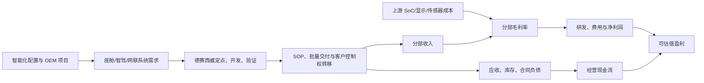

# 产业链—收入—利润—现金流桥

## 主题级利润池桥

## 德赛西威的已实现桥（2025）

| 项目 | 已披露量 | 对收益的含义 | 不可延伸部分 |
|---|---:|---|---|
| 总收入 | CNY32.557bn，+17.88% | 已确认的规模基础 | 不能倒推客户收入 |
| 智能座舱 | CNY20.585bn，毛利率 18.83% | 最大收入/毛利池，第四代平台已有多客户配套 | 新项目订单、第五代/中央计算没有客户级收入确认 |
| 智能驾驶 | CNY9.700bn，+32.63%，毛利率 16.36% | 增长最快的已确认业务 | 毛利率同比 -3.55pct；不能假定智驾渗透自动增厚利润 |
| 网联及其他 | CNY2.272bn | 软件/服务已有收入基础 | 未披露毛利、订阅/续费和客户份额，不能给予软件溢价 |
| 原材料 | CNY24.183bn，占成本 91.78% | BOM 是毛利的首要传导变量 | 无芯片/存储/显示采购价，不能精确模拟降本 |
| 经营现金流 | CNY2.884bn | 收入最终转化为现金的已实现证据 | 应收/库存按客户和产品拆分未披露 |

## 下一季度/年度验证阈值

| 驱动 | 升级为估值信用的最低验证 | 降级触发 | 当前处理 |
|---|---|---|---|
| 座舱订单 | 客户+车型/平台+SOP 或已确认收入，同时给出 ASP/分部毛利指引 | 订单仅维持年化口径、项目延迟/取消、座舱毛利继续恶化 | 已确认收入/毛利用基准；订单不用作预测增量 |
| 智驾量产 | 同比收入增长与毛利率改善/稳定，且至少有项目级 SOP 或收入解释 | 成本增速继续快于收入、毛利率下降、客户项目延迟 | 已确认分部可预测，项目可选性不计入 |
| 中央计算/第五代座舱 | 客户实名、SOP、订单金额或收入确认 | 仅“头部客户订单”/“定点开发”且无转换披露 | 零收入信用 |
| 显示/HUD/区域控制器 | 车型量产及产品收入/毛利 | “即将量产”延期，或只有订单而无 SOP | 零增量信用 |
| 海外制造 | 单厂项目进入量产、地区收入/成本披露、利用率或现金流验证 | 工厂建设/设备安装未形成量产或成本上升 | 仅交付韧性叙事 |
| 回款/库存 | CFO 与利润匹配；应收/存货周转稳定，减值受控 | 应收和专用库存增长显著快于收入、减值增加 | 作为风险与估值折现参数 |

## 估值使用结论

德赛西威的基础 EPS/估值桥必须从已披露收入、毛利、费用和现金流开始；新增订单只能作为验证未来增长的观察指标。2025年披露的 CNY35bn 以上订单年化口径不等于当期收入。若估值模型需要“某客户某车型 × 单车 ASP × 渗透率”，则因 GAP-01 至 GAP-09 的缺口而必须降级为情景分析，不能成为基准目标价。
