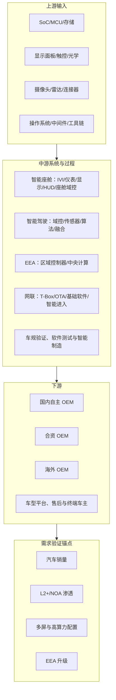

# 全链条分类法：智能汽车电子与 SDV

## 范围与分类原则

本案例采用 `custom：智能汽车电子与软件定义汽车` 覆盖包。分类先覆盖所有材料节点，再判断与德赛西威的关系；“可列为产业节点”不等于“可列为德赛西威受益证据”。节点类型、可投资性和证据质量在 `data/full_chain_universe_20260723.json` 逐行给出。

## 利润池与证据边界

| 层级 | 节点/产品 | 主要价值量来源 | 对德赛西威的已证实关系 | 估值边界 |
|---|---|---|---|---|
| 上游 | SoC、MCU、存储 | 算力、可靠性、车规认证、供给与价格 | G10PH 使用 Qualcomm Cockpit Elite 的合作已由双方披露；NVIDIA/小鹏 P7 历史项目有合作方披露 | 其他供应商、采购价、用量和锁价条款 `not disclosed` |
| 上游 | 显示/摄像头/毫米波雷达 | 显示尺寸、分辨率、传感器数量和性能 | 公司量产显示系统并自有摄像头/4D 雷达产品与工艺披露 | 面板、CIS、雷达芯片的供应商及 ASP `not disclosed` |
| 中游 | 座舱、智驾、域控、中央计算 | 系统集成、软件、功能安全、项目开发和量产交付 | 年报披露三大业务及部分客户/订单/量产 | 未披露各项目 BOM、ASP、SOP 和客户贡献 |
| 中游 | 网联与软件 | 基础软件、OTA、安全、数据及运营服务 | 年报披露网联服务收入和战略合作客户 | 服务合同年限、软件毛利率、续费率 `not disclosed` |
| 下游 | OEM/车型平台 | 定点、车型销量、排产、验收和回款 | 公司披露 80+ OEM 客户以及若干产品客户 | OEM 客户清单与车型销量不等同于公司收入或订单金额 |
| 需求锚点 | 智能化渗透/车型销量 | 终端智能化需求 | 仅可用于需求背景 | 不能证明任何上游/中游的订单或收入 |

## 进入核心估值池的条件

德赛西威是唯一 `core_valuation` 节点，原因是其产品、分部财务、客户池和部分量产/订单均有 T1 披露，并可在分部层面把收入与毛利、营运资本连接。它并不因某个上游芯片合作或某家 OEM 名称而自动获得客户级估值信用。

所有竞争公司、芯片厂商和需求锚点只能作为 `satellite_watch`、`out_of_scope` 或 `demand_anchor`：它们用于分析替代、供应风险和行业需求，不能用于本案例的目标价。
