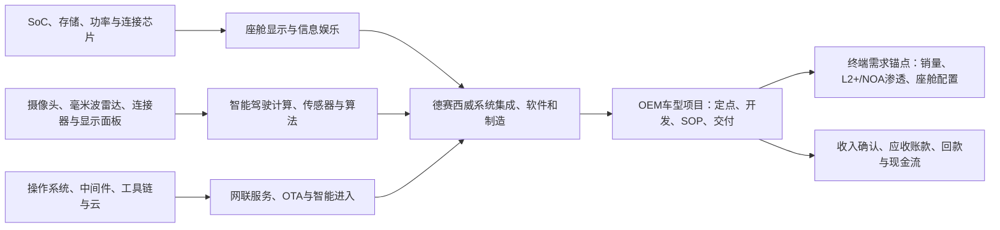

# 智能汽车电子产业景气与利润池（截至 2026-07-23）

## 结论先行

智能汽车电子的需求锚点是 OEM 的车型换代、EEA 从分布式 ECU 向域控制/中央计算迁移，以及座舱多屏与 NOA 等功能渗透；这些因素能够解释**行业需求方向**，不能单独证明德赛西威的订单、收入或利润。德赛西威可被验证的收益路径是：其智能座舱、智能驾驶和网联服务已形成已确认收入；以车型项目为单位的新增订单随后经过开发、SOP（量产启动）、交付、客户验收和回款，才可能成为收入及现金流。

2025 年，公司营业收入为 CNY32.557bn，其中智能座舱 CNY20.585bn（63.23%）、智能驾驶 CNY9.700bn（29.79%）、网联服务及其他 CNY2.272bn（6.98%）。智能驾驶同比增长 32.63%，快于座舱的 12.92%，但其 2025 年毛利率为 16.36%，低于座舱的 18.83%，且同比下降 3.55 个百分点。因此“高阶智驾提高单车价值量”已经是产品方向，尚不是“智能驾驶必然抬升公司综合毛利率”的事实。基础估值应使用已披露分业务收入、毛利率与现金流；订单和新平台只能在明确 SOP、客户、车型/平台、ASP 或收入确认后逐步获得预测信用。

## 产业分层与利润池

| 链条模块 | 价值与利润形成方式 | 德赛西威可验证位置 | 不能推断的事项 |
|---|---|---|---|
| 上游 SoC/存储 | 高算力 SoC、DRAM/NAND 与车规认证影响 BOM、供货弹性和平台迭代 | 公司披露产品依赖“大算力芯片”，并与 Qualcomm 推进 G10PH；供应商前五名匿名 | 不可将任一芯片厂列为公司确定供货商、不可将芯片平台合作视为整车项目收入 |
| 显示与感知 | 显示模组、摄像头/雷达决定系统配置与物料成本 | 公司披露显示系统、摄像头和 3D/4D 毫米波雷达产品；奇瑞、吉利显示系统有量产/订单证据 | 面板、图像传感器、雷达芯片来源及单车价值量均未披露 |
| 域控/中央计算 | Tier-1 通过硬件集成、软件算法、功能安全与项目交付获取系统收入 | 公司披露智能驾驶域控在多家 OEM 大规模量产；中央计算获国内多家头部客户订单 | 未披露中央计算客户、车型、SOP、订单金额或收入 |
| 基础软件/网联 | 软件、OTA、安全、生态与服务可提高系统粘性，但收入确认随合同履约 | 网联服务收入 CNY2.272bn；与多家 OEM 有战略合作 | 未披露软件订阅/服务的单车 ASP、续费率、单客户收入或分部毛利率 |
| OEM/车型 | 定点、车型上市、排产、客户验收决定从设计赢单到收入的时点 | 年报列示广泛客户池、部分产品的量产/订单客户 | 客户名单不是客户收入排名；车型销量不是公司配套收入证明 |

## 可观测的需求与经营信号

1. **产品需求的已实现部分：** 2025 年销售量 40.346m 套，同比增长 30.14%；生产量同比增长 39.71%。公司解释为订单及备货增加。这支持已发生的规模扩张，不等同于所有新增订单已转化为收入。
2. **订单：** 公司定义“订单年化销售额”为订单全生命周期销售额除以订单生命周期年数。年报披露 2025 年新项目订单年化销售额突破 CNY35bn，其中座舱超过 CNY20bn、智驾超过 CNY13bn。该指标不是合同负债、在手剩余订单，也不是下一年度可确认收入；本报告不以它直接乘估值倍数。
3. **价格/成本：** 2025 年汽车电子原材料为 CNY24.183bn，占营业成本 91.78%。在产品高集成、芯片/显示/传感器价值占比上升时，BOM 和议价结构是毛利的关键变量；但公司未披露产品级 ASP、芯片价格或向 OEM 的价格传导条款。
4. **现金流：** 经营净现金流为 CNY2.884bn，同比增加 93.09%，但年末应收账款 CNY9.778bn、存货 CNY4.789bn，且审计报告明确产品通常按订单生产、专用度较高，车型销售不利时存在存货减值风险。收入增长的质量须同时观察回款、存货和减值。

## 证据边界与来源

| ID | 来源 | 级别 | 可用结论 | 不可用结论 |
|---|---|---|---|---|
| S1 | [2025 年年度报告（公告 2026-006）](https://static.cninfo.com.cn/finalpage/2026-03-06/1224998406.PDF)，本地 `sources/ir-20260723/desay_sv_2025_annual_report_cninfo.pdf` | T1：交易所正式披露 | 分业务收入/毛利、客户池、已量产/订单描述、营运资本与生产数据 | 客户—车型—ASP—收入的逐项映射；芯片/面板供应商清单 |
| S2 | [Qualcomm 2025-01-06 新闻稿](https://www.qualcomm.com/news/releases/2025/01/desay-sv-collaborates-with-qualcomm-to-deliver-new-intelligent-a)，本地 `sources/ir-20260723/qualcomm_20250106_desay_g10ph.html` | T1：合作方官方 | G10PH 与 Snapdragon Cockpit Elite 平台合作 | 任一 OEM 已采用或 G10PH 已贡献收入 |
| S3 | [NVIDIA 2021-01-11 官方博客](https://blogs.nvidia.com/blog/leading-ev-makers-nvidia-drive/)，本地 `sources/ir-20260723/nvidia_20210212_desay_xpeng_p7.html` | T1：合作方官方 | 小鹏 P7 的历史项目与 Desay 协作事实 | 当前小鹏收入规模、后续车型持续供货或单车 ASP |

产业链判断门槛为 **CONDITIONAL**：德赛西威的分部财务、产品和部分客户/量产事实已可验证；客户收入分配、车型/SOP、ASP、利用率与项目毛利没有充分披露，故这些字段不得进入基准情景的增量估值。
