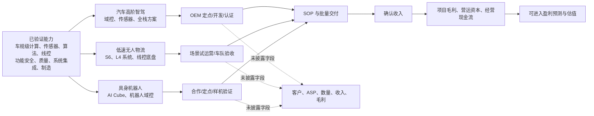

# 德赛西威 Physical AI 机会树（2026--2028）

**研究目的：** 本文不把“未来机会”等同于已确认利润，而是回答：德赛西威的汽车智能化全栈能力能否从高阶辅助驾驶进一步外溢到低速无人物流与具身智能，并在 2026--2028 年经过可验证的商业化节点，成为新的收入与估值来源。

**数据截止日：** 2026-07-23。除另有标注外，事实依据为公司 2025 年年报（S1）。`未披露` 不是零；它表示本报告不能将该字段写入收入、利润或目标价数学。

## 先给结论

德赛西威的 Physical AI 不是单一概念，而是一套可迁移的能力资产：车规级计算平台、传感器与线控接口、算法、功能安全/质量体系、系统集成与规模制造。三条路径的成熟度不同：

| 路径 | 当前状态 | 已经可确认的价值 | 未来机会 | 基准估值处理 |
|---|---|---|---|---|
| 高阶智驾/中央计算 | 智能驾驶已规模化量产；中央计算为获单阶段 | 2025 年智能驾驶收入 CNY9.700bn、同比 +32.63%；毛利率 16.36% | 从域控/传感器交付升级为中央计算与舱驾融合，抬升系统级价值量 | 已确认智能驾驶分部收入/毛利进入基础盈利；中央计算不另计增量 |
| 低速无人物流 | 品牌与 S6 平台已发布 | 车规级设计、L4 系统、线控底盘与场景适配的产品证据 | 园区、配送、冷链场景中形成车队部署与可复制交付 | 期权观察，零收入/零 EPS 信用 |
| 具身机器人 AI Cube/域控 | AI Cube 已发布；年报披露域控定点，计划 2026 年量产交付 | 车规级技术迁移、核心部件工艺突破、合作与定点进展 | 从样机/定点跨过量产、客户验收和毛利爬坡，形成通用计算终端收入 | 期权观察，零收入/零 EPS 信用 |

因此，投资研究的正确问题并非“这些业务今天贡献了多少”，而是：**哪条路径最先形成“客户/场景--量产/部署--收入--毛利--现金”的闭环，且其增量利润足以改变市场对公司 2027--2028 年盈利和平台属性的预期。**

## 路径一：高阶智能驾驶、舱驾融合与中央计算

### 为什么它是最接近兑现的 Physical AI 主线

公司年报披露，2025 年智能驾驶业务实现收入 CNY9.700bn，同比增长 32.63%，并称大算力旗舰、高性价比、国产化芯片平台均已批量交付，跨域融合 one-box 已量产，单芯片舱驾一体平台将启动规模化量产。公司同时披露，智能驾驶域控制器已经向多家 OEM 大规模量产交付。它证明的是**车端 Physical AI 的既有商业化能力**，不是纯技术储备。

中央计算则是下一阶段的架构升级。年报称第五代座舱平台面向端云一体 AI 座舱，并称单芯片和多芯片中央计算方案已获国内多家头部客户订单；但客户名称、车型、SOP、订单金额、收入和毛利均未披露。它是最具潜在系统级价值量提升的项目之一，也是最需要从“订单叙事”跨到“量产收入”的机会。

| 维度 | 已验证事实 | 仍属未来机会 | 未披露/不可外推字段 |
|---|---|---|---|
| 技术复用 | 域控制器、传感器、算法、车载 AI、软硬件系统集成和规模制造已用于智能驾驶；舱驾融合方案已量产 | 将计算资源、数据与软件能力由域级产品延伸到中央计算/区域控制器 | 具体芯片配置、软件收费比例、每车型系统范围 |
| 产品与客户证明 | 智驾分部收入 CNY9.700bn；多 OEM 域控量产；中央计算获匿名头部客户订单 | 单芯片舱驾一体和中央“中央大脑”可成为架构升级承接产品 | 中央计算客户实名、车型、SOP、订单金额、客户收入 |
| 收入转换链 | 已有产品已走至批量交付和分部收入 | 中央计算须从订单/开发走到车型 SOP、持续交付与收入确认 | 各节点的转化率、生命周期、单位数、ASP、项目取消率 |
| 利润与现金 | 智驾毛利率 16.36%，同比下降 3.55pct；已确认分部收入可作为盈利基底 | 若软件/系统集成提升组合价值量，可能改善利润结构 | 中央计算项目毛利、增量研发/质保、应收账期、库存占用 |

### 收入转换与经济学闸门

1. **产品获选/定点：** 证明客户技术路线选择，不等于收入。
2. **车型开发、功能安全与验证：** 车规交付需要经历软硬件适配、认证与量产准备；只有在获得 SOP 或公司披露的量产状态后，才能讨论出货。
3. **SOP 与批量交付：** 形成已交付产品、收入确认和客户回款的前提。2025 年智能驾驶分部已在汇总口径走到这一步；中央计算没有。
4. **项目毛利和现金转换：** 高算力 SoC、传感器 BOM、研发摊销、售后/质保和客户账期决定“系统价值量”能否转化为增量净利。毛利率与应收/库存必须同步验证。

### 竞争与替代边界

- **竞争不是单一零部件竞争。** 该路径的对手可以是其他系统级 Tier 1、OEM 自研/深度集成、芯片平台方与其生态合作伙伴。中央计算架构提升了系统集成价值，也提高了技术选型、软件适配和质量责任的竞争强度。
- **可迁移能力的边界。** 车端规模量产能够证明可靠性、质量和交付，但不能自动证明中央计算拥有更高毛利，或能获得软件平台溢价。若 OEM 将算法/软件、系统集成或数据闭环更多内化，供应商的价值池可能仍以硬件/工程服务为主。
- **替代触发。** 智驾分部毛利率继续下滑、中央计算仅维持匿名订单而无 SOP/收入、或客户的架构路线改变，均意味着“更高系统价值量”的投资逻辑应降级。

### 2026--2028 年验证清单与估值信用

| 时间窗 | 升级信号 | 降级信号 | 估值信用 |
|---|---|---|---|
| 2026 年中报/年报 | 智驾收入保持增长且毛利率稳定或改善；披露单芯片舱驾一体/中央计算的 SOP 或收入 | 智驾收入放缓且毛利继续承压；订单无量产更新 | 智驾汇总收入/毛利：已给基础信用；中央计算：零增量信用 |
| 2027 年 | 客户/车型或平台范围、量产节奏、项目收入/毛利至少有一项可审计披露 | 只重复“获单”口径，仍无交付或收入 | 可转为情景收入/估值敏感性，不进入基准 EPS |
| 2028 年 | 连续期间的收入、项目毛利、回款和研发费用显示规模效应 | 项目交付未带来现金或利润改善 | 仅在可复核盈利贡献出现后，才允许进入基础盈利桥 |

## 路径二：低速无人物流（“川行致远”S6）

### 机会的真正来源：把“车”变成可复制的场景交付

公司年报披露“川行致远”车规级低速无人车品牌与 S6 系列平台，称其采用全车规级开发体系、全栈自研 L4 级自动驾驶系统、全线控底盘和模块化上装，面向工业园区、物流配送、城市配送和冷链运输等场景。年报亦表述场景数据可以反哺智能驾驶算法。

这条线的意义不在于它已经证明了收入，而在于它把公司已具备的车规工程、线控/感知/算法和供应链管理能力带入一个更高频、可积累运营数据的应用场景。若形成可复制的车队部署，它既可能带来车辆/系统交付，也可能强化算法与系统迭代；但这两者都仍须通过商业化证据验证。

| 维度 | 已验证事实 | 仍属未来机会 | 未披露/不可外推字段 |
|---|---|---|---|
| 技术复用 | 车规级开发标准、智能控制、L4 系统、360°感知、双芯片冗余、线控底盘、模块化上装均有公司披露 | 将汽车级可靠性与感知/决策能力做成物流场景的可复制产品 | L4 运营设计域、远程接管、人车比、算法数据闭环效果 |
| 产品与场景 | S6 已发布；覆盖园区、物流配送、城市配送、冷链等应用方向 | 从产品发布走向场景签约、车队部署与复购 | 已付费客户、部署数量、单车配置、验收标准、运营主体 |
| 收入转换链 | 产品与技术叙事已存在 | 场景验证→订单/合同→车辆或系统交付→验收/回款→售后/服务复购 | 商业模式（销售、租赁、按服务收费或联合运营）、收入确认政策、单车 ASP |
| 利润与现金 | 可使用现有车规制造和供应链能力作为交付能力线索 | 模块化可降低定制复杂度，但须由批量交付证明 | 单车 BOM、维保/保险/运营成本、项目毛利、账期、库存与坏账 |

### 收入转换链的关键不是“发布”，而是单位经济性

低速无人物流的经济闭环至少要同时满足四项：

1. **场景适配：** 客户场地、任务频次、路权和安全/运维要求匹配产品能力；单一演示或试运行并不构成可复制需求。
2. **商业合同：** 需要清楚区分车辆销售、系统供货、租赁、运营服务或联合运营。不同合同形态对应不同收入确认、资本占用和回款风险。
3. **车队验收与利用：** 只有车队数量、运行时长/任务量、可用率和续约/复购能够证明产品在场景中有真实经济价值。
4. **毛利与现金：** 车辆 BOM、传感器和动力电池成本、维保、安全冗余、现场服务与应收账期，决定它是高毛利系统业务还是资本/运营占用业务。

公司没有披露上述客户、订单、数量、单车价格、商业模式、收入、毛利与回款信息。因此，不能把“最后一公里”市场空间或产品性能参数转换为德赛西威的 2026--2028 年收入。

### 竞争与替代边界

- 低速无人物流的竞争不仅来自同类无人车制造商，还来自人工/传统物流、园区数字化改造、客户自建运力以及不同自动化方案。客户采购取决于全生命周期成本、安全、可用率、运维网络和场景适配，而非单纯算法能力。
- 汽车级可靠性是潜在差异化，但不必然构成商业壁垒：低速场景的采购决策可能更看重价格、部署速度、运营服务和收益回收。
- 只要没有车队利用率、续约/复购、项目毛利和现金回收，低速无人车就应被视为产品期权，不应按“平台公司”给高倍数。

### 2026--2028 年验证清单与估值信用

| 时间窗 | 升级信号 | 降级信号 | 估值信用 |
|---|---|---|---|
| 2026 年 | 披露首批付费客户、场景、交付/验收或收入确认；明确商业模式 | 仅新品展示或泛化合作，没有付费部署 | 零收入/零 EPS；可作为催化剂跟踪 |
| 2027 年 | 车队规模、复购/续约、单项目毛利或现金回收有可审计数据 | 小规模试点停留，重资产或售后成本高于预期 | 允许做概率加权情景，但不使用通行市场规模推导 |
| 2028 年 | 多场景复制、收入单列或有可复核贡献，现金流与盈利可验证 | 客户集中、利用率不足或营运资本恶化 | 仅在可复核利润贡献出现后，才可给基础估值信用 |

## 路径三：具身机器人 AI Cube 与机器人域控制器

### 机会的本质：从车载计算模块向通用智能体计算终端延展

公司年报披露已发布机器人智能基座 AI Cube，并称其将辅助驾驶成熟技术架构迁移为高性能 AI 计算终端，为机器人提供核心算力与算法支撑；公司已与多家合作伙伴达成深度战略合作。年报还披露，公司已获取机器人域控项目定点订单，相关产品规划于 2026 年量产交付；制造端已完成 AI Cube 核心部件工艺突破并强化车规级 SIP 产品批量交付能力。

这为“技术外溢”提供了强于纯概念的产品、制造和定点证据，但它仍处于**定点/计划量产**而非已确认收入阶段。AI Cube 是面向机器人计算/算法的产品名称，不等于公司已经获得机器人平台份额、客户收入或软件订阅收入。

| 维度 | 已验证事实 | 仍属未来机会 | 未披露/不可外推字段 |
|---|---|---|---|
| 技术复用 | 辅助驾驶成熟技术架构、车规级计算/算法、SIP 制造和质量体系；AI Cube 核心部件工艺有突破 | 将可靠计算、感知与控制模块打包为机器人域控/智能基座 | 算力规格、传感器配置、软件栈边界、知识产权归属 |
| 产品与客户证明 | AI Cube 已发布；多家合作伙伴深度合作；机器人域控已获项目定点 | 2026 年量产交付可成为从产品到商业化的首个关键节点 | 合作伙伴/客户名称、机器人类型、定点金额、SOP、数量 |
| 收入转换链 | 定点为潜在采购关系，而非收入 | 样机/适配→项目验证→量产交付→客户验收→收入/回款 | 单机 ASP、收入确认、是否包含软件/服务、客户生命周期 |
| 利润与现金 | 制造工艺突破与 SIP 交付能力是规模化能力线索 | 标准化模块若形成复用，可能带来更好制造效率 | 项目毛利、研发摊销、质保、备货、付款条款、应收/库存 |

### 需要防止的估值跳跃

1. **合作不等于订单，定点不等于收入。** 年报披露“深度合作”和“项目定点”可以进入催化剂地图，不能直接代入 2026 年收入或 EPS。
2. **车规能力不等于机器人需求规模。** 车规可靠性、功能安全与制造体系构成进入门槛；机器人场景的标准化程度、客户自研比例、性能/成本要求和需求节奏仍需独立验证。
3. **硬件模块不自动享有软件估值。** 只有收费对象、软件交付边界、续费/使用量、毛利和现金流被披露，才可讨论平台化或经常性收入；在此之前只能按硬件/工程项目风险处理。

### 竞争与替代边界

- 该路径面对的可能是机器人整机厂自研、通用计算/芯片生态、自动化控制供应商与其他域控集成商。竞争的关键是可靠性之外的算力效率、开发工具链、适配速度、成本和客户锁定程度。
- 标准化 AI Cube 可能提高复用效率；如果每个客户都需要高度定制，研发和交付成本可能吞噬规模效应。
- 估值升级必须建立在“首个量产”之后的持续交付与项目利润上，而不是建立在机器人行业整体热度上。

### 2026--2028 年验证清单与估值信用

| 时间窗 | 升级信号 | 降级信号 | 估值信用 |
|---|---|---|---|
| 2026 年 | 计划中的量产交付实际发生；披露客户/机器人类别、SOP 或确认收入任一项 | 量产计划延后，或仅有合作叙事 | 零收入/零 EPS；保留事件催化剂观察 |
| 2027 年 | 出货/收入、产品毛利或增量研发费用出现可审计披露；多客户复用证据 | 单一试点、客户/订单不可核验、毛利被定制成本压缩 | 可做概率加权情景，不给主业倍数溢价 |
| 2028 年 | 连续收入、毛利、回款和客户扩展证明可复制 | 无持续交付或现金转化弱 | 仅在盈利贡献可复核后纳入基础估值 |

## 研究与交易的使用方式

### 三层价值，而非一条线性预测

| 价值层 | 内容 | 投资含义 | 禁止的推理 |
|---|---|---|---|
| 已实现底座 | 智能座舱、智能驾驶和网联的已披露收入、毛利、现金流 | 用于判断下行保护与主业盈利质量 | 用客户名单或订单年化拆成客户级收入 |
| 可验证成长 | 高阶智驾、舱驾融合、中央计算从订单到 SOP/收入的转换 | 用于跟踪未来 12--24 个月的预期差 | 将匿名订单或“即将量产”直接换算 EPS |
| Physical AI 期权 | 低速无人物流、AI Cube、机器人域控 | 用于判断长期重估的可能性和事件节奏 | 以行业空间、合作、发布会或热度直接给目标价 |

### 最重要的四个证据需求

1. **首个真实商业化闭环：** 任一路径出现客户/场景、SOP/验收、收入和回款的同一项目证据。
2. **单位经济性：** 至少披露或可由财报验证 ASP/价格、BOM/毛利、研发/服务成本中的关键一项，防止“收入增长、利润不增”。
3. **复制性：** 多客户、多场景或复购/续约，而非一次性定制项目。
4. **现金纪律：** 应收、库存、合同负债与经营现金流没有在新业务扩张中恶化；否则技术外溢可能消耗主业现金。

**估值总裁决：** 在上述证据出现前，德赛西威可以被研究为“存在 Physical AI 上行期权的汽车电子平台”，但只能按已确认汽车电子盈利定锚。市场若因为新业务叙事提前重估，投资者应把它视作对未来验证节点的仓位与风险管理问题，而非已经实现的盈利事实。

## 来源与证据等级

- **S1（T1，一手披露）：** [德赛西威 2025 年年度报告](https://static.cninfo.com.cn/finalpage/2026-03-06/1224998406.PDF)，本地归档：`sources/ir-20260723/desay_sv_2025_annual_report_cninfo.pdf`；产品与新业务见年报第 18、22--23 页，制造/质量体系见第 18--19 页，经营与分部数据见相关财务章节。
- **S2（T1，已核验财务摘录）：** `data/raw_financials.md` 与 `data/verified_financials.md`，用于已确认收入、毛利、研发、应收、库存和经营现金流。
- **使用限制：** 券商材料可帮助定位催化剂，但本文的产品状态、交付计划和估值边界均以 S1 为准；未用券商推导新业务收入或目标价。
