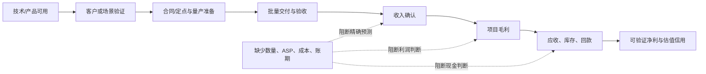

# 德赛西威 Physical AI 价值链经济学（2026--2028）

**口径与边界：** 本文讨论未来机会如何可能变成收入、利润和现金流，而不是把产业空间替代公司经济学。所有金额均为人民币；除已披露的 2025 年分部数据外，客户、数量、ASP、项目收入、项目毛利、利用率和回款条款均为 `未披露`，不得以行业均值或市场空间填补。

**一手来源：** 德赛西威 2025 年年报（S1，CNINFO）；财务核验摘录见 `data/raw_financials.md` 与 `data/verified_financials.md`（S2）。数据截止日为 2026-07-23。

## 总体判断：Physical AI 的价值不在“技术名词”，而在经济闭环

汽车智能化已经证明公司能把系统级产品做成收入；低速无人物流与机器人仍只证明了产品、制造准备和部分项目进展。未来两年的核心不是给新业务虚构一个收入规模，而是识别它是否能从技术复用跨过四个经济学闸门：

## 已实现底座：汽车智能化为新业务提供能力，但不自动提供利润

| 已披露 2025 年口径 | 数值/事实 | 对 Physical AI 的意义 | 不能延伸到新业务的部分 |
|---|---|---|---|
| 智能驾驶收入与毛利 | 收入 CNY9.700bn，同比增长 32.63%；毛利率 16.36%，同比 -3.55pct | 已验证了域控、传感器、算法和系统交付的收入化能力 | 不能据此假定中央计算、低速无人车或机器人也有相同收入增长/毛利率 |
| 智能座舱收入与毛利 | 收入 CNY20.585bn；毛利率 18.83% | 提供 AI 座舱、中央计算、显示与车端软件的工程/客户基础 | 客户/车型/ASP/项目毛利未披露，不能按单车价值量外推 |
| 网联及其他 | 收入 CNY2.272bn；分部毛利率未披露 | 证明公司有软件、OTA、网络安全等交付能力 | 不能给予新业务软件订阅或平台型毛利假设 |
| 研发投入 | CNY2.637bn，占收入 8.10% | 说明公司有持续投入算法、计算和跨领域产品的资源基础 | 新业务增量研发、客户定制成本和资本化政策未披露 |
| 制造与质量 | 高算力域控、摄像头、4D 雷达和 AI Cube 核心部件工艺突破；车规质量体系披露 | 是新产品从样机走向批量交付的必要能力 | 设计产能、利用率、良率、单厂成本、客户项目映射未披露 |
| 营运资本与现金 | 应收 CNY9.778bn、存货 CNY4.789bn、合同负债 CNY1.005bn、经营现金流 CNY2.884bn | 未来新业务必须接受回款和库存纪律检验 | 无客户/产品账期、专用库存或新业务现金流拆分 |

这张表揭示一个重要限制：**公司已证明“能交付”，尚未证明每一种 Physical AI 产品都能以更高的贡献利润和更低的现金占用交付。** 2025 年智能驾驶收入快速增长但分部毛利率下行，正说明更高算力、更复杂系统和更多收入并不必然带来更高利润率。

## 三条路径的价值链与经济学

| 路径 | 价值单元/客户购买对象 | 已披露商业化位置 | 收入转换所需链条 | 主要成本与毛利驱动 | 现金/营运资本风险 | 当前估值信用 |
|---|---|---|---|---|---|---|
| 高阶智驾、舱驾融合与中央计算 | 车载域控制器、传感器、算法、中央计算/区域控制器与系统集成 | 智驾已形成分部收入；中央计算为匿名头部客户订单，区域控制器为订单状态 | OEM 选型/定点 → 开发验证 → SOP → 批量交付 → 收入确认 → 回款 | 高算力 SoC、传感器、显示/连接、软件研发、系统测试、质保；项目定价与产品组合决定毛利 | OEM 账期、车型项目专用库存、芯片/BOM 波动、研发和售后投入 | 已确认智驾分部收入/毛利可进入基础模型；中央计算/区域控制器零增量信用 |
| 低速无人物流 S6 | 无人车整车、线控底盘、L4 系统、模块化上装；潜在车辆/系统/运营服务 | 产品和应用场景已发布，未披露付费客户或收入 | 场景验证 → 付费合同 → 车队交付/验收 → 车辆或服务收入 → 维保/复购 → 回款 | 车辆 BOM、动力电池、传感器、线控件、远程运维、安全冗余、场景交付与售后 | 若采用租赁或运营模式，可能产生车辆资本占用；销售模式也仍有应收、备货和售后风险 | 零收入/零 EPS；只能作为事件催化剂与概率情景 |
| AI Cube 与机器人域控 | 高性能 AI 计算终端、机器人域控、可能的软硬件适配/工程服务 | AI Cube 已发布；机器人域控已获定点，计划 2026 年量产交付 | 合作/样机适配 → 项目定点 → 量产准备 → 批量交付/验收 → 收入 → 续单/多客户复制 | 算力与处理器件、SIP/板级制造、传感器/接口、软件适配、研发摊销、质保和现场支持 | 高度定制时可能前置研发和备货；客户付款、项目取消和库存专用性决定现金质量 | 零收入/零 EPS；先要求量产、收入、项目毛利三项中的可审计闭环 |

## 路径一的经济学：高阶智驾/中央计算

### 已有的利润池与边际风险

智能驾驶是三条路径中唯一已有可审计收入和毛利的业务。其 2025 年收入 CNY9.700bn、毛利率 16.36%，但毛利率同比下降 3.55 个百分点。因而，未来高阶智驾和中央计算的投资价值不是简单的“算力增加 = ASP 增加”，而是下式中的每一项能否被验证：

> **项目贡献利润 = 经确认的系统收入 − 芯片/传感器/BOM − 制造与质保 − 项目研发及交付费用。**

公司没有披露中央计算的客户、车型、单位数、ASP、BOM、毛利率、研发增量或回款周期。这意味着可以确认技术与订单进展，却不能给出中央计算“每增加一个项目贡献多少 EPS”的数字。

### 价值增加与替代压力同时存在

- **可能抬升价值量的因素：** 中央计算、跨域融合、舱驾一体可能增加单车系统集成范围，且可复用既有算法、工程和制造能力。
- **可能压低利润的因素：** 更高算力芯片和传感器成本、客户降价、前置验证/质保、软件适配和车型定制。2025 年智驾毛利率下行是必须持续监测的现实约束。
- **客户议价/替代：** OEM 可增强自研或与芯片/算法伙伴深度协同，其他系统集成商也可参与竞争。因此“系统级”不等于天然拥有更高定价权。

### 升级为可估值盈利的最低证据

| 所需证据 | 为什么必要 | 允许的估值动作 |
|---|---|---|
| 中央计算/舱驾融合的车型 SOP 或已确认收入 | 把订单从产品进展变为交付事实 | 开始建立收入情景，仍不以订单金额取代收入 |
| 收入增速与分部毛利率同步改善/稳定 | 验证价值量没有被成本吞噬 | 可提高主业增长情景的可信度 |
| 客户/产品级别的价格或毛利线索 | 判断集成范围是否形成贡献利润 | 才可做项目级经济学敏感性 |
| 应收、库存和经营现金流与增长匹配 | 排除以现金占用换收入 | 降低估值折现或提升现金质量判断 |

## 路径二的经济学：低速无人物流

### 从“产品”到“可复制车队”之间仍缺的账

年报披露 S6 的车规级开发、L4 系统、线控底盘、模块化上装及园区/配送/冷链等方向，但不披露客户、部署数量、合同形态、单车价格、收入、成本或回款。低速无人物流的公司经济学取决于选择何种商业模式；在信息不足时，不能假设任何一种已经成立。

| 可能的合同形态（均非公司已披露事实） | 对收入确认的影响 | 对现金流的影响 | 需要的验证 |
|---|---|---|---|
| 车辆/系统一次性销售 | 可能在交付验收后确认硬件收入 | 应收和售后/质保管理关键 | 客户、验收、单车价格、毛利、回款周期 |
| 租赁或按月收费 | 收入可能跨期确认 | 车辆资产、折旧、保险与融资可能加大现金占用 | 资产归属、利用率、回本期、违约/残值安排 |
| 按任务/运营服务收费 | 收入与运行任务绑定 | 对运营团队、远程接管和服务网络投入更敏感 | 任务量、可用率、单位任务贡献、客户续约 |
| 与物流方联合运营 | 收入/成本/责任需按合同确定 | 可能有较高项目执行和回款风险 | 合作分工、分成、最低保底、应收和项目利润 |

这不是为了预设德赛西威会采用哪种模式，而是说明：没有合同结构与车队运行数据，“无人车市场规模”无法转化为公司收入，更无法转化为自由现金流。

### 低速无人车应接受的财务检验

1. **订单质量：** 付费、可验收、可回款，而不是展示、试运行或泛化合作。
2. **车队经济性：** 车队数量、有效运行、利用率、故障/维护、续约/复购；这些比单次交付新闻更能证明需求。
3. **毛利与投入：** 车辆 BOM 与现场服务成本决定贡献利润；若需要自持车辆或承担运营，现金回收比收入更重要。
4. **可复制性：** 至少两个独立场景或客户的重复部署，才可讨论平台化，而不是把一次性工程项目按长期增长估值。

## 路径三的经济学：AI Cube 与机器人域控制器

### 量产计划是第一道门，不是最后一道门

年报披露机器人域控取得项目定点，并规划 2026 年量产交付；还披露 AI Cube 核心部件工艺突破。这些是高质量的产品与制造准备证据。它们尚未披露客户名称、机器人品类、定点金额、数量、SOP、收入、ASP、项目毛利或付款安排，因此经济学状态仍是“待验证”。

机器人域控可能同时包含硬件、软件适配和工程服务，但公司没有披露各自占比。研究中应避免把 AI Cube 自动描述为软件平台收入，除非未来出现收费方式、交付边界、续费/使用量和毛利的证据。

| 经济学变量 | 当前披露状态 | 影响 | 升级证据 |
|---|---|---|---|
| 客户/机器人品类 | 未披露 | 决定需求持续性、适配难度与客户集中度 | 客户或细分应用披露，且不止单一原型 |
| 量产时间/SOP | 规划 2026 年量产交付 | 决定收入开始时间 | 实际交付、验收或收入确认 |
| 单机价格/系统范围 | 未披露 | 决定价值量，不可凭算力参数外推 | ASP、产品包或收入/出货的交叉披露 |
| BOM/制造效率 | 仅披露工艺突破 | 决定硬件毛利与良率爬坡 | 项目毛利、良率/成本或分部盈利线索 |
| 软件/服务收入 | 未披露 | 决定是否有经常性收入或较高毛利 | 合同收费、续费/使用量、毛利和现金回收 |
| 研发与定制成本 | 未披露 | 高定制可能使收入不形成净利 | 增量研发、客户项目数、交付周期、项目利润 |

### 估值上应如何处理“机器人期权”

在 2026 年实际量产交付前，机器人域控应视作**有产品和定点证据、但没有收入经济学的期权**。可做的工作是建立事件树、设定上行条件和仓位风险；不可做的工作是给出未经披露支撑的机器人收入、PS 或 EPS 加成。即使未来实际量产，也至少应再观察一个报告期的收入、毛利和营运资本，才判断它是可复制产品还是高定制工程项目。

## 横向的利润与现金约束

| 约束 | 已知事实 | 对未来机会的含义 | 后续观察指标 |
|---|---|---|---|
| BOM 与芯片成本 | 2025 年原材料 CNY24.183bn，占营业成本 91.78%；供应商、采购价和锁价未披露 | 高算力/传感器/电池升级可能提高价值量，也可能拉低毛利 | 分部毛利率、原材料占比、存货和供应链风险披露 |
| 研发强度 | 2025 年研发投入 CNY2.637bn，占收入 8.10% | 新业务若高度定制，可能持续消耗研发资源 | 研发费用率、项目数量、研发资本化及产品收入匹配 |
| 制造规模 | 已披露多地工厂和工艺突破，但设计产能/利用率/良率未披露 | 交付能力可支持机会，但不能从工厂建设推收入 | 产能利用、良率、单厂爬坡、地区收入/成本 |
| 应收与库存 | 2025 年应收 CNY9.778bn、存货 CNY4.789bn；订单生产且产品专用性有减值风险 | 新业务早期的备货、客户账期和车型/项目变化可能放大现金风险 | 周转、减值、合同负债、CFO 与净利的匹配 |
| 质量/责任 | 公司披露车规质量体系与功能安全等能力 | 可靠性是进入门槛，但质保/召回和验证成本可能侵蚀利润 | 售后、质保、质量费用、项目延期和客户验收信息 |

## 2026--2028 年估值信用规则

| 状态 | 需要满足的证据 | 可使用的模型方法 | 当前对应路径 |
|---|---|---|---|
| 已实现盈利 | 已披露收入、毛利/费用和现金流，且可与财报核对 | 基础盈利预测、P/E 或其他盈利方法 | 智能驾驶汇总分部、座舱汇总分部 |
| 可验证成长 | 客户/场景与 SOP/交付/收入至少形成一条可审计链，仍缺完整项目利润 | 概率加权情景、敏感性；不作为基准 EPS | 中央计算/舱驾融合的潜在升级状态 |
| 产品期权 | 产品发布、合作、定点或计划量产，但无收入/项目经济学 | 事件树、观察清单；基础模型零收入/零 EPS | 低速无人物流、AI Cube/机器人域控当前状态 |
| 可估值新业务 | 连续披露收入、项目毛利、回款/营运资本，且有复制性 | 在披露边界内建立独立盈利桥；再讨论估值方法 | 三条路径均尚未以新业务身份达到 |

## 防止“未来机会”研究沦为概念估值的四条纪律

1. **不以订单年化、定点、合作或产品发布替代收入。** 这些是前置节点，不能跳过 SOP、交付与确认。
2. **不以行业 TAM 代替公司份额和单位经济。** 没有客户、数量、ASP、成本和付款条款，TAM 只描述需求背景。
3. **不把硬件模块自动写成软件平台。** 只有经常性收费和毛利/现金证据，才可给予软件化估值讨论。
4. **不忽略现金。** 新业务最早出现的报表信号通常是研发、库存、应收与合同负债；收入增长若不转化为现金，估值信用应被折减。

## 可执行的验证优先级

| 优先级 | 验证问题 | 价值判断的变化 |
|---:|---|---|
| 1 | 机器人域控的 2026 年量产是否实际发生，是否出现收入或客户验收？ | 决定 AI Cube/域控能否从叙事进入商业化跟踪 |
| 2 | S6 是否披露付费场景、车队交付/运行或合同模式？ | 决定低速无人物流是产品展示还是可复制收入来源 |
| 3 | 智驾毛利率能否止跌，中央计算是否进入 SOP/收入？ | 决定 Physical AI 的汽车底座能否支持更高系统价值量 |
| 4 | 新业务扩张期间应收、库存和 CFO 是否保持纪律？ | 决定增长是否值得给予盈利质量和估值信用 |

**结论：** 德赛西威的未来机会真实存在于能力外溢和已披露的产品/定点/量产计划，但目前只有车端智能驾驶形成了可量化的收入与毛利基础。低速无人物流和机器人是值得提前研究、提前设定验证条件的长期期权；它们的真正价值要在量产、收入、毛利和现金四项证据逐步出现后才能被严谨定价。

## 来源与证据等级

- **S1（T1，一手披露）：** [德赛西威 2025 年年度报告](https://static.cninfo.com.cn/finalpage/2026-03-06/1224998406.PDF)，本地归档：`sources/ir-20260723/desay_sv_2025_annual_report_cninfo.pdf`。新业务、机器人量产规划和低速无人车见年报第 18、22--23 页；智能制造/质量见第 18--19 页；分部收入、成本和营运资本见财务章节。
- **S2（T1，核验数据包）：** `data/raw_financials.md`、`data/verified_financials.md`、`analysis/value_chain_economics.md`，用于 2025 年已实现财务数据与披露缺口。
- **限制：** 本文未把券商对无人车/机器人的前瞻判断换算为公司收入、净利或目标价；所有未来收入须待公司、客户或交易所披露验证。
