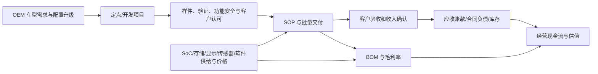

# 德赛西威供应链模型

## 从主题到财务的可审计链条

`B` 中的定点、合作或“订单年化销售额”不能跳过 `C-D-E`。公司 2025 年新项目订单年化销售额突破 CNY35bn，但其定义是全生命周期销售额除以生命周期年数；它不是可直接确认的订单余额。任何预测须在订单、车型/SOP、产品 ASP、毛利及回款得到对应证据后，才将其从可选性升级为基准收入。

## 德赛西威三段式商业传导

| 业务 | 已披露产品/链条位置 | 2025 已确认经营结果 | 客户/订单事实 | 主要传导与限制 |
|---|---|---:|---|---|
| 智能座舱 | IVI、显示、HUD、座舱域控、AI 座舱/中央计算 | 收入 CNY20.585bn；毛利率 18.83% | 第四代平台在理想、小米、吉利、奇瑞、广汽配套；新项目订单年化 >CNY20bn | SOP/ASP/车型和各客户收入 `not disclosed`；中央计算仅为匿名头部客户订单，不作当期收入 |
| 智能驾驶 | 域控、传感器、算法、3D/4D 雷达、舱驾融合 | 收入 CNY9.700bn；毛利率 16.36%；同比 +32.63% | 多家 OEM 域控大规模量产；新项目订单年化 >CNY13bn | 智驾成本同比 +38.52%，快于收入；未披露 SoC/BOM、产品组合、ASP 与项目毛利 |
| 网联服务及其他 | 基础软件、OTA、T-Box、智能进入、网络安全 | 收入 CNY2.272bn；分部毛利率 `not disclosed` | 与理想、长安、小鹏等客户持续合作 | 合作不等于订阅收入；软件收费、续费与客户份额 `not disclosed` |

## 上游依赖与制造约束

| 输入 | 关系状态 | 影响 | 证据和边界 |
|---|---|---|---|
| 高算力 SoC | Qualcomm G10PH 为 `official-disclosed` 合作；NVIDIA/小鹏 P7 为 `official-disclosed` 历史项目；其他 `not disclosed` | 平台性能、开发周期、认证、BOM、供给与平台迁移风险 | S1/S2/S3。不能将合作方列为全公司独家或主要供应商 |
| 存储 | `not disclosed` | 受座舱/中央计算配置影响，可能影响 BOM/供给 | 年报不披露供应商、容量、价格或锁价 |
| 显示/感知 | 公司产品/工艺 `official-disclosed`；关键部件供应商 `not disclosed` | 屏幕与传感器数量影响系统价值量和材料成本 | S1 仅披露显示、摄像头和雷达产品/订单 |
| 基础软件 | 自有“蓝鲸”生态、AIOS 等 `official-disclosed`；第三方 OS/工具链关系 `not disclosed` | 影响软硬解耦、研发效率和服务收入 | 可用于技术能力描述；不以软件溢价估值 |
| 工厂/交付 | 惠南二期投产、墨西哥首个量产、成都建设、西班牙设备安装 `official-disclosed` | 影响交付半径、爬坡费用和供应韧性 | 设计产能、利用率、良率、单厂盈亏 `not disclosed` |

## 供应链门槛

- **源头证据：** 公司 2025 年年报为核心；Qualcomm 和 NVIDIA 的官方材料仅用于特定平台/历史车型交叉验证。
- **估值可用：** 已确认分部收入、分部毛利、原材料占营业成本、营运资本、经营现金流、具名客户的“量产/订单”状态。
- **估值禁用：** 通过 OEM 销量倒推收入、以客户名单分配收入、把订单年化销售额作为收入、用工厂建设替代利用率、把合作或定点视为确认收入。
- **Gate：CONDITIONAL。** 德赛西威可作为唯一核心标的做汇总分部估值；客户/车型/ASP/订单转化层面的任何目标价均被缺口矩阵阻断。
