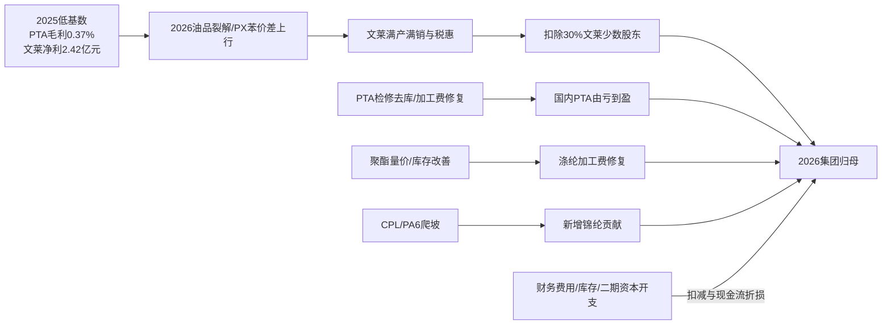

# 产业链盈利桥

## 主题层利润池桥

## 恒逸已验证桥

| 项目 | 2025A基线 | 2026证据 | 可用结论 | 不可用结论 |
|---|---:|---|---|---|
| 文莱主体 | 收入421.40亿元、净利润2.42亿元、OCF3.25亿元 | H1预告称满产满销、单吨盈利高 | 利润主驱动上移至文莱 | 不能从行业裂解价差反算文莱净利 |
| 文莱归属 | 70%权益；2025少数股东分得0.73亿元 | Q1集团少数股东损益8.23亿元 | 高景气必须扣少数股东 | 不能认定Q1全部少数股东来自文莱 |
| PTA/PIA | 毛利0.17/0.64亿元；PTA毛利率0.37% | 2026-06行业加工费阶段性修复；预告称盈利 | 由深亏/微利向修复 | 不能以2150万吨参控股产能乘665元/吨 |
| 涤纶 | 毛利24.34亿元、毛利率4.07% | 预告称盈利，但行业库存仍高 | 国内链条提供次要改善 | 不能用全国开工替代公司开工 |
| CPL/PA6 | 锦纶及副产品毛利1.24亿元 | 预告称广西项目贡献 | 新增事件期权 | 无量价/良率/客户，不进入基准EPS |
| 集团利润 | 归母2.58亿元 | Q1归母19.95亿元；H1预告55-60亿元 | Q2隐含归母约35.05-40.05亿元 | H1区间未经审计，不得全年机械翻倍 |
| 现金流 | OCF46.25亿元；购建长期资产55.02亿元 | Q1 OCF -25.73亿元，存货187.07亿元 | 盈利兑现需看库存和现金回款 | 高利润不等于自由现金流转正 |

## 公式化桥接

归母盈利应按下式组织，而非“行业价差×全部设计产能”：

`归母净利润 = 70%×文莱税后净利润 + 国内控股板块净利润 + 参股公司权益收益 - 母公司/财务与未分配费用 ± 非经常性损益`

其中：

- 文莱税后净利润必须由实际销量、综合裂解毛利、运营成本、税惠和融资成本得出；目前只有 2025 子公司附注可作为基线。
- PTA 只能使用同口径控股产销量或参股权益收益；2,150 万吨“参控股产能”不可视为全部并表销量。
- 聚酯应按 POY/FDY/DTY/PSF/瓶片分别建模；当前只有涤纶合计收入、毛利和产销量，故仅可用合并情景。

## 下一报告期验证阈值

| 验证项 | 升级阈值 | 降级阈值 | 估值影响 |
|---|---|---|---|
| H1实际归母 | 落在55-60亿元预告区间且扣非接近54.7-59.7亿元 | 低于区间或依赖大额非经常性项目 | 验证/下修高景气信用 |
| Q2归母 | 由预告与Q1推导约35.05-40.05亿元，半年报应可核对 | 明显低于隐含区间 | 说明预告/追溯口径或景气判断需重估 |
| 文莱分部 | 半年报披露收入、利润、税率、产量并能解释少数股东 | 仍仅定性或检修/运输受限 | 决定是否从情景估值升级为分部估值 |
| 少数股东转换 | 归母/合并净利润与70%文莱权益可解释 | 少数股东占比持续显著高于约30%且无解释 | 下调归母转换率 |
| PTA | 加工费持续高于2025均值255.6元/吨、库存不反弹；公司PTA毛利转正 | 加工费回落至约250元/吨以下或再累库 | 调整国内PTA周期利润 |
| 聚酯 | POY/DTY/FDY库存较26.5/38.3/30.7天下降，织机开工由57%回升，且公司毛利改善 | 库存继续升、开工下滑、毛利不升 | 调整涤纶加工费和营运资本 |
| 现金转化 | H1经营现金流转正、存货较Q1下降或增速显著低于收入 | H1 OCF仍大额为负且存货继续上升 | 提高FCF折价/财务风险 |
| CPL/PA6 | 披露分产品产销量、良率、认证与正毛利 | 库存接近/超过销量且无认证 | 升级或归零成长期权 |
| 文莱二期 | 进度高于2025年末3.17%，并披露有约束力融资金额/利率/资本金 | 工期、融资或资本金不确定性上升 | 二期仍维持零基准信用或进入期权情景 |

## 升降级所需证据

- 升级：2026 半年报子公司附注、分产品量价成本、文莱实际有效税率、少数股东拆分、二期贷款交割、CPL/PA6 客户认证。
- 降级：行业价差快速回落、装置检修、PTA/长丝再累库、Q1高存货不能转化为现金、二期融资/工期延期。

最终门禁：**CONDITIONAL**。可以支持恒逸的周期归一化和情景估值；不能支持2026H1高利润永久化、产能乘价差、未披露订单或文莱二期成长价值。
