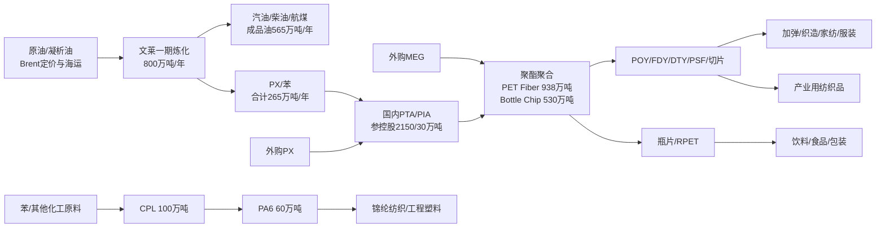

# 恒逸石化全链条分类

数据截止：2026-07-22。链条不是“原油上涨即利好”，而是原油成本、炼油/芳烃裂解价差、PTA 加工费和聚酯加工费在不同环节重新分配利润。文莱炼化与国内 PTA—聚酯资产必须分开观察。

## 链条块与价值传导

| chain_block | 核心物料/产品 | 利润代理 | 恒逸直接性 | 主要需求锚 | 关键约束 |
|---|---|---|---|---|---|
| 原油/凝析油 | Brent-linked 原油、凝析油 | Brent、采购贴水、VLCC 运费、库存收益/损失 | 直接成本输入；非资源生产商 | 全球炼厂加工和成品油消费 | 地缘、海峡运输、品质差异、库存周转 |
| 文莱炼化 | 汽油、柴油、航煤、PX、苯 | 柴油裂解价差、PX-石脑油价差、综合炼化毛利 | 直接；恒逸文莱 70% 控股 | 东南亚、澳大利亚成品油与芳烃需求 | 30% 少数股东、税惠期限、原油/产品物流、装置检修 |
| 国内 PTA/PIA | PTA、PIA | `PTA - 0.655×PX` 加工费 | 直接但参控股混合 | 国内聚酯产量、出口 | 行业过剩、参股权益法、装置开工与库存 |
| MEG | 外购为主；桐昆等同行有自制 | MEG 价格/库存 | 恒逸主要为成本输入 | 聚酯聚合 | 煤制/油制路线竞争、进口依赖、汇率 |
| 聚酯纤维 | POY、FDY、DTY、PSF、切片 | 聚酯/长丝加工费、库存天数 | 直接 | 织造、服装、家纺、产业用纺织 | 下游低开工、库存、出口与反倾销 |
| 瓶片/RPET | PET Bottle Chip、RPET | `瓶片 - 0.855×PTA - 0.335×MEG` | 参控股/产能口径；收入拆分不足 | 饮料、食品、包装 | 新增供给、客户认证/食品接触资质、海运 |
| CPL/PA6 | CPL、PA6 | CPL-苯/氨、PA6-CPL 加工差 | 直接，2025 新增板块 | 锦纶纺织、工程塑料 | 爬坡、良率、客户认证和收入披露不足 |
| 织造/服装/包装 | 面料、服装、家纺、包装 | 开工率、零售、出口、订单 | 需求锚；非恒逸上游订单证明 | 终端消费与出口 | 贸易壁垒、终端去库、替代材料 |
| 工业用途 | 轮胎帘子布、土工布、汽车/工程材料 | 产量、项目开工、汽车/基建需求 | 应用映射 | 汽车、基建、新能源 | 产品等级与认证未披露 |

## 路线与替代

- PTA：约 0.655 吨 PX 生产 1 吨 PTA；PX 约占 PTA 成本九成。此为郑商所/行业教育近似，不等于恒逸实际单耗。
- 聚酯：1 吨短纤或瓶片的行业近似物耗为 0.855 吨 PTA 与 0.335 吨 MEG；短纤原料约占成本 83%。
- 替代：短纤面对棉花、粘胶和再生短纤替代；包装面对玻璃、铝罐、纸包装及再生 PET；锦纶面对涤纶及其他工程塑料。
- 物流：文莱一期原油主要来自文莱、马来西亚，产品面向东南亚/澳大利亚；国内 PTA/聚酯沿海/长三角基地具备区域物流优势，但公司未披露分基地物流成本。

## 税、汇率与利润归属

- 文莱一般公司税率 18.5%；恒逸文莱因先锋企业资格披露享受 11 年公司所得税及进口器械/原料免税，但起止日及到期后有效税率未披露。
- 恒逸文莱功能货币为美元，集团报表为人民币；BND 与 SGD 1:1 挂钩只能降低 BND/SGD 波动，不消除 USD/CNY、原油和产品美元定价风险。
- 恒逸只持有文莱主体 70%，炼厂净利润必须扣除 30% 少数股东后才能进入归母利润桥。

## 证据门槛

直接受益必须同时满足：产品/工艺存在、收入路径明确、价格或价差可观察、产能与实际产量/开工可交叉验证。只出现“需求增长”“产能建设”或“价格上涨”不足以转为 EPS。

