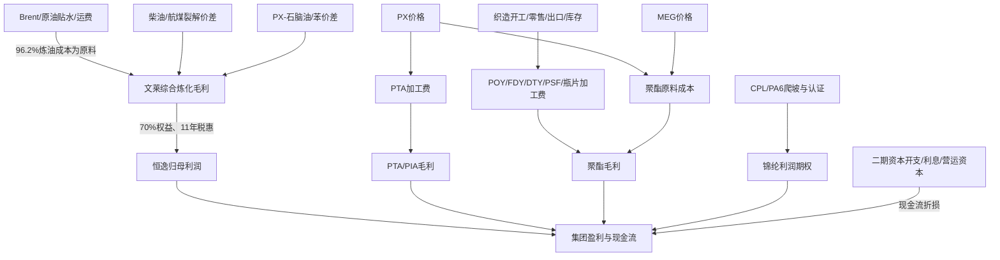

# 恒逸石化供应链模型

门禁状态：**CONDITIONAL**。

恒逸具备可验证的“文莱炼化—PX/苯—国内 PTA/PIA—聚酯纤维/瓶片”及“CPL—PA6”链条，足以支持周期归一化估值。2026 年盈利跃升的主驱动来自文莱炼化价差，而不是国内聚酯需求全面复苏；由于 H1 预告未披露分部利润、实际价差、税率和少数股东归属，高景气利润不得机械年化。

## 价值池迁移

## 2025 基线

| 板块 | 收入 | 毛利率 | 产销量/产能锚 | 判断 |
|---|---:|---:|---|---|
| 炼油产品 | 284.78亿元 | 4.86% | 产603.64、销606.95万吨；文莱一期800万吨原油加工 | 2025低基数，2026价差弹性最大 |
| 化工产品 | 110.90亿元 | 7.63% | 产219.27、销217.96万吨；PX/BZ合计265万吨设计 | 2025毛利同比下降6pct；2026芳烃价差修复需分部验证 |
| PTA | 44.16亿元 | 0.37% | 控股口径产220.91、销222.94万吨；参控股产能2150万吨 | 产能和产销口径不同，禁止产能乘加工费 |
| PIA | 14.12亿元 | 4.55% | 产20.81、销21.38万吨；产能30万吨 | 体量较小，非主驱动 |
| 涤纶 | 597.44亿元 | 4.07% | 产867.97、销868.93、库存50.76万吨；PET Fiber 938万吨 | 量增但毛利薄，受库存/织造开工制约 |
| 锦纶及副产品 | 18.20亿元 | 6.83% | 产8.89、销4.67、库存4.22万吨；CPL/PA6 100/60万吨 | 明显爬坡期，只给事件期权 |
| 供应链服务 | 65.67亿元 | 3.91% | 未披露独立量价 | 不与制造毛利混同 |

恒逸文莱主体 2025 年收入 421.40 亿元、净利润 2.42 亿元、经营现金流 3.25 亿元，较 2024 年净亏损 10.03 亿元改善；30% 少数股东对应 0.73 亿元利润。该主体数据是文莱利润桥的公司级基线，比集团“炼油+化工”分产品口径更直接。

## 2026 传导与边界

- 2026Q1 集团归母净利润 19.95 亿元、少数股东损益 8.23 亿元，少数股东占合并净利润约 29.2%，与文莱 70% 权益结构方向一致，但不能认定全部少数股东损益来自文莱。
- 2026H1 预告归母净利润 55-60 亿元，称文莱满产满销、东南亚油品与 PX/苯盈利高、国内 PTA/聚酯实现盈利及广西项目改善。该预告未经审计且无分部拆分，只作方向验证。
- 2026Q1 存货由 133.13 亿元升至 187.07 亿元，经营现金流为 -25.73 亿元，显示油价、备货和聚酯库存对现金转化的拖累；高利润不等于高自由现金流。

## 估值信用

- **可进入：** 2025 审计分部收入/毛利、文莱主体利润、实际产销量、库存、净负债/资本开支；采用周期归一化或分情景方法。
- **只作代理：** IEA/EIA 油价、行业裂解/加工费、PTA/聚酯开工与库存、外部航运指数。
- **不得进入：** 将 2,150 万吨 PTA 或 530 万吨瓶片设计产能全部乘行业价差；将 H1 预告年化；给二期未交割融资、未披露客户/订单或 CPL/PA6 设计产能成长信用。

## 门禁缺口

2026 分部利润与价差、文莱税惠起止、少数股东归属、国内分装置开工、客户/长协与 ASP、二期有约束力融资、CPL/PA6 良率认证均待补。因此结论是 `CONDITIONAL`，不是 `PASS`。

