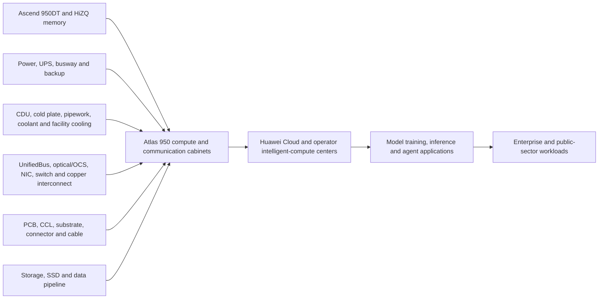

# Full-Chain Taxonomy

**Coverage pack:** `workspace/templates/industry-coverage-packs/aidc.md`.

The architecture creates scale-up demand across eight AIDC blocks, but Huawei retains the system, accelerator, memory-subsystem and interconnect control points. Public evidence does not disclose enough subsystem suppliers to convert the product launch directly into an A-share revenue list.
