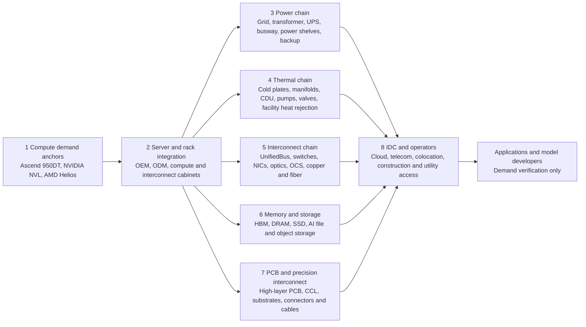

# Industry Landscape: Huawei Atlas 950 SuperPoD

**Evidence cutoff:** 2026-07-18  
**Selected coverage pack:** `workspace/templates/industry-coverage-packs/aidc.md`  
**Role conclusion:** The 1,024-card Atlas 950 shown in July 2026 is meaningful physical validation of Huawei's scale-up architecture, but the 8,192-card system remains a Q4 2026 maximum-design roadmap; therefore, the event supports a domestic AIDC architecture thesis, not upstream A-share order or earnings credit.

## 1. Decision-useful framing

Three concepts must remain separate:

1. **Ascend 950DT** is the planned training/decode accelerator. Huawei announced 144 GB of proprietary HiZQ 2.0 HBM, 4 TB/s memory bandwidth, 2 TB/s interconnect bandwidth, 1 PFLOPS FP8 and 2 PFLOPS FP4 per chip, with availability planned for 2026 Q4 [H1].
2. **Atlas 950 SuperPoD** is the single-logical-machine system built around UnifiedBus 2.0. Huawei's maximum roadmap configuration is 8,192 950DT cards across 160 cabinets, but the only physical Atlas 950 configuration publicly disclosed by the evidence cutoff is the 1,024-card system shown at WAIC on 2026-07-17 [H1][H3][H4].
3. **Atlas 950 SuperCluster** is a separate scale-out layer: 64 Atlas 950 SuperPoDs, more than 520,000 chips and more than 10,000 cabinets. It must not be presented as one physical SuperPoD [H1].

The investable industry implication is broader than accelerator count. Atlas 950 changes the unit of system design from a server or rack toward a multi-cabinet logical machine. The likely bottlenecks move toward all-optical fabric, high-density power, liquid cooling, HBM and pooled memory, high-speed PCB and connectors, and facility-scale integration. However, Huawei has not disclosed the Atlas 950 BOM, supplier list, ASP, system price, power envelope, signed customers, backlog, or upstream order allocation. All A-share mapping therefore remains a **capability watchlist** unless company-level filings supply product, qualification/order, and economics evidence.

## 2. Product-status reconciliation

| Item | Silicon / protocol | Public configuration | Status at cutoff | Material numbers | Evidence and quality | What it does not prove |
|---|---|---:|---|---|---|---|
| Atlas 900 A3 SuperPoD | Ascend 910C / UnifiedBus 1.0 | Up to 384 cards | Commercially deployed predecessor | 300 PFLOPS; more than 300 units and more than 20 customers reported in Sep-2025; the Jul-2026 release reports more than 750 Ascend 384-card systems without naming all of them Atlas 900 A3 | Huawei official statements [H1][H4], Tier 1 for Huawei's disclosure; installed-base figures are not independently audited here | Atlas 950 shipments or any upstream supplier order |
| CloudMatrix384 | Huawei Cloud service instance on Atlas 900 A3 | 384-card service instance | Cloud service based on predecessor hardware | Same 384-card system boundary | Huawei official keynote [H1] | A separate 950 product, a 950 order, or evidence for a listed supplier |
| Ascend 950DT | Ascend 950 die + proprietary HiZQ 2.0 HBM | One chip per “card” under Huawei's terminology | Product roadmap; planned 2026 Q4 | 1 PFLOPS FP8; 2 PFLOPS FP4; 144 GB; 4 TB/s memory bandwidth; 2 TB/s interconnect bandwidth | Huawei official keynote [H1], Tier 1 roadmap but forward-looking | Foundry, packaging, HBM manufacturing source, yield, volume ramp or qualification |
| Atlas 950 physical system | UnifiedBus / exact displayed silicon stepping not disclosed in Jul-2026 release | 1,024 cards | First public hardware display on 2026-07-17 | 1 EFLOPS FP8; 2 EFLOPS FP4; 256 TB global unified address space; TB-class NPU interconnect; 3 microseconds RTT | Huawei official WAIC release [H4], Tier 1 for the displayed configuration; performance remains vendor-stated | 8,192-card physical deployment, 950DT HBM equivalence, named customer, price, acceptance or mass production |
| Atlas 950 maximum design | Ascend 950DT / UnifiedBus 2.0 | Up to 8,192 cards; 128 compute + 32 interconnect cabinets | Announced design ceiling and 2026 Q4 availability roadmap | 8 EFLOPS FP8; 16 EFLOPS FP4; approximately 1,152 TB memory; approximately 16 PB/s interconnect; approximately 1,000 m2 | Huawei official Sep-2025 and Mar-2026 releases [H1][H3], Tier 1 roadmap, not delivered-system evidence | Physical completion, yield, utilization, reliability at full scale, customer acceptance or revenue |
| Atlas 950 SuperCluster | UBoE or RoCE between SuperPoDs | 64 SuperPoDs; more than 520,000 cards; more than 10,000 cabinets | 2026 Q4 roadmap | 524 EFLOPS FP8 | Huawei official keynote [H1], Tier 1 roadmap | One SuperPoD, one physical 500,000-card machine, or current deployment |

### 2.1 Arithmetic checks and unresolved memory boundary

- The compute progression is internally consistent at the level of Huawei's rounded vendor specifications: 1,024 cards multiplied by 1 PFLOPS FP8 per chip is approximately 1 EFLOPS; 8,192 cards is approximately 8 EFLOPS [H1][H4]. This arithmetic does not validate sustained application performance.
- Huawei's 1,152 TB maximum-design memory statement is consistent with 8,192 cards multiplied by 144 GB when a 1,024 conversion is used. Unit convention is not stated [H1].
- The July physical system's 256 TB global unified address space divided by 1,024 cards equals 256 GB per card. That is not the same as the 144 GB HiZQ 2.0 HBM roadmap figure. The difference could reflect pooled CPU or other memory, a changed configuration, or a broader address-space definition, but Huawei does not explain it [H1][H4]. The report must not label the 256 TB figure as HBM.
- The July release does not explicitly identify the displayed card as Ascend 950DT. Linking Atlas 950 to 950DT is supported by the September roadmap, but the displayed silicon stepping and production configuration remain undisclosed [H1][H4].
- Huawei's September engineering speech describes 2.1 microseconds interconnect latency, while the July physical-system release describes 3 microseconds **round-trip** latency. Because the first figure is not labelled as RTT and the system/configuration boundary may differ, the two figures must not be presented as directly comparable or as a proven regression [H1][H4].

## 3. Architecture transition: three competing scale-up models

| Platform | Scale-up domain described by vendor | Interconnect model | Status | Architectural moat | Key comparability warning |
|---|---:|---|---|---|---|
| Huawei Atlas 950 | 1,024 cards physically shown; 8,192-card maximum design | UnifiedBus 2.0; multi-cabinet all-optical UB-Mesh; UBoE/RoCE at SuperCluster layer | 1,024 physical display; 8,192 design planned for Q4 2026 | Domestic integrated stack, unified addressing, system-scale resource pooling and independence from restricted foreign accelerators | Huawei does not disclose precision/sparsity conventions, full-system power, software-normalized benchmarks or 8,192-card utilization [H1][H3][H4] |
| NVIDIA GB300 NVL72 | 72 GPUs in one rack-scale NVLink domain | Fifth-generation NVLink/NVSwitch; Quantum-X InfiniBand or Spectrum-X Ethernet for scale-out | NVIDIA page states “available now” at cutoff | CUDA/software ecosystem, NVLink/NVSwitch, networking, OEM and storage ecosystem, production references | 720 PFLOPS FP8/FP6 and 1,440 sparse / 1,080 dense PFLOPS FP4 use NVIDIA's stated conventions; unit count is not a performance metric by itself [C1] |
| AMD Helios | 72 MI455X GPUs in an open rack reference design | UALink over Ethernet for scale-up; UEC/Pensando for scale-out | Reference design; AMD expects volume deployments in 2H 2026 | Open standards, OEM/ODM flexibility, HBM4 capacity and ROCm portability | Helios is explicitly a reference design rather than a product for sale; 1.4 EFLOPS FP8 and 2.9 EFLOPS FP4 are AMD estimates subject to change [C2] |
| NVIDIA Vera Rubin POD | Five purpose-built racks around Vera Rubin NVL72 systems in NVIDIA's current May-2026 description | NVLink plus Spectrum-X Ethernet Photonics, BlueField and storage/network racks | Production ramp announced; shipments planned from fall 2026 | Broad MGX/OEM/ODM/storage ecosystem and co-packaged optics in production ramp | NVIDIA's current official boundary is not the “NVL144” naming used in Huawei's Sep-2025 peer-roadmap comparison; the Huawei comparison should not be treated as a current normalized matchup [C21] |

Huawei's differentiated wager is not simply “more chips.” It is that a larger multi-cabinet scale-up domain can compensate for semiconductor-process constraints if interconnect, memory pooling, software scheduling and reliability are co-designed. NVIDIA's moat remains the production software/network/OEM ecosystem around rack-scale NVLink domains and POD/scale-out fabrics. NVIDIA's May-2026 Vera Rubin release describes a five-rack POD built from NVL72 systems rather than the NVL144 boundary used in Huawei's September 2025 comparison, so that comparison is now best treated as a dated vendor-roadmap claim. AMD/UALink offers a more open alternative, but its 2026 Helios platform is still a partner-built reference design. These architectures may coexist because workload, power availability, sovereignty, software compatibility and deployment model differ.

## 4. Full-chain architecture and mandatory AIDC blocks



| Mandatory block | Physical role in Atlas 950 thesis | Global reference participants | China reference participants | Huawei-specific evidence | Investability boundary |
|---|---|---|---|---|---|
| 1. Compute platform and accelerator demand anchors | Accelerator, host CPU, scale-up protocol, compiler/runtime and workload scheduling | NVIDIA GB300 NVL72; AMD Helios/UALink; hyperscaler ASIC systems | Huawei Ascend/Atlas; domestic accelerator and server ecosystems including Cambricon, Hygon and private alternatives as adjacent substitutes | 950DT roadmap, UnifiedBus 2.0, 1,024-card physical system and 8,192-card maximum design [H1][H3][H4] | Huawei product evidence does not identify accelerator fabrication, packaging or listed-company suppliers; competitor products are demand and substitution anchors only |
| 2. Server, OEM, ODM and rack integration | Compute trays/cabinets, interconnect cabinets, BMC, power shelves, rack mechanics, manufacturing and field service | Dell, HPE, Lenovo, Supermicro; Foxconn, QCT, Wiwynn, Inventec and other ODMs in global AI-rack ecosystems | Huawei, Lenovo, IEIT/Inspur, H3C, xFusion and other domestic system vendors | Full roadmap calls for 128 compute and 32 interconnect cabinets; Huawei opens NPU modules, blades, cards and reference architecture to partners [H1][H2] | No Atlas 950 OEM/ODM, rack manufacturer, volume, ASP or order allocation is disclosed |
| 3. Data-centre power | Grid connection, transformer, medium/low-voltage distribution, UPS, busway, power shelves, battery and backup generation | Vertiv, Schneider Electric, Eaton, Delta and OEM-integrated rack power | Huawei Digital Power; Kehua, Kstar, Sungrow and other domestic data-centre power vendors | Huawei separately offers up-to-3.2-MW FusionPower9000 PowerPOD; this is generic AIDC capability, not a disclosed Atlas 950 attachment [C6]. Vertiv, Delta and Eaton sources verify global product participation [C22][C23][C25] | Atlas 950 cabinet power, system MW, power architecture, supplier and value amount are not disclosed; no revenue bridge is possible |
| 4. Thermal management and liquid cooling | Cold plates, blind-mate connectors, manifolds, CDU, pumps, valves, coolant, heat rejection and controls | Vertiv, Schneider/Motivair, CoolIT, Boyd and server-OEM thermal stacks | Huawei Digital Power; Envicool, Shenling, IEIT and other domestic vendors | Atlas 950 is fully liquid-cooled; Huawei describes a floating blind-mate liquid-cooling connector and integrated cooling materials/processes [H2]. Vertiv, Delta and Envicool sources verify adjacent cooling capability [C22][C23][C24] | General Huawei customer or data-service cooling exposure is not Atlas 950 order proof; CDU count, kW/rack, coolant loop and suppliers are undisclosed |
| 5. Optical, networking, switches, NICs, OCS and cables | Intra- and inter-cabinet scale-up, scale-out Ethernet/RoCE/UBoE, optical modules/fiber, packet and circuit switching | NVIDIA/Mellanox, Broadcom, Arista, Cisco/Acacia, Coherent and Lumentum; Google and Coherent demonstrate OCS relevance | Huawei; Innolight, Eoptolink, Accelink and other domestic optical/module vendors | Full design is all-optical between cabinets; 32 interconnect cabinets; UB-Mesh; UBoE may reduce switch and optical-module count versus RoCE [H1][H2] | “All-optical” does not reveal module count, speed, form factor, OCS use, DSP/CPO architecture or supplier; supplier inference is prohibited |
| 6. Storage, memory, HBM/DRAM/NAND and controllers | Accelerator-local HBM, CPU/pool memory, checkpoint/data lake, SSD and high-performance file/object storage | SK hynix, Samsung and Micron in HBM; Dell, NetApp, DDN, VAST and other AI storage systems | Huawei proprietary HiBL/HiZQ and OceanStor; domestic DRAM/NAND and storage vendors as adjacent capabilities | 950DT: 144 GB HiZQ 2.0 HBM and 4 TB/s; July system: 256 TB global address space; Huawei OceanStor AI storage exists separately [H1][H4][C11] | HBM manufacturing source, yield, package supplier and volume are undisclosed; OceanStor is not disclosed as the Atlas 950 storage configuration |
| 7. PCB, CCL, substrate, connectors, cables and precision parts | High-layer/high-speed boards, backplanes, power boards, substrates, high-speed copper/fiber, blind-mate liquid and electrical connectors | TTM, Unimicron, Compeq, Ibiden; Panasonic/EMC; Amphenol, TE and Molex | WUS, Shennan Circuits, Victory Giant, Shengyi Technology, Luxshare and other domestic participants | Huawei says the Atlas 950 uses an orthogonal cableless electrical architecture and a floating blind-mate liquid-cooling connector [H2]. TTM, TE and Panasonic sources verify adjacent global PCB/material/connector capability [C26][C27][C28] | General AI-server exposure or product capability does not establish Atlas 950 qualification, ASP, layer count, yield, supplier share or orders [C13][C14][C15] |
| 8. IDC, cloud, telecom operator, colocation and construction | Site, utility quota, grid/renewable power, water, permits, building, operations, utilization and cloud service monetization | AWS, Microsoft Azure, Google Cloud, Oracle, Meta; Equinix and Digital Realty | Huawei Cloud, Alibaba Cloud, Tencent Cloud, ByteDance; China Mobile/Telecom/Unicom; GDS, VNET, Range Technology and other operators | Huawei reports predecessor deployments and broad sector coverage, but no named Atlas 950 customer or site [H1][H4] | Operator capex and policy support are demand anchors only; they do not prove Atlas 950 purchase or upstream A-share orders |

## 5. Demand anchors are not supplier evidence

The evidence hierarchy for this case is:

| Evidence | What it can support | What it cannot support |
|---|---|---|
| Huawei product roadmap or physical display | Architecture, stated configuration, intended release timing and system-level demand direction | Supplier identity, order value, revenue, margin or A-share EPS |
| Huawei predecessor installed base | Evidence that Huawei can commercialize an earlier 384-card generation and has ecosystem demand | Atlas 950 delivery, 8,192-card completion or supplier continuity into the new platform |
| Cloud/operator/model capex or deployment | Addressable workload and facility demand | Any specific upstream supplier's qualification or order |
| A listed company's general AI-server/optical/power/cooling/PCB product exposure | Capability relevance and a reason to monitor | Atlas 950 relationship, customer acceptance, BOM share or revenue conversion |
| Named Huawei/Ascend cooperation | Ecosystem relationship | Atlas 950 product qualification, signed order, ASP, volume or margin unless explicitly disclosed |
| Named product + qualification/order + economics | Potential valuation credit if source is official and current | Credit beyond the disclosed scope or period |

Case-specific examples reinforce this boundary:

- iFlytek (002230) states in its 2025 annual report that it is co-developing on Ascend 950 and plans an October 2026 flagship model. This is a strong **software/workload demand anchor**, but it does not prove Atlas 950 procurement or an upstream component order [F1].
- Talkweb (002261) documents a direct Huawei/Ascend partnership. This supports an **Ascend ecosystem relationship**, not a disclosed Atlas 950 order or system BOM position [F2].
- Shenling Environment (301018) discloses Huawei as a data-service customer and cooperation with “Company H.” This supports a **general customer relationship and cooling/data-service exposure**. The filing does not identify Atlas 950, an Atlas platform qualification, order value or backlog; it must remain watchlist-only [F3].
- NVIDIA names Innolight and Eoptolink in its photonics ecosystem. That is official evidence for participation in NVIDIA's photonics ecosystem, not Huawei's all-optical Atlas 950 supply chain [C3].

## 6. TAM, SAM and valuation-eligible SOM boundary

### 6.1 Bottom-up formula

A defensible product-level value pool would require:

```text
System TAM = accepted SuperPoD units × configuration mix × system ASP
Block SAM = accepted units × block quantity per configuration × qualified ASP per unit
A-share SOM = block SAM × named-supplier allocation × delivery conversion × revenue recognition
```

The official sources provide the configuration ceiling and some physical counts, but not accepted Atlas 950 units, system ASP, power/cooling/network BOM quantities, supplier allocation, order conversion, or revenue recognition. A monetary TAM, China SAM, or company SOM is therefore **not disclosed / not supportable from the checked primary sources**.

### 6.2 Observable engineering envelope

- Physical validation: one publicly shown 1,024-card configuration; site and customer not disclosed [H4].
- Maximum design: 8,192 cards, 128 compute cabinets and 32 interconnect cabinets, approximately 1,000 m2 [H1].
- SuperCluster roadmap: 64 maximum-design SuperPoDs and more than 10,000 cabinets [H1].
- Cabinet power, rack density, cooling capacity, optical count, PCB area, connector count, system ASP and deployment count: not disclosed.

The usual 10–25% China SAM discount to global AIDC TAM should not be mechanically applied here. Atlas 950 is a China-centered sovereign-compute architecture with a different technology and procurement boundary, while the global competitor systems use different rack, fabric and software stacks. **Addressable by covered companies on currently evidenced Atlas 950 revenue: RMB 0 of valuation-eligible revenue at the cutoff.** This means zero credit, not zero industrial potential: no covered A-share supplier yet has the full public chain of Atlas 950 product exposure, qualification/order and block economics in the evidence reviewed for this file.

## 7. Policy and risk environment

| Factor | Current evidence | Industry effect | Specific monitoring trigger |
|---|---|---|---|
| Advanced-compute and HBM export controls | BIS added controls on HBM and semiconductor manufacturing items in Dec-2024; in Jan-2026 it moved H200, MI325X and similar China exports to case-by-case review subject to conditions [C16][C17] | Strengthens demand for domestic compute and memory substitution but constrains access to leading manufacturing equipment, HBM and ecosystem components | Changes to the EAR, licence policy, HBM control thresholds, Entity List status or third-country enforcement guidance |
| China compute-interconnection policy | MIIT initiated national compute-interconnection node construction in Feb-2026 [C18] | Supports pooling and scheduling of public compute resources; may improve utilization rather than automatically increase hardware orders | Node acceptance lists, operator tenders, utilization disclosures and national platform traffic |
| Energy-efficiency and project approval | Apr-2026 policy calls for stricter efficiency review, cooling architecture upgrades, renewable-energy use and higher unit-compute efficiency [C19] | Makes power availability, PUE, heat rejection and grid access binding constraints for multi-cabinet SuperPoDs | Approved MW/GW projects, PUE thresholds, grid connection, renewable contracts, water permits and commissioning dates |
| Execution at 8,192-card scale | Only 1,024-card physical hardware is disclosed; 8,192 remains a maximum design [H1][H4] | Reliability, optical fault handling, collective communication, yield and software utilization can delay revenue conversion | A physically identified 8,192-card system, independent benchmark, burn-in/acceptance disclosure, named site and sustained utilization |
| HBM localization | Huawei describes proprietary HiZQ 2.0 and HiBL 1.0 but not manufacturing source, yield or volume [H1] | HBM capacity, base die, packaging and yield may be the critical localization boundary | Volume-production confirmation, packaging capacity, yield, memory-spec reconciliation and named qualified supply chain |
| Software ecosystem | CANN and Mind software are being opened; Huawei reports ecosystem scale [H4] | Ecosystem compatibility and model performance determine effective rather than peak compute | Independent model training/inference results, porting time, operator availability, framework coverage and developer activity |
| Supplier over-attribution | Numerous A-share companies have generic AI/Huawei exposure but no Atlas 950 order disclosure | Creates crowded thematic trades and valuation risk before revenue proof | Exchange clarification, annual/interim report product naming, customer qualification, contract value, shipment and segment revenue |

## 8. Profit-pool direction and monitoring priorities

The architecture raises the strategic importance of five pools, but none is yet quantified for Atlas 950:

1. **Compute and HBM:** highest value density and strongest localization constraint. Monitor 950DT production, HiZQ 2.0 capacity/yield and memory-address-space reconciliation.
2. **All-optical scale-up:** potentially high content because the 8,192 design spans 160 cabinets, but UBoE's claimed reduction in switches and optical modules means unit-count extrapolation from RoCE clusters is unsafe.
3. **Liquid cooling and rack power:** necessary because Huawei describes Atlas 950 as fully liquid-cooled. Monitor system MW, kW/cabinet, CDU/manifold topology, supplier qualification and acceptance.
4. **High-speed PCB and connectors:** orthogonal cableless interconnect and blind-mate connectors create demanding specifications, but may redistribute value between PCB, cable, connector and optoelectronic content rather than simply increase all categories.
5. **IDC and grid infrastructure:** full-system economics ultimately depend on site power, utilization and cloud/operator monetization. Policy support and predecessor deployments are demand context, not supplier earnings.

## 9. Industry view, confidence and degradation

**House industry view:** Atlas 950 is strategically important because it demonstrates a plausible domestic path from chip-level constraints to system-level scale, but the July event moves the evidence only from “roadmap” to “1,024-card physical validation.” It does not close the 8,192-card, HBM-manufacturing, customer-acceptance or supplier-order gaps.

**Core valuation pool implication:** no A-share company should enter the core valuation pool solely because it makes AI-server, optical, cooling, power, PCB or connector products, or because it has a general Huawei relationship. Company-specific core eligibility requires official Atlas 950 product/process exposure, customer/platform qualification or orders, and economics that can bridge to revenue and margin.

**Satellite watch pool:** Ascend software/model partners, Huawei data-service cooling partners, domestic optical/PCB/CCL/connector vendors, power vendors and IDC operators can remain satellite watches with explicit upgrade triggers.

**Confidence:** 88/100 for product-status reconciliation and architecture; 58/100 for the commercial supply-chain map; 20/100 for monetary value allocation to A-share companies.

**Degradation:** Atlas 950 supplier list, system power, BOM, ASP, named customers, backlog, delivery/acceptance, HBM manufacturing source and full-scale 8,192-card validation are not disclosed. CR3/CR5 data are not available from checked primary sources and are handled in `competitive_landscape.md`.

## Source key

- **[H1]** Huawei, 2025-09-18, executive keynote transcript, official primary source: https://www.huawei.com/en/news/2025/9/hc-xu-keynote-speech. Case capture: `sources/official-huawei-20260718/huawei_2025-09-18_xu_keynote_evidence.md`.
- **[H2]** Huawei, 2025-09-18, SuperPoD architecture/product release, official primary source: https://www.huawei.com/en/news/2025/9/hc-superpod-innovation.
- **[H3]** Huawei, 2026-03-02, MWC Atlas 950 launch, official primary source: https://www.huawei.com/en/news/2026/3/mwc-superpod-ai. Case capture: `sources/official-huawei-20260718/huawei_2026-03-02_mwc_atlas950_evidence.md`.
- **[H4]** Huawei, 2026-07-17, WAIC physical Atlas 950 release, official primary source: https://www.huawei.com/cn/news/2026/7/atlas-950-superpod. Case capture: `sources/official-huawei-20260718/huawei_2026-07-17_waic_physical_system_evidence.md`.
- **[C1]–[C28]** Official competitor, supply-chain and policy sources with dates, URLs and limitations: `sources/official-huawei-20260718/official_competitor_policy_source_index.md`.
- **[F1]** iFlytek (002230), 2025 annual report, official CNINFO filing: https://static.cninfo.com.cn/finalpage/2026-04-29/1225233581.PDF. Case files: `sources/official-filings-20260718/002230-iflytek-2025-annual.pdf` and `.txt`.
- **[F2]** Talkweb (002261), 2025 annual report. Case files: `sources/official-filings-20260718/002261-talkweb-2025-annual.pdf` and `.txt`. The case source is a third-party PDF mirror of the official report and should be verified against CNINFO before high-impact quotation: https://notice.10jqka.com.cn/api/pdf/269dd440733c170c.pdf.
- **[F3]** Shenling Environment (301018), 2025 annual summary. Case files: `sources/official-filings-20260718/301018-shenling-2025-annual-summary.pdf` and `.txt`. The case source is a third-party mirror of the official filing and should be verified against CNINFO before high-impact quotation: https://pdf.dfcfw.com/pdf/H2_AN202604261821589125_1.pdf.
