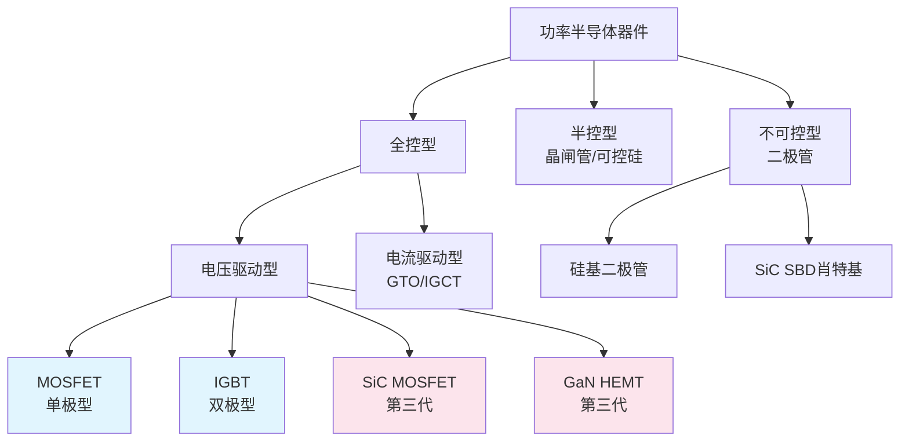
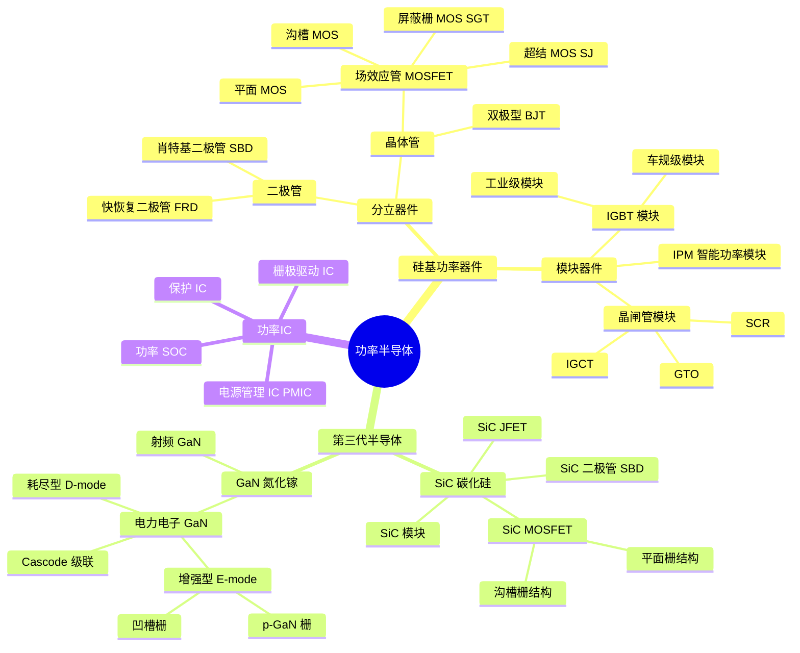
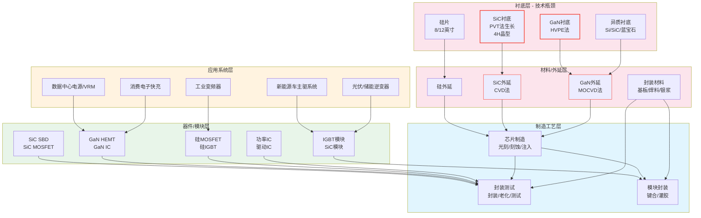

# 功率半导体技术原理与架构深度解析

> 本文档从物理原理层面系统解析功率半导体的技术架构，涵盖硅基 / SiC / GaN 三大技术路线的底层差异、制造工艺难点、封装技术演进及未来路线图，旨在帮助投资者理解"技术参数差异"如何转化为"产品性能与成本差异"。

---

## 一、功率半导体基础原理

### 1.1 核心功能：电能变换的"电子开关"

功率半导体的本质是**控制电能流动的电子开关**。想象一下家里的水龙头——你可以控制水流的大小、方向和开关时机。功率半导体做的事情类似，只不过控制的是电流而不是水流。

一个完整的电力电子系统通常包含以下变换类型：

| 变换类型 | 功能描述 | 典型应用 |
|---------|---------|---------|
| AC-DC（整流） | 交流电转直流电 | 充电器、电源适配器 |
| DC-AC（逆变） | 直流电转交流电 | 新能源车主驱、光伏并网 |
| DC-DC（斩波） | 直流电压升降 | 手机快充、服务器VRM |
| AC-AC（变频） | 交流电压/频率变换 | 工业变频器、家电变频 |

**核心指标**：一个功率器件的好坏，本质上看三件事——
1. **开得通**：导通时电阻越小越好（导通损耗低）
2. **断得开**：关断时能承受的电压越高越好（耐压高）
3. **变越快**：开关切换的速度越快越好（开关损耗低）

这三者构成了功率器件的"不可能三角"——提高耐压往往会增加导通电阻，加快开关速度又可能降低可靠性。不同的技术路线，就是在这个三角中寻找不同的平衡点。

### 1.2 主要技术参数详解

| 参数 | 含义 | 对应用户价值 | 通俗类比 |
|------|------|-------------|---------|
| **击穿电压 V_B** | 器件能承受的最高反向电压 | 决定能用在多高电压的系统中 | 水管能承受的最大水压 |
| **导通电阻 R_on** | 导通时的电阻值 | 决定导通时发热多少 | 水管的粗细——越粗水流越顺畅 |
| **开关频率 f_sw** | 每秒开关切换的次数 | 决定被动元件（电感/电容）能做多小 | 水龙头开关的快慢 |
| **开关损耗 E_sw** | 每次开关过程的能量损耗 | 高频应用中发热的主要来源 | 每次开关水龙头消耗的体力 |
| **热阻 R_th** | 热量从芯片传到外部的难易度 | 决定散热设计难度 | 保温杯的保温系数（反过来想） |
| **工作温度 T_j** | 芯片结温上限 | 决定可靠性和功率密度 | 人体能承受的最高体温 |

**关键洞察**：很多投资者只看"耐压"和"电流"两个参数，但真正决定系统级价值的是**开关损耗**和**热导率**——SiC 之所以能颠覆新能源车主驱，核心不是耐压更高（硅基 IGBT 也能做 1200V），而是开关损耗降低 70-80%，使得系统效率大幅提升、散热体积大幅缩小。

### 1.3 功率器件分类与应用场景

按可控性分类：



**各品类的定位**：

| 器件类型 | 电压范围 | 功率范围 | 频率范围 | 典型应用 | 市场地位 |
|---------|---------|---------|---------|---------|---------|
| 硅基 MOSFET | 12V~800V | 1W~10kW | 10kHz~1MHz | 消费电子、家电、汽车电子 | 中低压主力，量大面广 |
| 硅基 IGBT | 600V~6.5kV | 1kW~1MW+ | 1kHz~100kHz | 新能源车主驱、工业变频、光伏逆变器 | 中高压大功率王者 |
| SiC MOSFET | 650V~10kV+ | 10kW~MW级 | 50kHz~1MHz | 800V电车、快充、高压光伏 | 高压高端渗透加速 |
| GaN HEMT | 30V~900V | 10W~100kW | 100kHz~10MHz+ | 快充、数据中心VRM、车载OBC | 高频高效新势力 |

---

## 二、四大主流技术路线全面对比

### 2.1 核心参数对比表

| 对比维度 | 硅基 MOSFET | 硅基 IGBT | SiC MOSFET | GaN HEMT |
|---------|------------|----------|-----------|----------|
| **材料体系** | 第一代半导体 Si | 第一代半导体 Si | 第三代半导体 SiC | 第三代半导体 GaN |
| **器件结构** | 平面/沟槽/超结 | 沟槽栅+场截止 | 平面/沟槽 MOS | HEMT（二维电子气） |
| **载流子类型** | 单极型（只有电子） | 双极型（电子+空穴） | 单极型（只有电子） | 单极型（2DEG） |
|  |  |  |  |  |
| **典型耐压** | 12V ~ 800V | 600V ~ 6.5kV | 650V ~ 3.3kV | 30V ~ 900V |
| **单管电流** | 1A ~ 300A | 10A ~ 800A | 10A ~ 300A | 5A ~ 200A |
| **开关频率** | 10kHz ~ 1MHz | 1kHz ~ 50kHz | 50kHz ~ 1MHz | 100kHz ~ 10MHz+ |
|  |  |  |  |  |
| **导通损耗** | 中（低压很低，高压高） | 低（大电流下优） | 低（高压下优势大） | 极低 |
| **开关损耗** | 中 | 高（拖尾电流） | 极低（比IGBT低70-80%） | 接近零（无尾电流） |
| **反向恢复** | 有体二极管，较慢 | 快恢复FRD搭配 | 有体二极管，较慢 | 无体二极管，零恢复 |
|  |  |  |  |  |
| **芯片面积（同规格）** | 1.0x | 0.6x | 0.2 ~ 0.3x | 0.3 ~ 0.4x |
| **晶圆成本（相对）** | 1.0x | 1.2x | 6 ~ 8x | 2 ~ 3x |
| **系统成本（相对）** | 1.0x | 0.8 ~ 0.9x | 1.2 ~ 1.5x（含散热） | 1.1 ~ 1.8x |
|  |  |  |  |  |
| **结温上限** | 150°C | 150°C | 200°C+ | 150 ~ 175°C |
| **驱动电压** | 10 ~ 15V | 15V | 15 ~ 20V | 6V（裕量极窄） |
| **短路耐受** | 较好 | 优秀 | 较差（需设计补偿） | 差 |
|  |  |  |  |  |
| **技术成熟度** | ★★★★★ | ★★★★☆ | ★★★☆☆ | ★★☆☆☆ |
| **产业链成熟度** | ★★★★★ | ★★★★☆ | ★★★☆☆ | ★★★☆☆ |
| **降本空间** | 有限（接近极限） | 有限 | 大（8英寸+良率） | 大（规模效应） |

> 数据来源：英飞凌、Wolfspeed、英诺赛科官方技术文档，本研究团队整理（2026年6月）

### 2.2 技术差异 → 性能差异 → 成本差异

这是理解功率半导体投资价值的核心链条：

```
材料特性差异 → 器件结构差异 → 电性能参数差异 → 系统级价值差异 → 成本/价格差异
```

**案例 1：为什么 SiC 能替代 IGBT？**

- 材料层面：SiC 击穿电场是 Si 的 10 倍 → 同样耐压的芯片，SiC 的漂移区可以薄 10 倍
- 器件层面：更薄的漂移区 → 导通电阻大幅降低 + 开关速度大幅提升
- 系统层面：开关损耗降低 70-80% → 散热片可以做小一半 + 磁性元件减小 → 系统体积缩小 30-50%
- 成本层面：SiC 芯片本身贵 2-3 倍，但系统整体成本可能只高 20-30%，甚至在某些场景下更低

**案例 2：为什么 GaN 在快充中击败了硅基？**

- 材料层面：GaN 电子饱和速度是 Si 的 2.5 倍 → 开关速度可以快 5-10 倍
- 器件层面：更快的开关速度 → 开关频率可以从 65kHz 提升到 200kHz 以上
- 系统层面：频率提高 3 倍 → 变压器和电容的体积可以缩小 60-70% → 充电器从"砖头"变"饼干"
- 成本层面：GaN 器件贵一些，但被动元件省的钱更多，整体BOM成本接近甚至更低

**关键结论**：判断第三代半导体的渗透速度，不能只看器件本身的成本，要看**系统级 BOM 成本**和**用户价值**。当系统级成本打平的时候，就是渗透率加速提升的拐点。

---

## 三、SiC 碳化硅技术深度解析

### 3.1 SiC vs Si：材料特性的本质差异

碳化硅不是"更好的硅"，而是完全不同的材料。它的优势全部来源于一个基本事实——**禁带宽度大**。

| 材料特性 | 硅 (Si) | 4H-SiC | 比值 (SiC/Si) | 对器件性能的影响 |
|---------|--------|--------|--------------|-----------------|
| **禁带宽度** | 1.12 eV | 3.26 eV | ~2.9x | 耐温更高、漏电流更小 |
| **击穿电场强度** | 0.3 MV/cm | 3.0 MV/cm | ~10x | 同样耐压的芯片更薄，导通电阻更低 |
| **热导率** | 1.5 W/cm·K | 4.9 W/cm·K | ~3.3x | 散热更好，功率密度更高 |
| **电子饱和漂移速度** | 1×10^7 cm/s | 2×10^7 cm/s | ~2x | 开关速度更快，频率更高 |
| **介电常数** | 11.7 | 9.7 | ~0.83x | 寄生电容更小 |

**通俗解释——击穿电场 10 倍意味着什么？**

想象你要建一堵"墙"来挡住"电压洪水"。硅的"砖"比较软，要挡住 1200V 的电压，需要砌 100 层砖（漂移区厚度约 120μm）。SiC 的"砖"很硬，同样挡住 1200V，只需要 10 层砖（漂移区厚度约 12μm）。

墙变薄了有两个直接好处：
1. **电阻变小**（导通损耗降低）——水流经短管子比长管子阻力小
2. **开关变快**（开关损耗降低）——短距离"搬电荷"比长距离快

这就是为什么 SiC MOSFET 既是单极型器件（只有电子导电），又能在高压下比双极型的 IGBT 导通电阻还低。

### 3.2 SiC MOSFET 的结构和工作原理

SiC MOSFET 的基本结构与硅基 MOSFET 类似，都是"栅极电压控制沟道导通"，但因为材料不同，细节上有重要差异。

**平面栅 vs 沟槽栅**：

| 结构类型 | 原理简述 | 优势 | 劣势 | 代表厂商 |
|---------|---------|------|------|---------|
| **平面栅 MOSFET** | 栅极做在芯片表面，沟道水平流动 | 工艺成熟、可靠性高、良率高 | 比导通电阻较高、芯片面积大 | Wolfspeed、罗姆 |
| **沟槽栅 MOSFET** | 栅极刻入硅片内部，沟道垂直流动 | 比导通电阻更低、电流密度更高 | 工艺难度大、栅氧可靠性挑战 | 英飞凌、意法、斯达 |

**为什么沟槽栅是车规级的主流选择？**

车规应用对功率密度要求极高。沟槽栅结构可以把芯片面积缩小 30-40%，同样的封装里放更多芯片，或者同样数量的芯片用更小的封装。虽然沟槽栅的栅氧可靠性问题（沟槽拐角处电场集中）一度是技术难点，但随着工艺优化（如圆角沟槽、栅氧厚度优化），这个问题已经基本解决。

### 3.3 6 英寸 vs 8 英寸：尺寸升级的降本逻辑

衬底尺寸升级是 SiC 降本的核心路径，没有之一。

| 维度 | 6 英寸 SiC 衬底 | 8 英寸 SiC 衬底 | 变化 |
|-----|---------------|---------------|------|
| **晶圆面积** | ~177 cm² | ~314 cm² | +77% |
| **1200V 芯片数（25mm²）** | 约 500-600 颗 | 约 900-1000 颗 | +80% |
| **单片材料利用率** | ~60% | ~70% | +10pct |
| **单位芯片衬底成本** | 基准 | 降低 30-40% | -30~40% |

**为什么 8 英寸这么难？**

SiC 晶体是在 2300-2500°C 的超高温下用 PVT（物理气相传输）法生长的。尺寸越大：
1. **温度场控制越难**——晶锭直径从 6 英寸放大到 8 英寸，中心和边缘的温度梯度控制难度指数级上升
2. **缺陷密度越高**——大尺寸晶锭更容易产生微管、位错等缺陷，良率大幅下降
3. **生长周期更长**——8 英寸晶锭的生长周期比 6 英寸长 30-50%

**当前产业现状**：
- 海外：Wolfspeed 8 英寸衬底 2024 年量产，2025-2026 年逐步上量；英飞凌、意法也在布局
- 国内：天岳先进 8 英寸衬底处于小批量试产阶段，预计 2026-2027 年量产；天科合达等在研
- 整体：8 英寸替代 6 英寸是大趋势，但 2027 年之前 6 英寸仍将是主流

### 3.4 制造工艺难点：三大缺陷杀手

SiC 制造的难点，本质上是"在硬石头上绣花"。

#### (1) 微管 (Micropipe)
- **是什么**：SiC 晶体中贯穿整个衬底的空心管道，直径约 1-10μm
- **危害**：器件工作时会在微管处发生击穿，直接导致器件失效
- **现状**：优质衬底已降至 <0.1 个/cm²，6 英寸衬底平均约 0.5-1 个/cm²
- **类比**：就像水管上的洞——水压一高就漏水

#### (2) 位错 (Dislocation)
- **是什么**：晶体中原子排列的"错位"，包括螺位错、刃位错、基平面位错
- **危害**：增加导通电阻、降低可靠性、加速器件老化
- **现状**：位错密度从早期的 10^4 /cm² 降至现在的 10^3 /cm² 量级
- **类比**：就像绳子的结——电流流过时会卡壳、发热

#### (3) 栅氧可靠性
- **是什么**：SiC 和 SiO2 界面的缺陷密度远高于硅
- **危害**：阈值电压漂移、长期可靠性差、栅氧击穿
- **解决**：NO 退火工艺等，可以大幅降低界面态密度
- **类比**：就像门和门框之间的缝隙太大——漏风（漏电）还关不严

**制造工艺的其他难点**：
- **刻蚀难**：SiC 硬度极高（莫氏硬度 9.5，接近金刚石），刻蚀速率只有硅的 1/5-1/10
- **掺杂难**：SiC 原子结合力强，离子注入需要更高能量，激活率低
- **栅氧难**：SiC 热氧化生长 SiO2 速度慢，质量也不如硅的栅氧

### 3.5 国内与海外技术差距

| 环节 | 海外龙头水平（2026） | 国内领先水平（2026） | 差距 |
|-----|---------------------|---------------------|------|
| **衬底尺寸** | 8 英寸量产 | 6 英寸量产，8 英寸小批量 | ~2-3 年 |
| **衬底良率** | 6 英寸 ~80-85% | 6 英寸 ~60-70% | ~15-20pct |
| **位错密度** | ~1000 /cm² | ~3000-5000 /cm² | ~3-5 倍 |
| **外延厚度均匀性** | <1% | ~2-3% | 约 1 个数量级 |
| **器件性能（R_on*A）** | 英飞凌 Gen7 2.1 mΩ·cm² | 斯达/时代 ~3-4 mΩ·cm² | ~30-50% 差距 |
| **车规认证** | 多家通过 AEC-Q101 | 少数通过 AEC-Q101 | ~2-3 年 |

**差距的本质**：不是原理上的差距，而是**工艺积累**和**产业链协同**的差距。SiC 的物理原理是公开的，但每一个工艺参数（温度、时间、气体流量、压强……）的优化都需要年复一年的试错和积累。国内厂商在快速追赶，但"Know-How"的积累需要时间。

---

## 四、GaN 氮化镓技术深度解析

### 4.1 HEMT 结构：二维电子气的魔法

GaN 功率器件的核心是 **HEMT（高电子迁移率晶体管）**，它的工作原理和传统的 MOSFET 完全不同。

**什么是二维电子气（2DEG）？**

当 GaN 和 AlGaN（铝镓氮）两种材料"长"在一起时，因为两种材料的晶格常数不同（存在应力），在交界面处会形成一个极薄的（只有几个纳米厚）电子"层"。这个电子层里的电子被限制在二维平面内运动，就像在一个极薄的"管道"里流动——这就是二维电子气。

**2DEG 的神奇特性**：
- **电子迁移率极高**：是硅的 2-3 倍 → 导通电阻极低
- **电子浓度很高**：导电能力强 → 电流密度大
- **开关速度极快**：电子"出发"和"停止"都很快 → 开关损耗极低

这就是为什么 GaN 器件既能做到低导通电阻，又能做到极快的开关速度——它不是靠"掺杂"来导电，而是靠材料界面的"量子效应"来导电。

### 4.2 耗尽型 vs 增强型：常态关断是刚需

| 类型 | 特性 | 原理 | 应用场景 |
|-----|------|------|---------|
| **耗尽型 (D-mode)** | 不加栅压时就导通（常通型） | 2DEG 天然存在，电子一直在沟道里 | 射频放大器、级联结构 |
| **增强型 (E-mode)** | 不加栅压时关断（常断型） | 用特殊工艺耗尽 2DEG，需要加栅压才导通 | 电力电子应用（安全要求） |

**为什么增强型是电力电子的刚需？**

想象一下，如果你的灯泡是"常亮"的，需要按开关才会灭——这既不安全也不节能。电力电子系统要求器件"默认关断"，加控制信号才导通。

**实现增强型 GaN 的三大技术路线**：

| 技术路线 | 原理 | 代表厂商 | 优势 | 劣势 |
|---------|------|---------|------|------|
| **凹槽栅 (Recess Gate)** | 把栅极下方的 AlGaN 刻薄，耗尽 2DEG | 英飞凌、德州仪器 | 工艺相对成熟 | 刻蚀精度要求高，均匀性难控制 |
| **p-GaN 栅** | 在 AlGaN 上生长一层 p 型 GaN，耗尽 2DEG | 英诺赛科、Navitas、纳微 | 阈值电压稳定，可靠性好 | 工艺复杂度高 |
| **Cascode 级联** | 把 GaN D-mode 和硅 MOS 串联，整体呈 E-mode | 宜普电源 (EPC) | 驱动简单、可靠性高 | 封装体积大、寄生参数多 |

当前产业界的主流是 **p-GaN 增强型**路线，国内的英诺赛科、三安光电等都采用这条路线。

### 4.3 GaN-on-Si vs GaN-on-SiC：衬底选择的博弈

GaN 本身的单晶衬底非常昂贵且尺寸小（2-4 英寸），所以工业界都是在"异质衬底"上生长 GaN 外延层。

| 衬底类型 | 硅衬底 (GaN-on-Si) | SiC 衬底 (GaN-on-SiC) | 蓝宝石衬底 |
|---------|-------------------|---------------------|-----------|
| **衬底尺寸** | 6/8 英寸 | 4/6 英寸 | 6 英寸 |
| **衬底成本** | 低（~100 美元/片） | 高（~1000 美元/片） | 中 |
| **晶格失配** | 大（~17%） | 小（~3%） | 大（~13%） |
| **热导率** | 好（Si 衬底导热） | 极好（SiC 衬底） | 差 |
| **器件性能** | 良好 | 优秀 | 一般 |
| **典型应用** | 消费快充、工业电源 | 射频、高端功率 | LED（主流） |
| **代表厂商** | 英诺赛科、英飞凌、TI | Wolfspeed、Qorvo | 三安光电等 |

**为什么 GaN-on-Si 是功率应用的主流？**

核心原因是**成本**。8 英寸硅衬底的成本只有 6 英寸 SiC 衬底的 1/10，而且硅基工艺线的产能充足、设备成熟。虽然 GaN-on-Si 的材料缺陷更多（位错密度 ~10^9 /cm²），但对于 650V 以下的中低压应用来说，这些缺陷是可以接受的。

**技术挑战**：硅和 GaN 之间巨大的晶格失配和热膨胀系数失配，会导致外延层产生巨大的应力和缺陷。业界通过插入 AlN/AlGaN 缓冲层来"缓冲"这个应力，就像在两个不匹配的齿轮之间加变速箱。

### 4.4 横向 vs 纵向：GaN 高压化的关键

| 结构 | 原理 | 电压等级 | 代表 |
|-----|------|---------|------|
| **横向 GaN (Lateral)** | 源漏栅都在芯片表面，电流横向流动 | 100V ~ 650V | 目前主流，用于快充、数据中心 |
| **纵向 GaN (Vertical)** | 源极在背面，漏极在正面，电流纵向流动 | 650V ~ 1200V+ | 技术发展方向，用于车载主驱 |

**为什么需要纵向 GaN？**

横向结构的器件，耐压做高意味着源漏之间的距离要拉大，芯片面积就会增大——这导致高压 GaN 的成本急剧上升。而纵向结构可以像 SiC MOSFET 一样，让电流垂直流过漂移区，耐压由漂移区厚度决定，而不是由芯片表面积决定。

**产业现状**：纵向 GaN 目前还在研发和早期验证阶段，距离大规模量产还有 3-5 年时间。如果技术突破，GaN 可能会向 1200V 市场渗透，与 SiC 形成直接竞争。

### 4.5 国内 GaN 技术进展

中国在 GaN 领域的全球地位，比 SiC 领域更靠前，尤其是在消费级应用。

**消费级 GaN：全球第一梯队**
- 英诺赛科：全球最大的 8 英寸硅基 GaN 代工厂，月产能 6 万片，全球市占率前三
- 纳微半导体 (Navitas)：美股上市，技术领先，国内有产能布局
- 三安光电：全产业链布局，GaN-IC 集成度高

**工业/车规级 GaN：起步追赶**
- 车规 GaN 还在研发验证阶段，预计 2026-2027 年有产品通过 AEC-Q101
- 工业电源领域已有 650V 产品小批量出货
- 与国际领先厂商（英飞凌、TI）差距约 2-3 年

**关键瓶颈**：可靠性验证（动态导通电阻 D-Ron 漂移问题）、驱动方案、车规认证。

---

## 五、封装技术演进

封装不只是"装个壳子"——对于功率半导体，封装直接决定了器件的最大电流、散热能力、可靠性，甚至成本。

### 5.1 传统封装 vs 先进封装

| 封装层级 | 代表类型 | 典型应用 | 散热能力 | 成本 |
|---------|---------|---------|---------|------|
| **传统分立封装** | TO-220、TO-247、D-PAK | 消费电子、家电 | 一般（塑料+铜框架） | 低 |
| **表面贴装封装** | DFN、QFN、SMD | 板级电源、消费电子 | 中等 | 中 |
| **模块封装** | IGBT 模块、SiC 模块 | 新能源车主驱、工业变频 | 较好（陶瓷基板） | 高 |
| **先进功率封装** | 银烧结、双面散热、3D 封装 | 车规 SiC、AI 服务器电源 | 优秀 | 很高 |

**封装演进的核心驱动力**：
1. **更高功率密度**：同样体积输出更多功率
2. **更低热阻**：更快把热量导出去
3. **更高可靠性**：能承受更高的温度循环和机械应力
4. **更低寄生参数**：适应更高的开关频率（尤其 SiC/GaN）

### 5.2 三大先进封装技术

#### (1) 银烧结 (Silver Sintering)

**传统工艺**：用焊锡把芯片粘在基板上（ solder die attach）
**新工艺**：用纳米银颗粒烧结连接芯片和基板

| 参数 | 传统焊锡 | 银烧结 | 提升 |
|-----|---------|-------|------|
| **导热率** | ~50 W/m·K | ~200 W/m·K | ~4 倍 |
| **熔点** | 220°C（SnAgCu） | 961°C（银本体） | 高得多 |
| **热阻（芯片-基板）** | 基准 | 降低 30-50% | 显著 |
| **可靠性（温度循环）** | 基准 | 提升 5-10 倍 | 大幅 |

**为什么银烧结对 SiC 很重要？**

SiC 芯片的结温可以到 200°C+，但传统焊锡在 200°C 下已经变软、疲劳了。银烧结的高温稳定性完美匹配 SiC 的高温特性。

#### (2) 双面散热 (Double-side Cooling)

**传统封装**：热量只能从芯片正面（通过键合线）或背面（通过基板）散出去——主要靠背面
**双面散热**：芯片上下两面都有散热路径，正面不用键合线，改用铜夹片焊接

**效果**：
- 热阻降低 30-40%
- 电流承载能力提升 30-50%
- 寄生电感大幅降低（去掉了长键合线）

**代表**：英飞凌的 HybridPACK Drive、安森美的 VE-Trac，国内斯达半导、时代电气等也已掌握相关技术。

#### (3) 陶瓷基板：AMB vs DBC vs DBA

陶瓷基板是功率模块的"骨架"，既要导电又要绝缘还要导热。

| 基板类型 | 工艺 | 导热率 | 可靠性 | 成本 | 应用场景 |
|---------|------|-------|--------|------|---------|
| **DBC 陶瓷基板** | 直接覆铜，Al₂O₃ 陶瓷 | ~25 W/m·K | 良好 | 低 | 中低压 IGBT 模块 |
| **DBA 陶瓷基板** | 直接覆铝，AlN 陶瓷 | ~180 W/m·K | 优秀 | 高 | 高功率模块 |
| **AMB 陶瓷基板** | 活性金属焊接，Si₃N₄ 陶瓷 | ~90 W/m·K | 最佳 | 中高 | 车规 SiC 模块 |

**为什么 AMB 基板是 SiC 模块的标配？**

Si₃N₄（氮化硅）陶瓷的抗弯强度是 Al₂O₃ 的 2-3 倍，热导率也更高，而且热膨胀系数和 SiC 更匹配——温度循环下不容易裂。对于车规应用，可靠性是第一位的。

### 5.3 封装对性能和成本的影响

**一个直观的例子**：同样的 1200V SiC MOSFET 芯片：
- 用 TO-247 封装：能通过 50A 电流，卖 50 元
- 用 DFN 8x8 封装：能通过 30A 电流，卖 35 元
- 用模块封装（6 颗并联+AMB 基板+银烧结）：能通过 600A 电流，卖 800 元

芯片本身的价值可能只占总成本的 30-50%，封装和其他材料占了另一半。这也解释了为什么功率模块厂商（如斯达半导）有较高的附加值——他们的核心能力不只是芯片，更是封装集成能力。

---

## 六、技术路线图

### 6.1 硅基器件：逼近物理极限，但仍有优化空间

硅基功率器件已经发展了 60 多年，性能已经接近硅材料的"理论极限"，但仍在通过工艺和结构创新持续进步。

**硅 MOSFET 的演进路径**：
```
平面MOS → 沟槽MOS → 超结MOS → 屏蔽栅MOS → ?
```
- 每一代比导通电阻降低 30-50%
- 超结 MOS 打破了"硅极限"的 R_on ∝ V_B^2.5 关系
- 屏蔽栅 MOS 在中低压（100-200V）继续降低 R_on

**IGBT 的演进路径**：
```
第1-2代(平面) → 第3-4代(沟槽) → 第5代(沟槽+场截止) → 第6-7代(微沟槽+薄晶圆) → 第8代(高密度沟槽)
```
- 每代饱和压降降低 10-15%，开关损耗降低 10-20%
- 第 7 代 IGBT 已经做到 V_CE(sat) ~ 1.5V（125°C 额定电流下）

**硅基的"天花板"**：
- 硅基 IGBT 的比导通电阻理论极限约 0.5 mΩ·cm²（1200V）
- 实际量产产品约 2-3 mΩ·cm²，还有提升空间但幅度有限
- 开关损耗的下降也越来越难，因为硅的物理极限摆在那里

**结论**：硅基器件不会消失，但性能提升的边际效应递减。未来硅基的竞争力更多体现在**成本**和**可靠性**上，而不是**性能**上。

### 6.2 SiC 代际演进：每代性能跃升 30%+

| SiC 代际 | 代表厂商 | 比导通电阻 R_on*A (1200V) | 相比上一代提升 | 量产时间 |
|---------|---------|--------------------------|--------------|---------|
| **Gen 1** | Cree/Wolfspeed | ~6 mΩ·cm² | — | ~2011 |
| **Gen 2** | Wolfspeed | ~4 mΩ·cm² | -33% | ~2015 |
| **Gen 3** | 英飞凌 / Wolfspeed | ~2.5-3 mΩ·cm² | -25~33% | ~2018-2020 |
| **Gen 4 / Gen 5** | 英飞凌 Gen7 / 罗姆 Gen4 | ~1.8-2.2 mΩ·cm² | -25~30% | 2023-2025 |
| **Gen 6 / Gen 7** | 研发中 | ~1.2-1.5 mΩ·cm² | -30%+ | 2027-2029 |

**每一代性能提升的来源**：
1. **外延层优化**：掺杂浓度更精准、缺陷更少
2. **芯片结构优化**：从平面栅到沟槽栅、元胞密度提升
3. **栅氧工艺优化**：界面态降低、电场更均匀
4. **晶圆减薄**：衬底厚度从 350μm 减到 200μm 甚至更薄

**降本路线图**：
- 2025年：6 英寸为主，SiC 器件价格约为 IGBT 的 2-2.5 倍
- 2027年：8 英寸开始渗透，价格约为 IGBT 的 1.5-1.8 倍
- 2030年：8 英寸为主流，价格约为 IGBT 的 1.2-1.5 倍
- 2030年后：向 10-12 英寸演进？还很遥远

### 6.3 GaN 电压扩展：从快充到主驱

GaN 正在沿着"电压+功率"两个维度持续扩展：

```
30V → 100V → 200V → 650V → 900V → 1200V+
          ↓         ↓         ↓
        数据中心   快充/OBC   车载主驱?
        VRM
```

**电压提升的技术挑战**：
- 650V 以下：工艺成熟，成本快速下降
- 650V-900V：良率下降、成本上升，需要更厚的缓冲层
- 900V 以上：横向结构面积太大，需要纵向 GaN 技术突破

**长期展望**：
- 如果纵向 GaN 在 2028-2030 年实现量产，1200V 级别的 GaN 将直接挑战 SiC 的市场
- GaN 具有天然的高频优势，在车载 OBC、DC-DC 等场景中优于 SiC
- 在主驱逆变器等高压大功率场景，SiC 仍将长期主导

### 6.4 800V 平台：第三代半导体的催化剂

800V 高压平台是新能源汽车的重要技术趋势，也是 SiC 和 GaN 渗透的核心催化剂。

**800V 平台的技术要求**：

| 部件 | 400V 平台 | 800V 平台 | 技术变化 |
|-----|---------|----------|---------|
| **主驱逆变器** | 400V IGBT / 低压 SiC | 800V SiC MOSFET | SiC 成为刚需 |
| **车载充电机 OBC** | 400V 11kW | 800V 22kW | 功率翻倍，SiC/GaN 渗透 |
| **DC-DC 变换器** | 400V → 12V | 800V → 48V/12V | 高压化 + 高效率 |
| **空调压缩机** | 400V IPM | 800V SiC/GaN | 高压变频 |
| **电池** | 400V 电池包 | 800V 电池包 | 电芯串联数量翻倍 |

**为什么 800V 一定要用 SiC？**

在 800V 系统中，硅基 IGBT 需要选 1200V 耐压的器件。而 1200V 的硅基 IGBT 开关损耗很大，频率做不高，效率上不去。800V 系统的核心价值是"快充速度翻倍"，如果效率上不去，充电机的散热和体积都会很大——那就失去了 800V 的意义。

简单算笔账：
- 400V / 250A = 100kW 充电功率
- 800V / 250A = 200kW 充电功率
- 同样的电缆和连接器，功率翻倍——这就是 800V 的价值

但前提是：逆变器和充电机的效率要足够高，否则发热量翻倍、体积翻倍、成本翻倍，就不划算了。SiC 的高效率是 800V 平台能够成立的技术基础。

**渗透率预测**：
- 2025年：800V 车型渗透率约 15-20%（主要是高端车型）
- 2027年：800V 车型渗透率约 35-40%（中端车型开始普及）
- 2030年：800V 车型渗透率约 50-60%（成为主流配置）

---

## 七、技术谱系图与产业链技术层次

### 7.1 功率半导体技术谱系图



### 7.2 产业链技术层次图



**技术壁垒说明**：
- 🔴 **高壁垒环节**（红色边框）：SiC 衬底、GaN 衬底 — 结晶生长难度大，良率低，Know-How 积累深
- 🟠 **中壁垒环节**：SiC/GaN 外延、芯片制造工艺 — 需要专用设备和工艺积累
- 🟢 **中低壁垒环节**：硅基器件、封装测试 — 产业链成熟，国内替代进度快
- 🟡 **系统集成环节**：模块封装、系统应用 — 考验应用理解和可靠性积累

---

## 八、投资视角的关键结论

1. **技术代差决定估值溢价**：SiC/GaN 不是简单的"更好的硅"，而是材料底层的代际跃迁。具有第三代半导体技术能力的公司，理应享受估值溢价——但要区分"真技术"和"讲故事"。

2. **衬底是产业链的"咽喉"**：SiC 衬底占器件成本的 40-50%，也是技术壁垒最高的环节。谁掌握了衬底，谁就掌握了 SiC 产业链的话语权。

3. **封装是被低估的价值环节**：在 SiC/GaN 时代，封装的价值占比提升（从硅基的 20-30% 提升到 30-40%）。先进封装技术（银烧结、双面散热、AMB 基板）是模块厂商的核心竞争力之一。

4. **800V 是确定性最强的催化剂**：800V 平台加速渗透 → SiC 需求爆发 → 相关公司业绩兑现。这个传导链条的确定性较高，时间点在 2026-2028 年。

5. **GaN 的弹性大于 SiC，但确定性更低**：GaN 在数据中心 VRM、车载 OBC 等场景的渗透速度可能超预期，但技术路线和竞争格局的不确定性也更高。适合作为进攻型配置。

6. **国产替代的"深水区"在高端**：低端 MOSFET 的替代已经完成大半，但车规级 IGBT、SiC 衬底、高端驱动 IC 等领域仍有巨大替代空间。投资要找"卡在深水区、技术有突破"的公司。

---

> **文档版本**：v1.0（2026年6月21日）
> **数据截止**：2026年Q1产业数据 + 2026年6月公司技术进展
> **数据来源**：英飞凌/Wolfspeed/英诺赛科技术白皮书、Yole Développement、集邦咨询、各公司投资者交流材料

