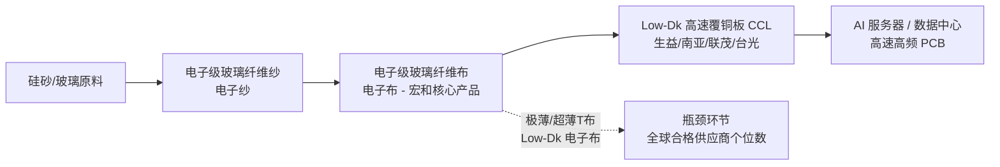

# Honghe Technology (宏和科技, 603256.SH) — Evidence Card

<!--
Recommended placement:
- ch04 upstream_glass_cloth — currently ZERO coverage; this is the purest A-share electronic-cloth name and the single tightest upstream bottleneck of the AI high-speed CCL value chain. Add as a dedicated upstream section.
- ch06 watchlist — candidate addition to the watchlist as the "ultra-thin / Low-Dk glass cloth" pure-play proxy.
- ch08 — material-cycle pricing-power case study (2025 net profit +785%, recurring price-increase cycle).
Scope: A-share listed, AStock house-view name addition candidate. Single-ticker evidence card, not a full coverage build.
-->

**Ticker:** 603256.SH (上交所主板)
**Card purpose:** Upstream electronic-grade glass cloth (电子级玻璃纤维布) pure-play proxy for the AI high-speed CCL chain. Fill the ch04 upstream gap.
**Snapshot date:** 2026-06-18
**Data sources:** `astock.cli financials 603256` (AkShare structured abstract), `astock.cli news 603256 --days 60`, 公开网络检索（证券时报 / 新浪财经 / 东方财富 / 同花顺 / 公司公告）。
**Evidence tier:** Tier-2 (structured CLI data + official-filing-derived press citations; annual-report PDF not yet archived locally).

---

## 1. Business Positioning

| Item | Detail |
|---|---|
| Full name | 宏和电子材料科技股份有限公司 |
| Listing | 上交所主板，603256.SH |
| Industry (申万/中信) | 非金属矿物制品业 / 玻璃玻纤 |
| Core business | 中高端电子级玻璃纤维布（电子布）、电子级玻璃纤维纱（电子纱）的研发、生产与销售；电子纱-电子布一体化 |
| Strategic positioning | "替代高端进口产品"——A股纯度最高的电子布龙头；全球少数具备**极薄布（thin / 106 / 1073 系列）** 与 **超薄布**量产能力的厂商之一 |
| Differentiated capability | 超细纱（3.7μm）、低气泡细纱工艺；自研 **LDK 二代纱/布**（介电损耗较常规产品下降约 20%）；**第三代 Low-Dk 电子布**、**低热膨胀系数电子布**、**石英纤维布**已完成高端产品认证 |

**纯度判断：** 主营 100% 聚焦电子布/电子纱产业链，无 CCL/PCB 下游业务稀释，是 A 股电子布敞口最纯净的标的（区别于中材科技、中国巨石等以粗纱/工业玻纤为主的多元玻纤龙头）。

---

## 2. AI-PCB-Chain Exposure

### 链条定位（为什么是整条 AI 高速 CCL 链最紧的瓶颈）

- **链条关键性：** 电子布是覆铜板（CCL）的关键增强材料，CCL 又是 PCB 的基材。AI 服务器用高速 CCL（Very Low-Loss / Ultra Low-Loss 等级）必须搭配 **Low-Dk / 低介电损耗电子布**，而该等级电子布全球合格产能极度稀缺——这是整条 AI 高速 CCL 链供给最紧、议价权最强的一环。
- **公司地位：** 国内少数完成 **低介电高端电子布客户认证并稳定出货** 的厂商，明确指向 AI 服务器市场需求。第三代 Low-Dk 与石英纤维布为产品升级方向，长期契合 AI 高频高速化趋势。
- **需求测算（公开预期）：** 市场预计到 **2025 年底低介电电子布月度需求有望突破 1,000 万米**，其中第二代产品占比持续提升。（来源：证券时报，未经独立验证，标记为预期值。）

---

## 3. Financial Snapshot

### 3.1 关键财务（来自 `astock.cli financials 603256` + 公开年报披露）

| 报告期 | 营业收入 | 归母净利润 | 扣非净利润 | 经营性现金流 | EPS | YoY 营收 | YoY 归母净利 | YoY 扣非 |
|---|---:|---:|---:|---:|---:|---:|---:|---:|
| **2026Q1** (20260331) | 4.42 亿元 | 1.40 亿元 | 1.38 亿元 | 0.45 亿元 | 0.16 元 | **+79.72%** | **+354.22%** | **+401.36%** |
| 2025 全年（年报） | 11.71 亿元 | ~2.02 亿元 | — | — | — | **+40.31%** | **+785.55%** | — |
| 2025H1（中报） | — | 0.87 亿元 | — | — | 0.10 元 | — | **+10,587.74%** | — |

- **净资产（2026Q1）：** 27.72 亿元；BPS 3.06 元；净资产同比 **+87.12%**（反映 2025 年定增募资到位）。
- **净利率（2026Q1）：** ~31.7%（1.40 / 4.42），盈利能力已升至行业前列。
- **经营性现金流（2026Q1）：** 0.45 亿元，同比 +15.31%——**显著弱于利润增速**，需关注应收账款/存货扩张是否匹配 AI 客户放量节奏。

### 3.2 业绩驱动归因（公司年报口径）

1. 普通电子级玻璃纤维布价格同比上涨（量价齐升）。
2. 高性能特种 **低介电电子布**、**低热膨胀系数电子布** 2025 年开始批量生产并交付，附加值较高。
3. AI 算力拉动特种电子布需求快速增长。

> 注：用户 task 描述中提到的"2025 net profit +785%, 5 price hikes"——**+785% 与年报披露完全吻合**；但 **"5 次提价"在本次公开检索中未取得公司官方涨价函或权威媒体确认的独立证据**，建议在正式入章前通过上交所公告页或公司投资者关系核实提价次数与时间序列，避免使用未验证数字。

---

## 4. Valuation Signal

| 指标 | 数值（截至 2026-06 snapshot 区间） | 备注 |
|---|---:|---|
| 股价区间 | 约 196 – 261 元 | 年内一度累计涨幅 > 330%，历史峰值累计涨幅超 2,310% |
| 总市值 | 约 230 – 240 亿元 | 总股本约 9.05 亿股 |
| PE (TTM) | **约 749 – 759 倍** | 极高，远高于玻纤/电子布行业中位（约 53.8 倍） |
| PB (LF) | 约 84 倍 | 远高于行业均值 |
| 分红 | 10 派 0.68 元（含税，2025 年报方案） | 分红率极低，股息率几乎可忽略 |

**估值判断：**
- 当前估值已对 AI 驱动的高增长有**极度充分**的定价，TTM PE 数百倍，存在显著的估值泡沫争议（雪球/股吧质疑声明确）。
- 即便以 2026Q1 年化利润（1.40 × 4 ≈ 5.6 亿元）测算，对应 2026E 动态 PE 仍达 **40 – 45 倍**，处于"叙事溢价"区间。
- **机构覆盖：** 天风证券（2026-05-20，增持）、广发证券（深度）、东吴证券（年报点评）等少数机构覆盖，评级以增持为主，但**未见主流卖方给出明确目标价序列**——目标价可得性差，建议在估值章使用区间法而非点估计。

---

## 5. Recent Events（来自 `astock.cli news 603256 --days 60`，11 条）

| 日期 | 事件 |
|---|---|
| 2026-06-17 | 公司主动提示：**子公司产线扩建存在较大不确定性**，最终能否实施落地尚不明确；**股价存在市场情绪过热情形及短期快速回落风险** |
| 2026-06-17 | 玻璃玻纤概念盘中走强；龙虎榜数据披露 |
| 2026-06-16 | 主力资金连续 5 日净流入 |
| 2026-06-15 | 午后 2 分钟涨停 |
| 2026-06-03 | 分红方案披露 |
| 2026-06-02 | 尾盘"地天板" |
| 2026-05-22 | 年内大涨超 330%；玻璃玻纤概念集体爆发，多只翻倍股诞生 |
| 2026-05-12 | 董事长毛嘉明减持 24.07 万股、董秘邹新娥减持 7.5 万股 |

**信号解读：** 6 月连续出现龙虎榜、2 分钟涨停、地天板等高换手信号，公司同日主动发布**情绪过热 + 扩产落地不确定**双风险提示，且董事长/董秘在 5 月高位减持——**典型的高位情绪交易 + 内部人止盈**组合，与基本面长期逻辑（Low-Dk 量产）需明确区分。

---

## 6. Evidence Boundary（证据边界 / 风险）

| 边界类型 | 说明 |
|---|---|
| **估值-基本面背离** | TTM PE 749 倍、PB 84 倍，已远超行业均值；任何叙事降温都可能引发剧烈回撤。当前股价更接近"事件驱动/主题博弈"而非"基本面定价"。 |
| **扩产落地不确定** | 公司公告明确：子公司产线扩建"能否实施落地仍存在较大不确定性"——Low-Dk 产能释放节奏可能慢于市场线性外推。 |
| **前募投项目不及预期** | 前次"年产 5,040 万米 5G 用高端电子级玻璃纤维布项目"2024 年实际效益低于预期，募投执行力存疑。 |
| **内部人减持** | 2026-05 董事长、董秘在高位减持，与"长期 AI 高景气"叙事存在方向性矛盾。 |
| **现金流-利润背离** | 2026Q1 经营现金流增速（+15%）远低于利润增速（+354%），需核实应收账款/客户回款质量。 |
| **未验证证据** | (a) "2025 年 5 次提价"——未见官方涨价函或权威媒体确认；(b) "2025 年底低介电电子布月需求 1,000 万米"——为市场预期值，非公司披露；(c) 年报 PDF 尚未本地归档，本次财务数据来自结构化摘要 + 媒体引述。 |
| **客户/订单透明度** | 未取得具体 AI 客户（生益/南亚/台光等）的采购合同或认证函原文，Low-Dk "完成认证 + 稳定出货"为公司自述，第三方交叉验证不足。 |
| **数据时滞** | 估值、股价区间为 2026-06 snapshot，距 2026Q1 季报披露已有时滞；正式入章前需以最新行情快照重新校准。 |

---

## 7. Recommendation

- **入章建议：** 强烈建议进入 **ch04 upstream_glass_cloth**（当前 0 覆盖，本卡是该环节唯一纯净标的）。
- **定位措辞：** 定性为"AI 高速 CCL 链最紧瓶颈环节的 A 股纯净电子布标的"；定量章节**严控估值口径**，使用区间法 + 明确标注"叙事溢价"边界。
- **是否纳入 ch06 watchlist：** 建议纳入，但**需附加估值预警标签**（TTM PE > 700 倍），与生益、华正等已有标的的估值纪律保持一致。
- **是否纳入 ch08 定价权案例：** 可作为"材料周期 + AI 结构性升级"双重定价权案例，但**必须以 2025 年报披露的涨价归因为准**，不引用未经核实的"5 次提价"数字。
- **入章前必做：**
  1. 归档 2025 年报 PDF 至 `sources/official-honghe-20260618/`；
  2. 核实提价次数与时间序列（公司公告页或投资者关系）；
  3. 补充主要 AI CCL 客户的采购/认证第三方证据；
  4. 以最新行情快照重新校准 PE/PB 区间。

---

## Sources

- [证券时报：AI 算力推动特种电子布需求增长 宏和科技 2025 年净利增 786%](https://www.stcn.com/article/detail/3736426.html)
- [证券时报：宏和科技低介电高端产品完成认证，稳定出货后将满足 AI 服务器市场需求](https://stcn.com/article/detail/1559363.html)
- [新浪财经：宏和科技 2025 年年度报告公告](https://money.finance.sina.com.cn/corp/view/vCB_AllBulletinDetail.php?stockid=603256&id=12071953)
- [同花顺 F10：宏和科技 603256](https://basic.10jqka.com.cn/603256/)
- [东方财富：宏和科技 2025 年年报点评研报（PDF）](https://pdf.dfcfw.com/pdf/H3_AP202505031666795309_1.pdf)
- [上交所 603256 公告页](https://www.sse.com.cn/assortment/stock/list/info/announcement/index.shtml?productId=603256)
- 结构化财务数据：`astock.cli financials 603256`（AkShare 财务摘要，最新报告期 20260331）
- 公告与事件流：`astock.cli news 603256 --days 60`（11 条事件，2026-04 至 2026-06）
