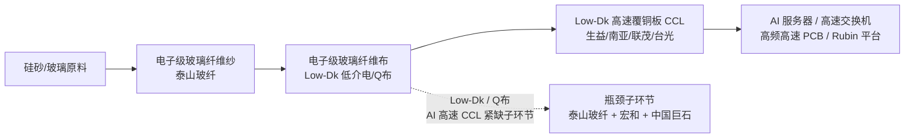

# Zhongcai Technology (中材科技, 002080.SZ) — Evidence Card

<!--
Recommended placement:
  - ch04 upstream_glass_cloth: 加入玻纤布/电子布上游分组，与宏和科技（603256，纯电子布）、中国巨石（600176，同业竞争）并列；定位为"玻纤龙头切入 AI 低介电电子布"的多元平台型上游标的，非纯净电子布标的。
  - ch06 watchlist: 建议纳入 watchlist 而非 Core Candidate（依据：2025 年特种纤维布收入仅 6.28 亿、占公司总营收 2.08%，AI 电子布逻辑当前为"题材 + 远期产能"而非已兑现业绩；公司 6/17 主动风险提示）。
  - ch08 board/valuation: 仅作为"题材溢价 vs. 当期业绩占比"对照案例；不可直接写入目标价（PE > 90x 依赖远期特种玻纤放量，存在证伪风险）。
  - ch10 guidance: 作为"定增 + 在建产能先行指标"主题储备（定增近 45 亿、3500 万米低介电 + 2400 万米超低损耗低介电在建）。
Scope: A 股上市，PCB 上游玻纤布/电子布敞口扩充调研标的。单标证据卡，非完整 coverage build。
Boundary: 多元玻纤平台，非纯电子布标的；AI 电子布敞口当前为个位数营收占比；题材驱动连续涨停，须与基本面严格区分。
-->

**Ticker / Name:** 002080.SZ / 中材科技股份有限公司（中材科技）
**Card purpose:** PCB 上游玻璃纤维布 / 低介电电子布敞口扩充调研标的；填充 ch04 upstream_glass_cloth 的"玻纤龙头切入 AI 电子布"节点。
**Snapshot date:** 2026-06-20（行情）/ 2026-03-31（最新一期报表 2026Q1）
**Data sources:** `astock.cli financials 002080`、`astock.cli news 002080 --days 60`、`astock.cli quote 002080` @ 2026-06-20，公开网络检索（中国经营报 / 财联社 / 长江证券 / 东方财富研报 PDF / 巨潮资讯网年报摘要）。
**Evidence tier:** Tier-2（结构化 CLI 财务数据 + 官方公告/卖方研报引述；2025 年报 PDF 尚未本地归档）。

---

## 1. Business positioning（业务定位）

| Item | Detail |
|---|---|
| Full name | 中材科技股份有限公司 |
| Listing | 深交所主板，002080.SZ |
| Industry (申万/中信) | 建筑材料 / 玻璃玻纤 / 玻纤制造 |
| 控股股东 | 中国建材集团（央企背景）；与中国巨石（600176）同属中建材系，存在玻纤同业竞争关系 |
| 主导业务（三大产业） | 风电叶片、玻璃纤维及制品（主体为全资子公司**泰山玻纤**）、锂电池隔膜 |
| 核心子公司 | **泰山玻纤**（山东泰安/邹城）——玻纤及电子布/特种玻纤布运营主体 |
| 电子布/AI 敞口定位 | 多元玻纤平台龙头；通过泰山玻纤切入 **Low-Dk 低介电电子布、低膨胀布、超低损耗低介电布（Q布）**，被长江证券等卖方定位为"AI 特种玻纤布全球稀缺龙头" |

**纯度判断（关键）：** 中材科技是**多元玻纤平台**，并非纯电子布标的。玻纤业务以粗纱/工业玻纤（2025 年对外销售 137 万吨创历史新高）为收入主体；电子布/特种玻纤布为**增速弹性项而非收入主力**。与宏和科技（603256，100% 电子布）相比，AI 电子布纯度显著更低——这是本卡建议 watchlist（而非 Core Candidate）的核心原因。

来源：中材科技 2025 年半年度报告摘要（巨潮资讯网）、中国经营报、财联社、长江证券研报。

---

## 2. AI-PCB-chain exposure（AI-PCB 链路敞口）

### 2.1 传导链与环节定位

- **链条关键性：** Low-Dk 低介电 / 超低损耗低介电（Q布）电子玻纤布是 AI 服务器用 Very/Ultra Low-Loss CCL 的关键增强材料；该等级电子布全球合格产能稀缺，是 AI 高速 CCL 链供给最紧的子环节之一。
- **泰山玻纤产品矩阵：** 已覆盖**低介电一代、二代、低膨胀布、超低损耗低介电布（Q布）全品类**，公司口径称"均已完成国内外头部客户认证"（待第三方交叉验证，见证据边界）。

### 2.2 产能与定增（AI 敞口的核心证据）

| 项目 | 规模 | 状态 |
|---|---:|---|
| 现有特种玻纤布产能（泰山玻纤） | 约 2,400 万米（低介电 + 低膨胀 + 超低损耗） | 在产 |
| 在建：年产 3,500 万米**低介电纤维布**项目 | 3,500 万米 | 拟新建（山东泰安/邹城）；已获山东省发改委节能审查批复 |
| 在建：年产 2,400 万米**超低损耗低介电纤维布（Q布）**项目 | 2,400 万米，投资 17.51 亿元 | 拟新建 |
| **定增募资** | **近 45 亿元** | 重点投向上述特种玻纤项目（公告 2025-08） |

来源：[中国经营报（定增近 45 亿元）](http://www.cb.com.cn/index/show/zj/cv/cv135337051265)、[东方财富研报 PDF（8/28 公告扩产）](https://pdf.dfcfw.com/pdf/H3_AP202508291736450389_1.pdf)、[募集说明书（2025-12 修订稿）](http://xinpi.zqrb.cn/pdf/SZ/002080/2025/1220/c3df792bd73e58f942476f2c19a74a24.pdf)。

### 2.3 AI-server / Rubin / optical relevance

| 维度 | 证据 | 强度 |
|---|---|---|
| AI 服务器 / 高速 PCB 间接传导 | Low-Dk 电子布 → 生益/南亚/联茂/台光 CCL → AI 服务器 PCB；链条清晰 | 强（结构性传导） |
| Rubin 平台前瞻 | 卖方将中材定位为"Rubin 放量下低介电电子布稀缺弹性标的"；但**无 Rubin 专用订单/收入公开披露** | 弱（卖方叙事，无具名订单） |
| 光模块 / 光学相关 | 本卡公开检索中**未发现**中材科技直接涉及光模块或光学元件业务的证据；电子布下游主要用于电学 PCB，非光学链路 | 无（不构成光模块敞口） |
| 特种纤维布实际营收（2025） | 销量 1,917 万米、收入 **6.28 亿元**、占公司总营收 **2.08%** | 强（公司 6/17 风险提示公告） |

**敞口判断：** AI 电子布逻辑真实存在（在建产能 + 定增），但**当期业绩占比极低（2.08%）**，市场已计入的"AI 电子布龙头"叙事与 2025 年实际收入贡献之间存在显著落差。

来源：[财联社 cls.cn 2215028](https://www.cls.cn/detail/2215028)、[长江证券研报](https://www.hibor.com.cn/data/8138a6cd452f2b169abe3bb75da69fd9.html)、公司 2026-06-17 风险提示公告。

---

## 3. Financial snapshot（财务快照）

**数据源：** `astock.cli financials 002080`（AkShare 财报摘要回填），最新一期 2026-03-31（2026Q1）。2025 年报 PDF 尚未本地归档，2025 全年数据来自公司公告/卖方研报引述。

### 3.1 2026Q1 单季（2026-03-31，单位：元）

| 指标 | 值 | 同比 |
|---|---:|---:|
| 营业收入 | 6,854,349,366.81（68.54 亿元） | **+24.50%** |
| 营业成本 | 6,255,408,568.62（62.55 亿元） | — |
| 归母净利润 | 507,472,483.06（5.07 亿元） | **+40.15%** |
| 净利润（含少数股东） | 587,666,705.13（5.88 亿元） | **+42.25%** |
| 扣非归母净利 | 451,343,799.43（4.51 亿元） | **+79.74%** |
| 经营性现金流净额 | **−2,014,429,897.68（−20.14 亿元）** | **−598.69%**（同比恶化） |
| 基本每股收益（元） | 0.30 | — |
| 每股净资产（元） | 12.19 | — |
| 归母净资产 | 28,959,098,736.32（289.59 亿元） | +6.65% |
| 推算毛利率（Q1 单季） | **8.74%**（(68.54−62.55)/68.54） | — |
| 商誉 | 48,265,219.55（0.48 亿元，极小） | — |

### 3.2 关键财务解读

1. **营收 +24.50% / 归母 +40.15% / 扣非 +79.74%**：三表增长健康，但增长主体来自**传统玻纤/风电叶片/隔膜**三大主业，**不是** AI 电子布（后者 2025 全年仅 6.28 亿、占比 2.08%）。
2. **经营性现金流 −20.14 亿元（同比 −598.69%）**：与净利润 +40% 严重背离，**这是 ch06 watchlist 而非 Core Candidate 的关键边界依据**——与宏和科技（603256）现金流为正 + 增速 +354% 形成对照。需核实应收账款/存货扩张是否匹配扩产节奏。
3. **毛利率 8.74%**：远低于宏和科技（净利率 ~31.7%）与芯碁微装（毛利率 35.59%），反映其**传统建材/工业玻纤主导的业务结构**，AI 电子布高毛利逻辑尚未在合并毛利率中体现。

### 3.3 卖方预测（特种玻纤布分部，2025-06 研报口径）

| 年份 | 特种玻纤布收入 | 对应净利润 | 净利率 |
|---|---:|---:|---:|
| 2025E | 8.5 亿元 | 1.8 亿元 | ~21% |
| 2026E | 16.6 亿元 | 4.9 亿元 | ~30% |
| 2027E | 24.5 亿元 | 8.2 亿元 | ~34% |

> 注：上表为卖方（长江/东方财富口径）预测，非公司指引；2025 实际特种纤维布收入 6.28 亿元**低于**卖方 8.5 亿预期，提示卖方模型存在高估风险。

来源：东方财富研报 PDF、长江证券研报。

---

## 4. Valuation signal（估值信号）

**数据源：** `astock.cli quote 002080` @ 2026-06-20；市值/PE 由本地按 2026Q1 BPS 12.19 反推股本估算。

| 指标 | 值（2026-06-20） | 备注 |
|---|---:|---|
| 现价 | **80.55 元** | 当日 −2.26%（−1.86）；盘中高 82.80 / 低 78.20 |
| 总股本（估算） | 约 **23.76 亿股** | 由 equity / bps = 289.59 亿 / 12.19 反推 |
| 总市值 | **约 1,914 亿元** | 大市值玻纤龙头 |
| TTM 归母净利（粗估） | 约 **20.3 亿元** | Q1 5.07 亿 × 4 的粗略年化；**非真实 TTM**，2025 年报未本地归档无法精确取 TTM |
| 粗估 PE（Q1×4） | **约 94×** | 高估值，远高于玻纤行业中位（约 20–30×）；依赖远期特种玻纤放量 |
| PB（LF） | 约 6.6×（80.55 / 12.19） | 高于行业均值 |
| 卖方特种玻纤 26E/27E 净利 | 4.9 亿 / 8.2 亿 | 若兑现，远期 PE 收敛但仍 > 50× |

**估值判断：**
- 当前约 94× PE 已对"AI 电子布龙头"叙事**极度充分定价**，但**当期 AI 电子布收入占比仅 2.08%**，估值与基本面背离明显，处于"题材溢价"区间。
- 与宏和科技（TTM PE ~750×，纯度 100% 但更高泡沫）相比，中材市值更大、流动性强，但 AI 纯度更低；两者均属"题材驱动高位"组合。
- **现价隐含估值不可直接写入 ch08 目标价**；ch08 若纳入须显式标注"题材溢价 vs. 当期业绩占比 2.08%"边界。

**机构覆盖：** 长江证券（"AI 特种玻纤布全球稀缺龙头"）、东方财富研报深度覆盖；**未见主流卖方给出明确目标价序列**（与芯碁/胜宏等覆盖密度差距大），目标价可得性差。

---

## 5. Evidence boundary（证据边界 — 必读）

**可以写入正文的：**
- 公司三大主业结构（风电叶片 / 玻纤（泰山玻纤）/ 锂电隔膜）及央企（中建材系）背景。
- 2025 全年泰山玻纤特种纤维布销量 1,917 万米、收入 6.28 亿元、占公司总营收 2.08%（公司 6/17 风险提示公告）。
- 2025 全年泰山玻纤对外销售玻纤产品 137 万吨创历史新高（年报摘要）。
- 定增近 45 亿元、在建 3,500 万米低介电 + 2,400 万米超低损耗低介电（Q布）项目（公告 + 募集说明书）。
- 2026Q1 三表（收入 +24.50% / 归母 +40.15% / 扣非 +79.74%）官方数据。
- 2026Q1 经营性现金流 −20.14 亿元、同比 −598.69%（watchlist 边界依据）。

**不可写入正文 / 须打折标注的：**
- **"AI 电子布龙头 / Rubin 弹性标的"**：卖方叙事，2025 实际 AI 电子布收入占比仅 2.08%；任何"AI 占比"须作为待验证情景变量，按远期产能投产节奏打折。
- **"特种玻纤布 26/27E 收入 16.6 / 24.5 亿、净利 4.9 / 8.2 亿"**：卖方预测，非公司指引；且 2025 实际值（6.28 亿）已低于卖方 8.5 亿预期，提示模型高估，不可直接写入估值模型。
- **"头部客户认证全部完成"**：公司自述口径，未取得具体 AI CCL 客户（生益/南亚/台光等）采购合同或认证函原文，第三方交叉验证不足。
- **粗估 PE ~94×**：基于 Q1×4 年化的粗略值，**非真实 TTM**；2025 年报 PDF 未本地归档前不得作为精确估值锚。
- **Q1 毛利率 8.74%**：单季合并口径，受传统建材业务拖累，不反映特种玻纤布真实单品毛利；不写入分部模型。
- **光模块/光学敞口**：本卡未发现任何中材科技直接涉及光模块/光学元件的公开证据，不得归入光模块链路。

**降级/升级触发条件（前瞻监控）：**
- 升级至 Core Candidate：需 2026 半年报特种纤维布收入占比突破 5% 且经营现金流修复转正。
- 维持 watchlist：当前 2.08% 占比 + 现金流负 + 题材涨停组合，不满足 Core Candidate 现金流为正的边界。
- 降级移除：若定增项目终止或特种玻纤产线投产延期 > 12 个月，则 AI 电子布逻辑证伪。

---

## 6. Recent events（来自 `astock.cli news 002080 --days 60`，11 条）

| 日期 | 事件 |
|---|---|
| 2026-06-17 | **公司主动风险提示**：2025 年泰山玻纤特种纤维布营收占公司总营收比例**较低**；7 天 4 板中材科技提示特种纤维布销售收入占营收比例较小 |
| 2026-06-17 | 中材科技 3 连板；国家大基金持股概念涨幅居前；深股通现身 20 只个股龙虎榜 |
| 2026-06-17 | 龙虎榜机构席位买卖详情披露（002080 龙虎榜数据 06-16 / 06-17） |
| 2026-06-15 | 玻璃玻纤概念走强；行业兼具"周期"与"成长"属性 |
| 2026-05-23 | 分红方案披露 |

**信号解读：** 6 月连续出现 3 连板 / 7 天 4 板 / 龙虎榜机构席位 / 深股通现身等高换手信号，但**公司同日主动发布两次风险提示**（特种纤维布占比低、投资风险）——典型"题材驱动涨停 + 上市公司主动降温"组合。与基本面（AI 电子布占比 2.08%）严格区分；题材交易属性显著强于基本面定价属性。

---

## 7. Source registry

| 来源 | 类型 | 路径 / 链接 | 用途 |
|---|---|---|---|
| astock financials | 结构化 | `.venv/bin/python -m astock.cli financials 002080` @ 2026-06-20 | 2026Q1 三表 + 同比 |
| astock quote | 行情 | `.venv/bin/python -m astock.cli quote 002080` @ 2026-06-20 | 现价 80.55 / −2.26% |
| astock news | 公告/事件 | `.venv/bin/python -m astock.cli news 002080 --days 60` | 风险提示 / 龙虎榜 / 涨停 / 板块异动 |
| 公司 2025 半年报摘要 | 一手 | [巨潮资讯网 PDF](https://static.cninfo.com.cn/finalpage/2025-08-22/1224535520.PDF) | 泰山玻纤技术优势、玻纤主业叙述 |
| 中国经营报 | 媒体 | [定增近 45 亿元押注 AI 特纤项目](http://www.cb.com.cn/index/show/zj/cv/cv135337051265) | 定增规模 + 3500万米/2400万米项目 |
| 东方财富研报 PDF | 卖方 | [扩产 AI 电子布公告点评](https://pdf.dfcfw.com/pdf/H3_AP202508291736450389_1.pdf) | 产能扩张细节 |
| 募集说明书（2025-12 修订稿） | 一手 | [zqrb PDF](http://xinpi.zqrb.cn/pdf/SZ/002080/2025/1220/c3df792bd73e58f942476f2c19a74a24.pdf) | 3500万米项目节能审查批复 |
| 财联社 | 媒体 | [cls.cn 2215028](https://www.cls.cn/detail/2215028) | AI 高阶品类缺货涨价、特种纤维布收入占比 |
| 长江证券研报 | 卖方 | [hibor 8138...](https://www.hibor.com.cn/data/8138a6cd452f2b169abe3bb75da69fd9.html) | "AI 特种玻纤布全球稀缺龙头"定位 |

---

## 8. Card-to-chapter linkage（与现有章节的引用映射）

| 章节 | 现状 | 本卡建议动作 |
|---|---|---|
| ch04 upstream_glass_cloth | 已有宏和科技（603256，纯电子布）、上游供应商清单 | **新增**：作为"玻纤龙头切入 AI 低介电电子布"的多元平台型上游节点，与宏和（纯电子布）、中国巨石（同业竞争）并列；明确标注**纯度差异**（中材 AI 电子布占比 2.08% vs. 宏和 100%） |
| ch06 companies/watchlist | watchlist 已有上游候选 | **新增 watchlist**：作为"多元玻纤平台 AI 电子布题材"候选，附加"现金流为负 + 占比 2.08%"双重边界标签；**不升 Core Candidate** |
| ch08 valuation | 12 标的 consensus 表 | **谨慎**：当前不纳入目标价表（PE ~94× 依赖远期特种玻纤放量）；仅作为"题材溢价 vs. 当期业绩占比"对照案例，须显式标注估值-基本面背离 |
| ch10 guidance | capex lead indicator 主题 | **新增**：作为"定增 45 亿 + 在建 5900 万米低介电产能"的远期 capex 先行指标储备 |

---

*Card generated 2026-06-20. Next refresh trigger: 2025 年报 PDF 本地归档（精确 TTM PE）/ 2026 半年报特种纤维布收入占比更新 / 定增项目落地节奏 / 经营现金流修复验证。*
